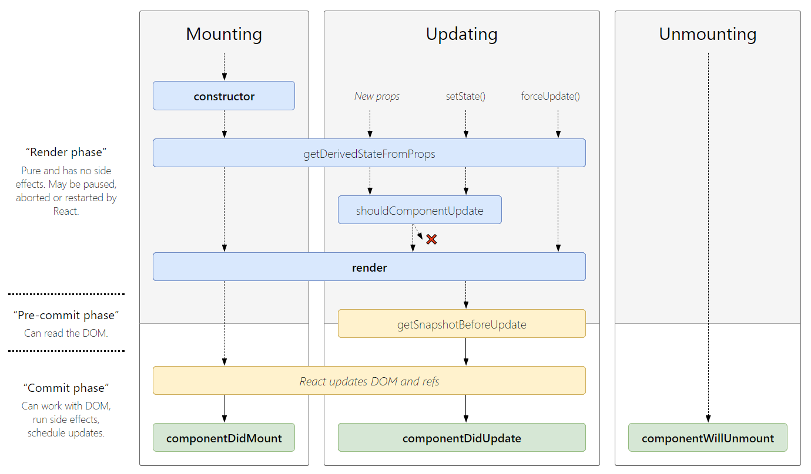

 Important React Interview Questions

<br/>

## Q. Create a component, that displays data from https://reqres.in/api/users?

```js
import React, { useEffect, useState } from "react";
import axios from "axios";

export default function App() {
  const [users, setUsers] = useState([]);

  useEffect(() => {
    axios.get("https://reqres.in/api/users?page=1").then((response) => {
      setUsers(response.data.data);
    });
  }, []);

  return (
    <div>
      <ul>
        {users.map((user) => (
          <li key={user.id}>
            {user.first_name} {user.last_name}
          </li>
        ))}
      </ul>
    </div>
  );
}
```

**&#9885; [Try this example on CodeSandbox](https://codesandbox.io/s/react-rest-api-hmcx8p?file=/src/App.js)**

## Q. What is Destructuring in React?

Destructuring is a convenient way of accessing multiple properties stored in objects and arrays. It was introduced to JavaScript by ES6 and has provided developers with an increased amount of utility when accessing data properties in Objects or Arrays.

When used, destructuring does not modify an object or array but rather copies the desired items from those data structures into variables. These new variables can be accessed later on in a React component.

**Example:**

```js
/**
 * Destructuring in React
 */
import React from "react";

export default function App() {
  // Destructuring
  const [counter, setcounter] = React.useState(0);

  return (
    <>
      <button onClick={() => setcounter(counter + 1)}> Increment </button>
      <button onClick={() => setcounter(counter > 0 ? counter - 1 : 0)}>
        Decrement
      </button>

      <h2>Result: {counter}</h2>
    </>
  );
}
```

**&#9885; [Try this example on CodeSandbox](https://codesandbox.io/s/destructuring-in-react-6fxnbh?file=/src/App.js)**

<div align="right">
    <b><a href="#table-of-contents">↥ back to top</a></b>
</div>

## Q. How to add custom DOM attributes in JSX?

Custom attributes are supported natively in React 16. This means that adding a custom attribute to an element is now as simple as adding it to a render function, like so:

**Example:**

```js
// 1. Custom DOM Attribute
render() {
  return (
    <div custom-attribute="some-value" />
  );
}

// 2. Data Attribute ( starts with "data-" )
render() {
  return (
    <div data-id="10" />
  );
}

// 3. ARIA Attribute ( starts with "aria-" )
render() {
  return (
    <button aria-label="Close" onClick={onClose} />
  );
}
```

**&#9885; [Try this example on CodeSandbox](https://codesandbox.io/s/react-custom-attribute-8enl34?file=/src/App.js)**

<div align="right">
    <b><a href="#table-of-contents">↥ back to top</a></b>
</div>

## Q. How to use InnerHtml in React?

The **innerHTML** is risky because it is easy to expose users to a cross-site scripting (XSS) attack. React provides **dangerouslySetInnerHTML** as a replacement for innerHTML. It allows to set HTML directly from React by using `dangerouslySetInnerHTML` and passing an object with a `__html` key that holds HTML.

**Example:**

```js
/**
 * InnerHtml in React
 */
import React from "react";

export default function App() {
  return (
    <div
      dangerouslySetInnerHTML={{
        __html: "<p>This text is set using <b>dangerouslySetInnerHTML</b></p>"
      }}
    ></div>
  );
}
```

**&#9885; [Try this example on CodeSandbox](https://codesandbox.io/s/react-dangerouslysetinnerhtml-i4wqq?file=/src/App.js)**

<div align="right">
    <b><a href="#table-of-contents">↥ back to top</a></b>
</div>

## Q. What are React components?

Components are the building blocks of any React app and a typical React app will have many of these. Simply put, a component is a JavaScript class or function that optionally accepts inputs i.e. properties(`props`) and returns a React element that describes how a section of the UI (User Interface) should appear.

A React component can be either **stateful** or **stateless**. A stateful component is a component that holds some state. Stateless components, by contrast, have no state.

**1. Stateless Component:**

```js
import React from 'react'

const ExampleComponent = () => {
    return (<h1>Stateless Component</h1>)
}

export default class App extends React.Component {
  render() {
    return (
      <div>
        <ExampleComponent/>
      </div>
    )
  }
}
```

The above example shows a stateless component named ExampleComponent which is inserted in the `<App/>` component. The `ExampleComponent` just comprises of a `<h1>` element.

**2. Stateful Component:**

```js
import React from 'react'

class ExampleComponent extends React.Component {

  constructor(props) {
    super(props)
    this.state = {
      heading: "Stateful Component"
    }
  }
  render() {
    return (
        <div>
            <h1>{ this.props.welcomeMsg }</h1>
            <h2>{ this.state.heading }</h2>
        </div>
    )
  }
}

export default class App extends React.Component {
  render() {
    const welcomeMsg = "Welcome to React!"
    return (
      <div>
        <ExampleComponent welcomeMsg={welcomeMsg}/>
      </div>
    )
  }
}
```

The above example shows a stateful component named ExampleComponent which is inserted in the `<App/>` component. The `ExampleComponent` contains a `<h1>` and the `<h2>` element wrapped in a `<div>`. The `<h1>` displays data using props while the `<h2>` takes its data from the internal state of the ExampleComponent.

<div align="right">
    <b><a href="#table-of-contents">↥ back to top</a></b>
</div>

## Q. What is the difference between Component and Container in React?

The **presentational** components are concerned with the look, **container** components are concerned with making things work.

For example, this is a presentational component. It gets data from its props, and just focuses on showing an element

```js
/**
 * Presentational Component 
 */
const Users = props => (
  <ul>
    {props.users.map(user => (
      <li>{user}</li>
    ))}
  </ul>
)
```

On the other hand this is a container component. It manages and stores its own data, and uses the presentational component to display it.

```js
/**
 * Container Component 
 */
class UsersContainer extends React.Component {
  constructor() {
    this.state = {
      users: []
    }
  }

  componentDidMount() {
    axios.get('/users').then(users =>
      this.setState({ users: users }))
    )
  }

  render() {
    return <Users users={this.state.users} />
  }
}
```

<div align="right">
    <b><a href="#table-of-contents">↥ back to top</a></b>
</div>

## Q. How would you prevent a component from rendering?

React **shouldComponentUpdate()** is a performance optimization method, and it tells React to avoid re-rendering a component, even if state or prop values may have changed. This method only used when a component will stay static or pure.

The React `shouldComponentUpdate()` method return `true` if it needs to re-render or `false` to avoid being re-render.

**Syntax:**

```js
shouldComponentUpdate(nextProps, nextState){ }
```

**Example:**

```js
/**
 * Prevent a component from rendering
 */
export default class App extends React.Component {
  constructor() {
    super();
    this.state = {
      countOfClicks: 0
    };
    this.handleClick = this.handleClick.bind(this);
  }

  handleClick() {
    this.setState({
      countOfClicks: this.state.countOfClicks + 1
    });
  }

  shouldComponentUpdate(nextProps, nextState) {
    console.log("this.state.countOfClicks", this.state.countOfClicks);
    console.log("nextState.countOfClicks", nextState.countOfClicks);
    return true;
  }

  render() {
    return (
      <div>
        <h2>shouldComponentUpdate Example</h2>
        <p>Count of clicks: <b>{this.state.countOfClicks}</b></p>
        <button onClick={this.handleClick}>CLICK ME</button>
      </div>
    );
  }
}
```

**&#9885; [Try this example on CodeSandbox](https://codesandbox.io/s/react-shouldcomponentupdate-mryjv?file=/src/App.js)**

<div align="right">
    <b><a href="#table-of-contents">↥ back to top</a></b>
</div>

## Q. What is Compound Components in React?

The Compound components are a pattern in which components are used together such that they share an implicit state that lets them communicate with each other in the background.

Internally they are built to operate on a set of data that is passed in through children instead of props. Behind the scenes they make use of React\'s lower level API such as `React.children.map()`, and `React.cloneElement()`. Using these methods, the component is able to express itself in such a way that promotes patterns of composition and extensibility.

**Example:**

```js
function App() {
  return (
    <Menu>
      <MenuButton>
        Actions <span aria-hidden>▾</span>
      </MenuButton>
      <MenuList>
        <MenuItem onSelect={() => alert('Download')}>Download</MenuItem>
        <MenuItem onSelect={() => alert('Copy')}>Create a Copy</MenuItem>
        <MenuItem onSelect={() => alert('Delete')}>Delete</MenuItem>
      </MenuList>
    </Menu>
  )
}
```

In this example, the `<Menu>` establishes some shared implicit state. The `<MenuButton>`, `<MenuList>`, and `<MenuItem>` components each access and/or manipulate that state, and it\'s all done implicitly. This allows you to have the expressive API you're looking for.

<div align="right">
    <b><a href="#table-of-contents">↥ back to top</a></b>
</div>

## Q. What is the recommended ordering of methods in class component?

* static methods
* constructor()
* getChildContext()
* componentWillMount()
* componentDidMount()
* componentWillReceiveProps()
* shouldComponentUpdate()
* componentWillUpdate()
* componentDidUpdate()
* componentWillUnmount()
* click handlers or event handlers like `onClickSubmit()` or `onChangeDescription()`
* getter methods for render like `getSelectReason()` or `getFooterContent()`
* optional render methods like `renderNavigation()` or `renderProfilePicture()`
* render()

<div align="right">
    <b><a href="#table-of-contents">↥ back to top</a></b>
</div>

## Q. How to create a dynamic table in react?

```js
/**
 * Generate dynamic table in React
 */
class Table extends React.Component {
   constructor(props) {
      super(props)
      this.state = {
         employees: [
            { id: 10, name: 'Swarna Sachdeva', email: 'swarna@email.com' },
            { id: 20, name: 'Sarvesh Date', email: 'sarvesh@email.com' },
            { id: 30, name: 'Diksha Meka', email: 'diksha@email.com' }
         ]
      }
   }

   renderTableHeader() {
      let header = Object.keys(this.state.employees[0])
      return header.map((key, index) => {
         return <th key={index}>{key.toUpperCase()}</th>
      })
   }

   renderTableData() {
      return this.state.employees.map((employee, index) => {
         const { id, name, email } = employee 
         return (
            <tr key={id}>
               <td>{id}</td>
               <td>{name}</td>
               <td>{email}</td>
            </tr>
         )
      })
   }

   render() {
      return (
         <div>
            <h1 id='title'>React Dynamic Table</h1>
            <table id='employees'>
               <tbody>
                  <tr>{this.renderTableHeader()}</tr>
                  {this.renderTableData()}
               </tbody>
            </table>
         </div>
      )
   }
}
```

**&#9885; [Try this example on CodeSandbox](https://codepen.io/learning-zone/pen/wvdeqBm?editors=0110)**

<div align="right">
    <b><a href="#table-of-contents">↥ back to top</a></b>
</div>

## Q. How do you set a timer to update every second?

Using `setInterval()` inside React components allows us to execute a function or some code at specific intervals. A function or block of code that is bound to an interval executes until it is stopped. To stop an interval, we can use the `clearInterval()` method.

**Example:**

```js
class Clock extends React.Component {
  constructor(props) {
    super(props)
    this.state = {
      time: new Date().toLocaleString()
    }
  }
  componentDidMount() {
    this.intervalID = setInterval(
      () => this.tick(),
      1000
    )
  }
  componentWillUnmount() {
    clearInterval(this.intervalID)
  }
  tick() {
    this.setState({
      time: new Date().toLocaleString()
    })
  }
  render() {
    return (
      <p className="App-clock">
        The time is {this.state.time}.
      </p>
    )
  }
}
```

<div align="right">
    <b><a href="#table-of-contents">↥ back to top</a></b>
</div>

## Q. What is the purpose of using super constructor with props argument?

The `super()` keyword is used to call the parent constructor. `super(props)` would pass `props` to the parent constructor.

```js
/**
 * super constructor
 */
class App extends React.Component {
  constructor(props) {
      super(props)
      this.state = {}
   }

  // React says we have to define render()
  render() {
    return <div>Hello world</div>
  }
}

export default App
```

Here, `super(props)` would call the `React.Component` constructor passing in props as the argument.

<div align="right">
    <b><a href="#table-of-contents">↥ back to top</a></b>
</div>

## Q. What is the purpose of render() function in React?

The React class components uses render() function. It is used to update the UI.

**Purpose of render():**

* React renders HTML to the web page by using a function called render().
* The purpose of the function is to display the specified HTML code inside the specified HTML element.
* In the render() method, we can read props and state and return our JSX code to the root component of our app.
* In the render() method, we cannot change the state, and we cannot cause side effects ( such as making an HTTP request to the webserver).

```js
/**
 * render() function
 * 
 * React v18.0.0
 */
import React from "react";
import { createRoot } from "react-dom/client";

class App extends React.Component {
  render() {
    return <h1>Render() Method Example</h1>;
  }
}

const container = document.getElementById("root");
const root = createRoot(container);
root.render(<App />);
```

**&#9885; [Try this example on CodeSandbox](https://codesandbox.io/s/react-render-l2q7qk?file=/src/index.js)**

<div align="right">
    <b><a href="#table-of-contents">↥ back to top</a></b>
</div>

## Q. What are the different phases of React component lifecycle?

React provides several methods that notify us when certain stage of this process occurs. These methods are called the component lifecycle methods and they are invoked in a predictable order. The lifecycle of the component is divided into four phases.

<p align="center">
  
</p>

**1. Mounting:**  

These methods are called in the following order when an instance of a component is being created and inserted into the DOM:

* `constructor()`
* `getDerivedStateFromProps()`
* `render()`
* `componentDidMount()`

**2. Updating:**  

The next phase in the lifecycle is when a component is updated. A component is updated whenever there is a change in the component\'s state or props.

React has five built-in methods that gets called, in this order, when a component is updated:

* `getDerivedStateFromProps()`
* `shouldComponentUpdate()`
* `render()`
* `getSnapshotBeforeUpdate()`
* `componentDidUpdate()`

**3. Unmounting:**  

The next phase in the lifecycle is when a component is removed from the DOM, or unmounting as React likes to call it.

* `componentWillUnmount()`

<div align="right">
    <b><a href="#table-of-contents">↥ back to top</a></b>
</div>

## Q. How to make component to perform an action only once when the component initially rendered?

**1. Using Class Component:**

The `componentDidMount()` lifecycle hook can be used with class components. Any actions defined within a `componentDidMount()` lifecycle hook are called only once when the component is first mounted.

**Example:**

```js
class Homepage extends React.Component {
  componentDidMount() {
    trackPageView('Homepage')
  }
  render() {
    return <div>Homepage</div>
  }
}
```

**2. Using Function Component:**

The `useEffect()` hook can be used with function components. The `useEffect()` hook is more flexible than the lifecycle methods used for class components. It receives two parameters:

* The first parameter it takes is a callback function to be executed.
* The optional second parameter it takes is an array containing any variables that are to be tracked.

The value passed as the second argument controls when the callback is executed:

* If the second parameter is **undefined**, the callback is executed every time that the component is rendered.
* If the second parameter contains an array of variables, then the callback will be executed as part of the first render cycle and will be executed again each time an item in the array is modified.
* If the second parameter contains an empty array, the callback will be executed only once as part of the first render cycle.

**Example:**

```js
const Homepage = () => {
  useEffect(() => {
    trackPageView('Homepage')
  }, [])
  
  return <div>Homepage</div>
}
```

<div align="right">
    <b><a href="#table-of-contents">↥ back to top</a></b>
</div>