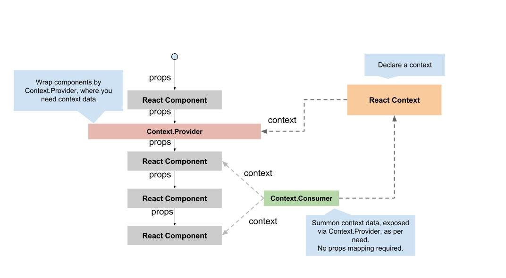
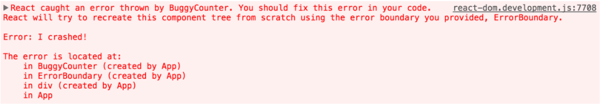
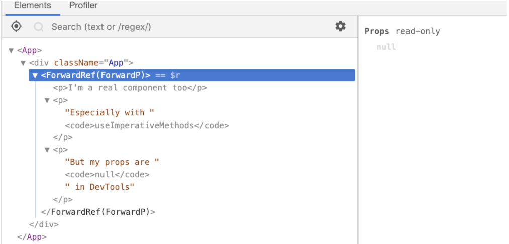
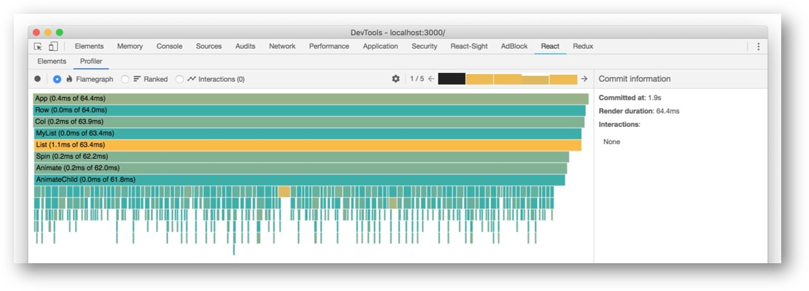

# ReactJS - Basics

> *Click &#9733; if you like the project. Your contributions are heartily ♡ welcome.*

<br/>

## Related Topics

* *[React Coding Practice](react-coding-practice.md)*
* *[React Quick Reference](react-quick-reference.md)*
* *[Redux Quick Reference](redux-quick-reference.md)*
* *[Jest Quick Reference](jest-quick-reference.md)*
* *[React Best Practices](best-practices.md)*
* *[React MCQ's](react-mcq.md)*
* *[React Unit Testing](https://github.com/learning-zone/react-unit-testing)*
* *[React Project - ToDo App](https://github.com/rahull0328/ToDo-React)*

<br/>

## Table of Contents

* React
  * [Introduction](#-1-introduction)
  * [React Setup](#-2-react-setup)
  * [React JSX](#-3-react-jsx)
  * [React Components](#-4-react-components)
    * [Functional Components](#-41-functional-components)
    * [Class Components](#-42-class-components)
      * [React Lifecycle](#-421-react-lifecycle)
    * [Pure Components](#-43-pure-components)
    * [Higher Order Components](#-44-higher-order-components)
    * [Lazy Loading](#-45-lazy-loading)
  * [React Props](#-5-react-props)
  * [React State](#-6-react-state)
  * [React Events](#-7-react-events)
  * [React Lists](#-8-react-lists)
  * [React RESTful API](#-9-react-restful-api)
  * [React Forms](#-10-react-forms)
  * [React Hooks](#-11-react-hooks)
  * [React Context](#-12-react-context)
  * [React Router](#-13-react-router)
  * [React Error Boundaries](#-14-react-error-boundaries)
  * [React Refs](#-15-react-refs)
  * [React Composition](#-16-react-composition)
  * [React CSS Styling](#-17-react-css-styling)
  * [React Internationalization](#-18-react-internationalization)
  * [React Testing](#-19-react-testing)
  * [React Miscellaneous](#-20-react-miscellaneous)

* Redux
  * [Redux Overview](#-1-redux-overview)
  * [Redux Setup](#-2-redux-setup)
  * [Redux Data Flow](#-3-redux-data-flow)
  * [Redux Store](#-4-redux-store)
  * [Redux Actions](#-5-redux-actions)
  * [Redux Reducers](#-6-redux-reducers)
  * [Redux Middleware](#-7-redux-middleware)
  * [Redux Forms](#-8-redux-forms)
  * [Redux Miscellaneous](#-9-redux-miscellaneous)

<br/>

## # 1. INTRODUCTION

<br/>

## Q. What is React.js?

React is a JavaScript library created for building fast and interactive user interfaces for web and mobile applications. It is an open-source, component-based, front-end library responsible only for the application view layer.

The main objective of ReactJS is to develop User Interfaces (UI) that improves the speed of the apps. It uses virtual DOM (JavaScript object), which improves the performance of the app. The JavaScript virtual DOM is faster than the regular DOM. We can use ReactJS on the client and server-side as well as with other frameworks. It uses component and data patterns that improve readability and helps to maintain larger apps.

**Reference:**

* *[https://reactjs.org/tutorial/tutorial.html](https://reactjs.org/tutorial/tutorial.html)*

<div align="right">
    <b><a href="#table-of-contents">↥ back to top</a></b>
</div>

## Q. How React works?

React implements a virtual DOM that is basically a DOM tree representation in Javascript. So when it needs to read or write to the DOM, it will use the virtual representation of it. Then the virtual DOM will try to find the most efficient way to update the browsers DOM.

Unlike browser DOM elements, React elements are plain objects and are cheap to create. React DOM takes care of updating the DOM to match the React elements. The reason for this is that JavaScript is very fast and it is worth keeping a DOM tree in it to speedup its manipulation.

<div align="right">
    <b><a href="#table-of-contents">↥ back to top</a></b>
</div>

## Q. List some of the major advantages and limitations of React?

<p align="center">
  
</p>

**Advantages:**  

* It relies on a virtual-dom to know what is really changing in UI and will re-render only what has really changed, hence better performance wise
* JSX makes components/blocks code readable. It displays how components are plugged or combined with.
* React data binding establishes conditions for creation dynamic applications.
* Prompt rendering. Using comprises methods to minimise number of DOM operations helps to optimise updating process and accelerate it.
Testable. React native tools are offered for testing, debugging code.
* SEO-friendly. React presents the first-load experience by server side rendering and connecting event-handlers on the side of the user:
    * React.renderComponentToString is called on the server.
    * React.renderComponent() is called on the client side.
    * React preserves markup rendered on the server side, attaches event handlers.  

**Limitations:**  

* Learning curve. Being not full-featured framework it is required in-depth knowledge for integration user interface free library into MVC framework.
* View-orientedness is one of the cons of ReactJS. It should be found 'Model' and 'Controller' to resolve 'View' problem.
* Not using isomorphic approach to exploit application leads to search engines indexing problems.

<div align="right">
    <b><a href="#table-of-contents">↥ back to top</a></b>
</div>

## Q. Why does React emphasize on unidirectional data flow?

It is also known as one-way data flow, which means the data has one, and only one way to be transferred to other parts of the application. In essence, this means child components are not able to update the data that is coming from the parent component. In React, data coming from a parent is called **props**.

In React this means that:

* state is passed to the view and to child components
* actions are triggered by the view
* actions can update the state
* the state change is passed to the view and to child components

The view is a result of the application state. State can only change when actions happen. When actions happen, the state is updated. One-way data binding provides us with some key advantages

* Easier to debug, as we know what data is coming from where.
* Less prone to errors, as we have more control over our data.
* More efficient, as the library knows what the boundaries are of each part of the system.

In React, a state is always owned by one component. Any changes made by this state can only affect the components below it, i.e its `children`. Changing state on a component will never affect its parent or its siblings, only the children will be affected. This is the main reason that the state is often moved up in the component tree so that it can be shared between the components that need to access it.

<div align="right">
    <b><a href="#table-of-contents">↥ back to top</a></b>
</div>

## Q. How to declare constant in react?

```js
// Constants.js

export const POSTURL = "http://localhost:3000/api/v1/patterns";
export const DELETEURL = "http://localhost:3000/api/v1/patterns/";

export const DeleteButton = require("./images/delete-icon.png");
export const LoadingWheel = require("./images/loading-wheel.gif");

```

```js
// App.js

import * as Constants from "./Constants";

const employee = {
  emp_id: 10,
  name: "Nakul Agate",
  email: "nakul.agate@email.com"
};

class App extends React.Component {
  render() {
    return (
      <div>
        <div>Employee Details :{JSON.stringify(employee)}</div>
        <div></div>
      </div>
    );
  }
}
```

**&#9885; [Try this example on CodeSandbox](https://codesandbox.io/s/react-constants-knzec?file=/src/App.js)**

<div align="right">
    <b><a href="#table-of-contents">↥ back to top</a></b>
</div>

## Q. What is Destructuring?

Destructuring is a convenient way of accessing multiple properties stored in objects and arrays. It was introduced to JavaScript by ES6 and has provided developers with an increased amount of utility when accessing data properties in Objects or Arrays.

When used, destructuring does not modify an object or array but rather copies the desired items from those data structures into variables. These new variables can be accessed later on in a React component.

**Example:**

```js
/**
 * Destructuring in React
 */
import React from "react";

export default function App() {
  // Destructuring
  const [counter, setcounter] = React.useState(0);

  return (
    <>
      <button onClick={() => setcounter(counter + 1)}> Increment </button>
      <button onClick={() => setcounter(counter > 0 ? counter - 1 : 0)}>
        Decrement
      </button>

      <h2>Result: {counter}</h2>
    </>
  );
}
```

**&#9885; [Try this example on CodeSandbox](https://codesandbox.io/s/destructuring-in-react-6fxnbh?file=/src/App.js)**

<div align="right">
    <b><a href="#table-of-contents">↥ back to top</a></b>
</div>

## Q. Why is it necessary to start component names with a capital letter?

In JSX, lower-case tag names are considered to be HTML tags. However, lower-case tag names with a dot (property accessor) aren\'t.

When an element type starts with a lowercase letter, it refers to a built-in component like or and results in a string `<div>` or `<span>` passed to `React.createElement`. Types that start with a capital letter like compile to `React.createElement(Foo)` and correspond to a component defined or imported in your JavaScript file.

* `<component />` compiles to `React.createElement('component')` (html tag)
* `<Component />` compiles to `React.createElement(Component)`
* `<obj.component />` compiles to `React.createElement(obj.component)`

<div align="right">
    <b><a href="#table-of-contents">↥ back to top</a></b>
</div>

## Q. What are fragments?

Fragments allows to group a list of children without adding extra nodes to the DOM.

**Example:**

```js
class App extends React.Component {
  render() {
    return (
      <React.Fragment>
        <ChildA />
        <ChildB />
        <ChildC />
      </React.Fragment>
    )
  }
}
```

**Benefits:**

* It\'s a tiny bit faster and has less memory usage (no need to create an extra DOM node). This only has a real benefit on very large and/or deep trees, but application performance often suffers from death by a thousand cuts. This is one cut less.
* Some CSS mechanisms like Flexbox and CSS Grid have a special parent-child relationship, and adding divs in the middle makes it hard to keep the desired layout while extracting logical components.
* The DOM inspector is less cluttered.

<div align="right">
    <b><a href="#table-of-contents">↥ back to top</a></b>
</div>

## Q. What is Virtual DOM?

In React, for every **DOM object**, there is a corresponding "virtual DOM object". A virtual DOM object is a representation of a DOM object, like a lightweight copy. A virtual DOM object has the same properties as a real DOM object, but it lacks the real thing\'s power to directly change what\'s on the screen.

Manipulating DOM is slow, but manipulating Virtual DOM is fast as nothing gets drawn on the screen. So each time there is a change in the state of our application, virtual DOM gets updated first instead of the real DOM.

**&#9885; [Virtual DOM Example](https://codesandbox.io/s/react-virtual-dom-2w52y?file=/src/index.js)**

<div align="right">
    <b><a href="#table-of-contents">↥ back to top</a></b>
</div>

## Q. What is the difference between ShadowDOM and VirtualDOM?

<p align="center">
  
</p>

**1. Document Object Model:**

It a way of representing a structured document via objects. It is cross-platform and language-independent convention for representing and interacting with data in HTML, XML, and others. Web browsers handle the DOM implementation details, so we can interact with it using JavaScript and CSS.

**2. Virtual DOM:**

Virtual DOM is any kind of representation of a real DOM. Virtual DOM is about avoiding unnecessary changes to the DOM, which are expensive performance-wise, because changes to the DOM usually cause re-rendering of the page. It allows to collect several changes to be applied at once, so not every single change causes a re-render, but instead re-rendering only happens once after a set of changes was applied to the DOM.

**3. Shadow DOM:**

Shadow DOM is mostly about encapsulation of the implementation. A single custom element can implement more-or-less complex logic combined with more-or-less complex DOM. Shadow DOM refers to the ability of the browser to include a subtree of DOM elements into the rendering of a document, but not into the main document DOM tree.

**Difference:**

The virtual DOM creates an additional DOM. The shadow DOM simply hides implementation details and provides isolated scope for web components.

<div align="right">
    <b><a href="#table-of-contents">↥ back to top</a></b>
</div>

## # 2. REACT SETUP

<br/>

## Q. How to set up a react project with create react app?

Create React App is an officially supported way to create single-page React applications. It offers a modern build setup with no configuration. This tool is wrapping all of the required dependencies like **Webpack**, **Babel** for React project itself.

**Requirements:**

The Create React App is maintained by Facebook and can works on any platform, for example, macOS, Windows, Linux, etc. To create a React Project using create-react-app, you need to have installed the following things in your system.

* [Node version >= 14](https://nodejs.org/en/download/)
* [Visual Studio Code Editor](https://code.visualstudio.com/download)

**Installation:**

```js
npx create-react-app my-app
cd my-app
npm start
```

**Output:**

Running any of these commands will create a directory called **my-app** inside the current folder. Inside that directory, it will generate the initial project structure and install the transitive dependencies:

```js
my-app
├── README.md
├── node_modules
├── package.json
├── .gitignore
├── public
│   ├── favicon.ico
│   ├── index.html
│   ├── logo192.png
│   ├── logo512.png
│   ├── manifest.json
│   └── robots.txt
└── src
    ├── App.css
    ├── App.js
    ├── App.test.js
    ├── index.css
    ├── index.js
    ├── logo.svg
    ├── serviceWorker.js
    └── setupTests.js
```

**Reference:**

* *[https://create-react-app.dev/docs/getting-started/](https://create-react-app.dev/docs/getting-started/)*

<div align="right">
    <b><a href="#table-of-contents">↥ back to top</a></b>
</div>

## Q. What are the features of create react app?

**Create React App** is a command-line program that lets us create a new React project easily and build the project into artifacts that we can deploy. It is created by the React team and creates a scaffold to the app.

Below are the list of some of the features provided by create react app.

* React, JSX, ES6, Typescript and Flow syntax support.
* Autoprefixed CSS
* CSS Reset/Normalize
* Live-editing CSS and JS in local development server.
* A fast interactive unit test runner with built-in support for coverage reporting
* A build script to bundle JS, CSS, and images for production, with hashes and sourcemaps
* An offline-first service worker and a web app manifest, meeting all the Progressive Web App criteria.

<div align="right">
    <b><a href="#table-of-contents">↥ back to top</a></b>
</div>

## Q. What does eject do in create react app?

The `create-react-app` commands generate **React App** with an excellent configuration and helps you build your React app with the best practices in mind to optimize it. However, running the `eject` script will remove the single build dependency from your project. That means it will copy the configuration files and the transitive dependencies (e.g. `Webpack`, `Babel`, etc.) as dependencies in the `package.json` file. If you do that, you\'ll have to ensure that the dependencies are installed before building your project.

After running the `eject`, commands like `npm start` and `npm run build` will still work, but they will point to the copied scripts so you can tweak them. It won\'t be possible to run it again since all scripts will be available except the eject one.

<div align="right">
    <b><a href="#table-of-contents">↥ back to top</a></b>
</div>

## Q. How to put React in production mode?

Create a simple `hello-world-app` using [create-react-app](https://create-react-app.dev/docs/getting-started).

```js
npx create-react-app hello-world-app
```

Modify the `App.js` file as shown below.

```js
import './App.css';

function App() {
  return (
    <div className="App">
      <header className="App-header">
        <h1>Hello world app</h1>
      </header>
    </div>
  );
}

export default App;
```

Run the app local server by running the following command

```js
npm start
```

On the local server (http://localhost:3000) you can see a simple React app displaying a "hello world" message. The next step is to make this app production-ready for deployment. Inside the root directory run the following command:

```js
npm run build
```

This creates a build directory inside the root directory, which bundles your React app and minifies it into simple HTML, CSS, and JavaScript files. This build folder serves your app via a simple entry point, `index.html`, where your entire React app resides. Running your app via a remote server means running this `index.html` file on the server.

<div align="right">
    <b><a href="#table-of-contents">↥ back to top</a></b>
</div>

## Q. What are the common folder structures for React?

React doesn\'t have opinions on how you put files into folders. That said there are a few common approaches popular in the ecosystem you may want to consider.

**1. Grouping by features or routes:**

One common way to structure projects is to locate CSS, JS, and tests together inside folders grouped by feature or route.

```js
common/
  Avatar.js
  Avatar.css
  APIUtils.js
  APIUtils.test.js
feed/
  index.js
  Feed.js
  Feed.css
  FeedStory.js
  FeedStory.test.js
  FeedAPI.js
profile/
  index.js
  Profile.js
  ProfileHeader.js
  ProfileHeader.css
  ProfileAPI.js
```

**2. Grouping by file type:**

Another popular way to structure projects is to group similar files together, for example:

```js
api/
  APIUtils.js
  APIUtils.test.js
  ProfileAPI.js
  UserAPI.js
components/
  Avatar.js
  Avatar.css
  Feed.js
  Feed.css
  FeedStory.js
  FeedStory.test.js
  Profile.js
  ProfileHeader.js
  ProfileHeader.css
```

<div align="right">
    <b><a href="#table-of-contents">↥ back to top</a></b>
</div>

## Q. What are the popular React-specific linter?

**1. ESLint:**

ESLint is a popular JavaScript linter. There are plugins available that analyse specific code styles. One of the most common for React is an npm package called `eslint-plugin-react`.

```js
npm install -g eslint-plugin-react
```

This will install the plugin we need, and in our ESLint config file, we just need a few extra lines.

```js
"extends": [
    "eslint:recommended",
    "plugin:react/recommended"
]
```

```js
"scripts": {
    "start": "react-scripts start",
    "build": "react-scripts build",
    "test": "react-scripts test --env=jsdom",
    "eject": "react-scripts eject",
    "lint": "eslint src/**/*.js src/**/*.jsx"
}
```

**2. eslint-plugin-jsx-a11y:**

It will help fix common issues with accessibility. As JSX offers slightly different syntax to regular HTML, issues with `alt` text and `tabindex`, for example, will not be picked up by regular plugins.

<div align="right">
    <b><a href="#table-of-contents">↥ back to top</a></b>
</div>

## Q. What is the browser support for react applications?

By default, **Create React App** generated project supports all modern browsers. Support for Internet Explorer 9, 10, and 11 requires polyfills. For a set of polyfills to support older browsers, use **react-app-polyfill**.

The `browserslist` configuration controls the outputted JavaScript so that the emitted code will be compatible with the browsers specified.

**Example:**

```js
// package.json

"browserslist": {
  "production": [
    ">0.2%",
    "not dead",
    "not op_mini all"
  ],
  "development": [
    "last 1 chrome version",
    "last 1 firefox version",
    "last 1 safari version"
  ]
}
```

<div align="right">
    <b><a href="#table-of-contents">↥ back to top</a></b>
</div>

## Q. Explain the use of Webpack and Babel in React?

**1. Babel:**

Babel is a JS transpiler that converts new JS code into old ones. It is a very flexible tool in terms of transpiling. One can easily add presets such as `es2015`, `es2016`, `es2017`, or `env`; so that Babel compiles them to ES5. Babel allows us to have a clean, maintainable code using the latest JS specifications without needing to worry about browser support.

**2. Webpack:**

Webpack is a modular build tool that has two sets of functionality — Loaders and Plugins. Loaders transform the source code of a module. For example, style-loader adds CSS to DOM using style tags. sass-loader compiles SASS files to CSS. babel-loader transpiles JS code given the presets. Plugins are the core of Webpack. They can do things that loaders can\'t. For example, there is a plugin called UglifyJS that minifies and uglifies the output of webpack.

**3. create-react-app:**

[create-react-app](https://create-react-app.dev/docs/getting-started/), a popular tool that lets you set up a React app with just one command. You don\'t need to get your hands dirty with Webpack or Babel because everything is preconfigured and hidden away from you.

**Example:** Quick Start

```bash
npx create-react-app my-app
cd my-app
npm start
```

<div align="right">
    <b><a href="#table-of-contents">↥ back to top</a></b>
</div>

## Q. What is the difference between ReactDOM and React?

The ReactDOM module exposes DOM-specific methods, while React has the core tools intended to be shared by React on different platforms (e.g. React Native).

**React** package contains: `React.createElement()`, `React.createClass()`, `React.Component()`, `React.PropTypes()`, `React.Children()`

**ReactDOM** package contains: `ReactDOM.render()`, `ReactDOM.unmountComponentAtNode()`, `ReactDOM.findDOMNode()`, and react-dom/server that including: `ReactDOMServer.renderToString()` and `ReactDOMServer.renderToStaticMarkup()`.

**Example:**

```js
/**
 * React vs ReactDOM
 */
import { createRoot } from "react-dom/client";

export default function App() {
  return <h1>Hello React</h1>;
}

const rootElement = document.getElementById("root");
const root = createRoot(rootElement);

root.render(<App />);
```

**&#9885; [Try this example on CodeSandbox](https://codesandbox.io/s/react-vs-reactdom-o52zfc?file=/src/index.js)**

<div align="right">
    <b><a href="#table-of-contents">↥ back to top</a></b>
</div>

## Q. What is ReactDOM?

ReactDOM is a package that provides DOM specific methods that can be used at the top level of a web app to enable an efficient way of managing DOM elements of the web page.

ReactDOM provides the developers with an API containing the following methods

* render()
* findDOMNode()
* unmountComponentAtNode()
* hydrate()
* createPortal()

**1. render():**

```js
ReactDOM.render(element, container, callback)
```

Render a React element into the DOM in the supplied container and return a reference to the component (or returns null for stateless components). If the React element was previously rendered into container, this will perform an update on it and only mutate the DOM as necessary to reflect the latest React element. If the optional callback is provided, it will be executed after the component is rendered or updated.

**&#9885; [Try this example on CodeSandbox](https://codesandbox.io/s/reactdom-render-cyddr?file=/src/index.js)**

**2. hydrate():**

```js
ReactDOM.hydrate(element, container, callback)
```

This method is equivalent to the `render()` method but is implemented while using server-side rendering. This function attempts to attach event listeners to the existing markup and returns a reference to the component or null if a stateless component was rendered.

**&#9885; [Try this example on CodeSandbox](https://codesandbox.io/s/react-hydrate-e2bw5?file=/src/index.js)**

**3. unmountComponentAtNode():**

```js
ReactDOM.unmountComponentAtNode(container)
```

This function is used to unmount or remove the React Component that was rendered to a particular container. It returns true if a component was unmounted and false if there was no component to unmount.

**&#9885; [Try this example on CodeSandbox](https://codesandbox.io/s/react-unmountcomponentatnode-yued6)**

**4. findDOMNode():**

```js
ReactDOM.findDOMNode(component)
```

If this component has been mounted into the DOM, this returns the corresponding native browser DOM element. This method is useful for reading values out of the DOM, such as form field values and performing DOM measurements.

**&#9885; [Try this example on CodeSandbox](https://codesandbox.io/s/react-finddomnode-ft936?file=/src/index.js)**

**5. createPortal():**

```js
ReactDOM.createPortal(child, container)
```

createPortal allow us to render a component into a DOM node that resides outside the current DOM hierarchy of the parent component.

**&#9885; [Try this example on CodeSandbox](https://codesandbox.io/s/react-portal-v2h6q?file=/src/index.js)**

<div align="right">
    <b><a href="#table-of-contents">↥ back to top</a></b>
</div>

## Q. How to build a progressive web app with react?

*ToDo*

<div align="right">
    <b><a href="#table-of-contents">↥ back to top</a></b>
</div>

## Q. What is the difference between create-react-app and webpack?

*ToDo*

<div align="right">
    <b><a href="#table-of-contents">↥ back to top</a></b>
</div>

## Q. What is the difference between grunt and webpack?

*ToDo*

<div align="right">
    <b><a href="#table-of-contents">↥ back to top</a></b>
</div>

## # 3. REACT JSX

<br/>

## Q. What is JSX?

JSX ( **JavaScript Expression** ) allows us to write HTML elements in JavaScript and place them in the DOM without any `createElement()` or `appendChild()` methods. JSX converts HTML tags into react elements. React uses JSX for templating instead of regular JavaScript. It is not necessary to use it, however, following are some pros that come with it.

* It is faster because it performs optimization while compiling code to JavaScript.
* It is also type-safe and most of the errors can be caught during compilation.
* It makes it easier and faster to write templates.

When JSX compiled, they actually become regular JavaScript objects. For instance, the code below:

```js
const hello = <h1 className = "greet"> Hello World </h1>
```

will be compiled to

```js
const hello = React.createElement {
    type: "h1",
    props: {
      className: "greet",  
      children: "Hello World"
    }
}
```

**Example:**

```js
export default function App() {
  return (
    <div className="App">
      <h1>Hello World!</h1>
    </div>
  );
}
```

**&#9885; [Try this example on CodeSandbox](https://codesandbox.io/s/react-jsx-zjmxvb?file=/src/App.js)**

<div align="right">
    <b><a href="#table-of-contents">↥ back to top</a></b>
</div>

## Q. How JSX prevents Injection Attacks?

React DOM escapes any values embedded in JSX before rendering them. Thus it ensures that you can never inject anything that\'s not explicitly written in your application. Everything is converted to a string before being rendered.

For example, you can embed user input as below,

```js
export default class JSXInjectionExample extends React.Component {

  constructor(props) {
    super(props);
    this.state = {
      userContent: `JSX prevents Injection Attacks Example 
          <script src="http://example.com/malicious-script.js></script>`
    };
  }

  render() {
    return (
      <div>User content: {this.state.userContent}</div>
    );
  }
}

// Output
User content: JSX prevents Injection Attacks Example 
<script src="http://example.com/malicious-script.js></script>
```

**&#9885; [Try this example on CodeSandbox](https://codesandbox.io/s/react-jsxinjection-ckmu8z?file=/src/App.js)**

<div align="right">
    <b><a href="#table-of-contents">↥ back to top</a></b>
</div>

## Q. What are the benefits of new JSX transform?

The React 17 release provides support for a new version of the JSX transform. There are three major benefits of new JSX transform,

* It enables you to use JSX without having to import React.
* The compiled output relatively improves the bundle size.
* The future improvements provides the flexibility to reduce the number of concepts to learn React.

<div align="right">
    <b><a href="#table-of-contents">↥ back to top</a></b>
</div>

## Q. Is it possible to use React without rendering HTML?

It is possible with latest version (>=16.2). Below are the possible options:

```js
render() {
  return false
}
```

```js
render() {
  return null
}
```

```js
render() {
  return []
}
```

```js
render() {
  return <React.Fragment></React.Fragment>
}
```

```js
render() {
  return <></>
}
```

Note that React can also run on the server side so, it will be possible to use it in such a way that it doesn\'t involve any DOM modifications (but maybe only the virtual DOM computation).

<div align="right">
    <b><a href="#table-of-contents">↥ back to top</a></b>
</div>

## Q. How to write comments in React and JSX?

Writing comments in React components can be done just like comment in regular JavaScript classes and functions.

**React comments:**

```js
function App() {

  // Single line Comment

  /*
  * multi
  * line
  * comment
  **/

  return (
    <h1>My Application</h1>
  );
}
```

**JSX comments:**

```js
export default function App() {
  return (
    <div>
      {/* A JSX comment */}
      <h1>My Application</h1>
    </div>
  );
}
```

<div align="right">
    <b><a href="#table-of-contents">↥ back to top</a></b>
</div>

## Q. How to add custom DOM attributes in JSX?

Custom attributes are supported natively in React 16. This means that adding a custom attribute to an element is now as simple as adding it to a render function, like so:

**Example:**

```js
// 1. Custom DOM Attribute
render() {
  return (
    <div custom-attribute="some-value" />
  );
}

// 2. Data Attribute ( starts with "data-" )
render() {
  return (
    <div data-id="10" />
  );
}

// 3. ARIA Attribute ( starts with "aria-" )
render() {
  return (
    <button aria-label="Close" onClick={onClose} />
  );
}
```

**&#9885; [Try this example on CodeSandbox](https://codesandbox.io/s/react-custom-attribute-8enl34?file=/src/App.js)**

<div align="right">
    <b><a href="#table-of-contents">↥ back to top</a></b>
</div>

## Q. How many outermost elements can be there in a JSX expression?

A JSX expression must have only one outer element. For Example:

```js
const headings = (
    <div id = "outermost-element">
       <h1>I am a heading </h1>
       <h2>I am also a heading</h2>
    </div>
)
```

<div align="right">
    <b><a href="#table-of-contents">↥ back to top</a></b>
</div>

## Q. How to loop inside JSX?

You can simply use `Array.prototype.map` with ES6 arrow function syntax.

**Example:**

```js
/**
 * Loop inside JSX
 */
const animals = [
  { id: 1, animal: "Dog" },
  { id: 2, animal: "Bird" },
  { id: 3, animal: "Cat" },
  { id: 4, animal: "Mouse" },
  { id: 5, animal: "Horse" }
];

export default function App() {
  return (
    <ul>
      {animals.map((item) => (
        <li key={item.id}>{item.animal}</li>
      ))}
    </ul>
  );
}
```

**&#9885; [Try this example on CodeSandbox](https://codesandbox.io/s/react-jsx-loop-9x2pi?file=/src/App.js)**

<div align="right">
    <b><a href="#table-of-contents">↥ back to top</a></b>
</div>

## Q. How do you print false values in JSX?

In React, boolean values (`true` and `false`), `null`, and `undefined` are valid children, but these values will not be rendered in UI if you put them directly inside {} in JSX.

For example, all these JSX expressions will result in the same empty div:

```js
<div />
<div></div>
<div>{false}</div>
<div>{null}</div>
<div>{undefined}</div>
<div>{true}</div>
```

If you want a value like `false`, `true`, `null`, or `undefined` to show in the output, you have to convert it to a string first.

```js
<div>{String(true)}</div>
<div>{String(false)}</div>
<div>{String(undefined)}</div>
<div>{String(null)}</div>
```

In the output, this will render `true`, `false`, `undefined`, and `null` respectively.

**&#9885; [Try this example on CodeSandbox](https://codesandbox.io/s/react-rendering-false-values-1g1rm?file=/src/App.js)**

<div align="right">
    <b><a href="#table-of-contents">↥ back to top</a></b>
</div>

## Q. How to use React label element?

If you try to render a `<label>` element bound to a text input using the standard `for` attribute, then it produces HTML missing that attribute and prints a warning to the console.

```js
<label for={'user'}>{'User'}</label>
<input type={'text'} id={'user'} />
```

Since `for` is a reserved keyword in JavaScript, use `htmlFor` instead.

```js
<label htmlFor={'user'}>{'User'}</label>
<input type={'text'} id={'user'} />
```

<div align="right">
    <b><a href="#table-of-contents">↥ back to top</a></b>
</div>

## Q. How to use InnerHtml in React?

The **innerHTML** is risky because it is easy to expose users to a cross-site scripting (XSS) attack. React provides **dangerouslySetInnerHTML** as a replacement for innerHTML. It allows to set HTML directly from React by using `dangerouslySetInnerHTML` and passing an object with a `__html` key that holds HTML.

**Example:**

```js
/**
 * InnerHtml in React
 */
import React from "react";

export default function App() {
  return (
    <div
      dangerouslySetInnerHTML={{
        __html: "<p>This text is set using <b>dangerouslySetInnerHTML</b></p>"
      }}
    ></div>
  );
}
```

**&#9885; [Try this example on CodeSandbox](https://codesandbox.io/s/react-dangerouslysetinnerhtml-i4wqq?file=/src/App.js)**

<div align="right">
    <b><a href="#table-of-contents">↥ back to top</a></b>
</div>

## Q. How to show and hide elements in React

**1. Returning Null:**

```js
const AddToCart = ({ available }) => {
  if (!available) return null

  return (
    <div className="full tr">
      <button className="product--cart-button">Add to Cart</button>
    </div>
  )
}
```

**2. Ternary Display:**

When you need to control whether one element vs. another is displayed, or even one element vs. nothing at all (null), you can use the ternary operator embedded inside of a larger portion of JSX.

```js
<div className="half">
  <p>{description}</p>

  {remaining === 0 ? (
    <span className="product-sold-out">Sold Out</span>
  ) : (
    <span className="product-remaining">{remaining} remaining</span>
  )}
</div>
```

In this case, if there are no products remaining, we will display "Sold Out"; otherwise we will display the number of products remaining.

**3. Shortcut Display:**

It involves using a conditional inside of your JSX that looks like `checkIfTrue && <span>display if true</span>`. Because if statements that use `&&` operands stop as soon as they find the first value that evaluates to false, it won\'t reach the right side (the JSX) if the left side of the equation evaluates to false.

```js
<h2>
  <span className="product--title__large">{nameFirst}</span>
  {nameRest.length > 0 && (
    <span className="product--title__small">{nameRest.join(" ")}</span>
  )}
</h2>
```

**4. Using Style Property:**

```js
<div style={{ display: showInfo ? "block" : "none" }}>info</div>
```

<div align="right">
    <b><a href="#table-of-contents">↥ back to top</a></b>
</div>

## # 4. REACT COMPONENTS

<br/>

## Q. What are React components?

Components are the building blocks of any React app and a typical React app will have many of these. Simply put, a component is a JavaScript class or function that optionally accepts inputs i.e. properties(`props`) and returns a React element that describes how a section of the UI (User Interface) should appear.

In React, a **Stateful Component** is a component that holds some state. A **Stateless component**, by contrast, has no state. Note that both types of components can use props.

**1. Stateless Component:**

```js
import React from 'react'

const ExampleComponent = (props) => {
    return <h1>Stateless Component - {props.message}</h1>;
};

const App = () => {
  const message = 'React Interview Questions'
  return (
    <div>
      <ExampleComponent message={message} />
    </div>
  );
};

export default App;
```

The above example shows a stateless component named ExampleComponent which is inserted in the `<App/>` component. The `ExampleComponent` just comprises of a `<h1>` element. Although the **Stateless component** has no state, it still receives data via props from a parent component.

**2. Stateful Component:**

```js
import React, { useState } from 'react'

const ExampleComponent = (props) => {
  const [email, setEmail] = useState(props.defaultEmail)

  const changeEmailHandler = (e) => {
    setEmail(e.target.value)
  }

  return (
    <input type="text" value={email} onChange={changeEmailHandler} />
  );
}


const App = () => {
  const defaultEmail = "suniti.mukhopadhyay@gmail.com"
  return (
    <div>
      <ExampleComponent defaultEmail={defaultEmail} />
    </div>
  );
};

export default App;
```

The above example shows a stateful component named **ExampleComponent** which is inserted in the `<App/>` component. The **ExampleComponent** contains a `<input>`. First of all, in the **ExampleComponent**, we need to assign **defaultEmail** by props to a local **state** by a `useState()` hook in **ExampleComponent**.

Next, we have to pass **email** to **value** property of a input tag and pass a function **changeEmailHandler** to an `onChange()` event for a purpose keeping track of the current value of the input.

<div align="right">
    <b><a href="#table-of-contents">↥ back to top</a></b>
</div>

## Q. What is the difference between Component and Container in React?

The **presentational** components are concerned with the look, **container** components are concerned with making things work.

For example, this is a presentational component. It gets data from its props, and just focuses on showing an element

```js
/**
 * Presentational Component 
 */
const Users = props => (
  <ul>
    {props.users.map(user => (
      <li>{user}</li>
    ))}
  </ul>
)
```

On the other hand this is a container component. It manages and stores its own data, and uses the presentational component to display it.

```js
/**
 * Container Component 
 */
class UsersContainer extends React.Component {
  constructor() {
    this.state = {
      users: []
    }
  }

  componentDidMount() {
    axios.get('/users').then(users =>
      this.setState({ users: users }))
    )
  }

  render() {
    return <Users users={this.state.users} />
  }
}
```

<div align="right">
    <b><a href="#table-of-contents">↥ back to top</a></b>
</div>

## Q. How to import and export components using React.js?

```js
// Importing combination
import React, { Component } from 'react';
import ReactDOM from 'react-dom';

// Wrapping components with braces if no default exports
import { Button }  from './Button';

// Default exports ( recommended )
import  Button  from './Button';
 
class DangerButton extends Component {
    render()
    {
        return <Button color="red" />;
    }
}

export default DangerButton; 
// or export DangerButton;
```

By using default you express that\'s going to be member in that module which would be imported if no specific member name is provided. You could also express you want to import the specific member called DangerButton by doing so: `import { DangerButton } from './comp/danger-button';` in this case, no default is needed

<div align="right">
    <b><a href="#table-of-contents">↥ back to top</a></b>
</div>

## Q. What is difference between declarative and imperative in React.js?

**1. Imperative programming:**

It is a programming paradigm that uses statements that change a program\'s state.

```js
const string = "Hi there , I'm a web developer";
let removeSpace = "";
for (let i = 0; i < i.string.length; i++) {
  if (string[i] === " ") removeSpace += "-";
  else removeSpace += string[i]; 
}
console.log(removeSpace);
```

In this example, we loop through every character in the string, replacing spaces as they occur. Just looking at the code, it doesn\'t say much. Imperative requires lots of comments in order to understand code. Whereas in the declarative program, the syntax itself describes what should happen and the details of how things happen are abstracted way.

**2. Declarative programming:**

It is a programming paradigm that expresses the logic of a computation without describing its control flow.

**Example:**

```js
const { render } = ReactDOM
const Welcome = () => (
  <div id="App">
    //your HTML code 
    //your react components
  </div>
)
render(
<App />,
document.getElementById('root')
)
```

React is declarative. Here, the **Welcome** component describes the DOM that should be rendered. The render function uses the instructions declared in the component to build the DOM, abstracting away the details of how the DOM is to be rendered. We can clearly see that we want to render our **Welcome** component into the element with the ID of 'target'.

<div align="right">
    <b><a href="#table-of-contents">↥ back to top</a></b>
</div>

## Q. What is the difference between Element and Component?

**1. React Element:**

It is a simple object that describes a DOM node and its attributes or properties. It is an immutable description object and you can not apply any methods on it.

```js
const element = <h1>React Element Example!</h1>;
ReactDOM.render(element, document.getElementById('app'));
```

**2. React Component:**

It is a function or class that accepts an input and returns a React element. It has to keep references to its DOM nodes and to the instances of the child components.

```js
function Message() {
  return <h2>React Component Example!</h2>;
}
ReactDOM.render(<Message />, document.getElementById('app'));
```

<div align="right">
    <b><a href="#table-of-contents">↥ back to top</a></b>
</div>

## Q. How to conditionally render components in react?

Conditional rendering is a term to describe the ability to render different user interface (UI) markup if a condition is true or false. In React, it allows us to render different elements or components based on a condition.

**1. Element Variables:**

You can use variables to store elements. This can help you conditionally render a part of the component while the rest of the output doesn\'t change.

```js
function LogInComponent(props) {
  const isLoggedIn = props.isLoggedIn;
  if (isLoggedIn) {
    return <UserComponent />;
  }
  return <GuestComponent />;
}

ReactDOM.render(
  <LogInComponent isLoggedIn={false} />,
  document.getElementById('root')
);
```

**2. Inline If-Else with Conditional Operator:**

```js
render() {
  const isLoggedIn = this.state.isLoggedIn;
  return (
    <div>
      {isLoggedIn
        ? <LogoutButton onClick={this.handleLogoutClick} />
        : <LoginButton onClick={this.handleLoginClick} />
      }
    </div>
  );
}
```

**&#9885; [Try this example on CodeSandbox](https://codesandbox.io/s/react-conditional-render-xjvr10?file=/src/App.js)**

<div align="right">
    <b><a href="#table-of-contents">↥ back to top</a></b>
</div>

## Q. How to conditionally add attributes to React components?

Inline conditionals in attribute props

```js
/**
 * Conditionally add attributes
 */
import React from "react";

export default function App() {
  const [mood] = React.useState("happy");

  const greet = () => alert("Hi there! :)");

  return (
    <button onClick={greet} disabled={"happy" === mood ? false : true}>
      Say Hi
    </button>
  );
}
```

**&#9885; [Try this example on CodeSandbox](https://codesandbox.io/s/conditional-attributes-n13jg0?file=/src/App.js)**

<div align="right">
    <b><a href="#table-of-contents">↥ back to top</a></b>
</div>

## Q. How would you prevent a component from rendering?

React **shouldComponentUpdate()** is a performance optimization method, and it tells React to avoid re-rendering a component, even if state or prop values may have changed. This method only used when a component will stay static or pure.

The React `shouldComponentUpdate()` method return `true` if it needs to re-render or `false` to avoid being re-render.

**Syntax:**

```js
shouldComponentUpdate(nextProps, nextState){ }
```

**Example:**

```js
/**
 * Prevent a component from rendering
 */
export default class App extends React.Component {
  constructor() {
    super();
    this.state = {
      countOfClicks: 0
    };
    this.handleClick = this.handleClick.bind(this);
  }

  handleClick() {
    this.setState({
      countOfClicks: this.state.countOfClicks + 1
    });
  }

  shouldComponentUpdate(nextProps, nextState) {
    console.log("this.state.countOfClicks", this.state.countOfClicks);
    console.log("nextState.countOfClicks", nextState.countOfClicks);
    return true;
  }

  render() {
    return (
      <div>
        <h2>shouldComponentUpdate Example</h2>
        <p>Count of clicks: <b>{this.state.countOfClicks}</b></p>
        <button onClick={this.handleClick}>CLICK ME</button>
      </div>
    );
  }
}
```

**&#9885; [Try this example on CodeSandbox](https://codesandbox.io/s/react-shouldcomponentupdate-mryjv?file=/src/App.js)**

<div align="right">
    <b><a href="#table-of-contents">↥ back to top</a></b>
</div>

## Q. When would you use StrictMode component in React?

The **StrictMode** is a tool for highlighting potential problems in an application. Like `Fragment`, `StrictMode` does not render any visible UI. It activates additional checks and warnings for its descendants.

Strict mode checks are run in development mode only; they do not impact the production build.

**Example:**

```js
/**
 * StrictMode
 */
import { StrictMode } from "react";
import MyComponent from "./MyComponent";

export default function App() {
  return (
    <StrictMode>
      <MyComponent />
    </StrictMode>
  );
}
```

React StrictMode, in order to be efficient and avoid potential problems by any side-effects, needs to trigger some methods and lifecycle hooks twice. These are:

* Class component constructor() method
* The render() method
* setState() updater functions (the first argument)
* The static getDerivedStateFromProps() lifecycle
* React.useState() function

**Benefits of StrictMode:**

* Identifying components with unsafe lifecycles
* Warning about legacy string ref API usage
* Warning about deprecated findDOMNode usage
* Detecting unexpected side effects
* Detecting legacy context API

<div align="right">
    <b><a href="#table-of-contents">↥ back to top</a></b>
</div>

## Q. Why to avoid using setState() after a component has been unmounted?

Calling `setState()` after a component has unmounted will emit a warning. The "setState warning" exists to help you catch bugs, because calling `setState()` on an unmounted component is an indication that your app/component has somehow failed to clean up properly.

Specifically, calling `setState()` in an unmounted component means that your app is still holding a reference to the component after the component has been unmounted - which often indicates a memory leak.

**Example:**

```js
/**
 * setState() in unmounted component
 */
import React, { Component } from "react";
import axios from "axios";

export default class App extends Component {
  _isMounted = false; // flag to check Mounted

  constructor(props) {
    super(props);

    this.state = {
      news: []
    };
  }

  componentDidMount() {
    this._isMounted = true;

    axios
      .get("https://hn.algolia.com/api/v1/search?query=react")
      .then((result) => {
        if (this._isMounted) {
          this.setState({
            news: result.data.hits
          });
        }
      });
  }

  componentWillUnmount() {
    this._isMounted = false;
  }

  render() {
    return (
      <ul>
        {this.state.news.map((topic) => (
          <li key={topic.objectID}>{topic.title}</li>
        ))}
      </ul>
    );
  }
}
```

Here, even though the component got unmounted and the request resolves eventually, the flag in component will prevent to set the state of the React component after it got unmounted.

**&#9885; [Try this example on CodeSandbox](https://codesandbox.io/s/react-setstate-in-unmount-qmjn7m?file=/src/App.js)**

<div align="right">
    <b><a href="#table-of-contents">↥ back to top</a></b>
</div>

## Q. What is Lifting State Up in ReactJS?

The common approach to share **state** between two components is to move the state to common parent of the two components. This approach is called as lifting state up in React.js. With the shared state, changes in state reflect in relevant components simultaneously.

**Example:**

The App component containing PlayerContent and PlayerDetails component. PlayerContent shows the player name buttons. PlayerDetails shows the details of the in one line.

The app component contains the state for both the component. The selected player is shown once we click on the one of the player button.

```js
/**
 * Lifting State Up
 */
import React from "react";
import PlayerContent from "./PlayerContent";
import PlayerDetails from "./PlayerDetails";

export default class App extends React.Component {
  constructor(props) {
    super(props);
    this.state = { selectedPlayer: [0, 0], playerName: "" };
    this.updateSelectedPlayer = this.updateSelectedPlayer.bind(this);
  }
  updateSelectedPlayer(id, name) {
    const arr = [0, 0, 0, 0];
    arr[id] = 1;
    this.setState({
      playerName: name,
      selectedPlayer: arr
    });
  }
  render() {
    return (
      <div>
        <PlayerContent
          active={this.state.selectedPlayer[0]}
          clickHandler={this.updateSelectedPlayer}
          id={0}
          name="Player 1"
        />
        <PlayerContent
          active={this.state.selectedPlayer[1]}
          clickHandler={this.updateSelectedPlayer}
          id={1}
          name="Player 2"
        />
        <PlayerDetails name={this.state.playerName} />
      </div>
    );
  }
}
```

```js
/**
 * PlayerContent
 */
import React, { Component } from "react";

export default class PlayerContent extends Component {
  render() {
    return (
      <button
        onClick={() => {
          this.props.clickHandler(this.props.id, this.props.name);
        }}
        style={{ color: this.props.active ? "red" : "blue" }}
      >
        {this.props.name}
      </button>
    );
  }
}
```

```js
/**
 * PlayerDetails
 */
import React, { Component } from "react";

export default class PlayerDetails extends Component {
  render() {
    return <h2>{this.props.name}</h2>;
  }
}
```

**&#9885; [Try this example on CodeSandbox](https://codesandbox.io/s/react-lifting-state-up-z8xkci?file=/src/App.js)**

<div align="right">
    <b><a href="#table-of-contents">↥ back to top</a></b>
</div>

## Q. What is "Children" in React?

In React, **children** refer to the generic box whose contents are **unknown** until they\'re passed from the parent component. Children allows to pass components as data to other components, just like any other prop you use.

The special thing about children is that React provides support through its `ReactElement API` and `JSX`. XML children translate perfectly to React children!

**Example:**

```js
/**
 * Children in React
 */
const Picture = (props) => {
  return (
    <div>
      
      {props.children}
    </div>
  )
}
```

This component contains an `` that is receiving some props and then it is displaying `{props.children}`.
Whenever this component is invoked `{props.children}` will also be displayed and this is just a reference to what is between the opening and closing tags of the component.

```js
/**
 * App.js
 */

render () {
  return (
    <div className='container'>
      <Picture key={picture.id} src={picture.src}>
          {/** what is placed here is passed as props.children **/}
      </Picture>
    </div>
  )
}
```

<div align="right">
    <b><a href="#table-of-contents">↥ back to top</a></b>
</div>

## Q. What is Compound Components in React?

The Compound components are a pattern in which components are used together such that they share an implicit state that lets them communicate with each other in the background.

Internally they are built to operate on a set of data that is passed in through children instead of props. Behind the scenes they make use of React\'s lower level API such as `React.children.map()`, and `React.cloneElement()`. Using these methods, the component is able to express itself in such a way that promotes patterns of composition and extensibility.

**Example:**

```js
function App() {
  return (
    <Menu>
      <MenuButton>
        Actions <span aria-hidden>▾</span>
      </MenuButton>
      <MenuList>
        <MenuItem onSelect={() => alert('Download')}>Download</MenuItem>
        <MenuItem onSelect={() => alert('Copy')}>Create a Copy</MenuItem>
        <MenuItem onSelect={() => alert('Delete')}>Delete</MenuItem>
      </MenuList>
    </Menu>
  )
}
```

In this example, the `<Menu>` establishes some shared implicit state. The `<MenuButton>`, `<MenuList>`, and `<MenuItem>` components each access and/or manipulate that state, and it\'s all done implicitly. This allows you to have the expressive API you're looking for.

<div align="right">
    <b><a href="#table-of-contents">↥ back to top</a></b>
</div>

## # 4.1. FUNCTIONAL COMPONENTS

<br/>

## Q. What are functional components in react?

A React functional component is a simple JavaScript function that accepts **props** and returns a React element. It also referred as **stateless** components as it simply accept data and display them in some form.

After the introduction of React Hooks, writing functional components has become the ​standard way of writing React components in modern applications.

**Example:**

```js
function Welcome(props) {
  return <h1>Hello, {props.name}</h1>;
}

const element = <Welcome name="World!" />;

ReactDOM.render(
  element,
  document.getElementById('root')
);
```

**&#9885; [Try this example on CodeSandbox](https://codepen.io/learning-zone/pen/MWmEmRj?editors=0010)**

<div align="right">
    <b><a href="#table-of-contents">↥ back to top</a></b>
</div>

## # 4.2. CLASS COMPONENTS

<br/>

## Q. What are class components in react?

The class component, a stateful/container component, is a regular ES6 class that extends the component class of the React library. It is called a stateful component because it controls how the state changes and the implementation of the component logic. Aside from that, they have access to all the different phases of a React lifecycle method.

**Example:**

```js
class Welcome extends React.Component {
  render() {
    return <h1>Hello, {this.props.name}</h1>;
  }
}

const element = <Welcome name="World!" />;

ReactDOM.render(
  element,
  document.getElementById('root')
);
```

**&#9885; [Try this example on CodeSandbox](https://codepen.io/learning-zone/pen/BaRwZyB)**

<div align="right">
    <b><a href="#table-of-contents">↥ back to top</a></b>
</div>

## Q. What is the recommended ordering of methods in class component?

* static methods
* constructor()
* getChildContext()
* componentWillMount()
* componentDidMount()
* componentWillReceiveProps()
* shouldComponentUpdate()
* componentWillUpdate()
* componentDidUpdate()
* componentWillUnmount()
* click handlers or event handlers like `onClickSubmit()` or `onChangeDescription()`
* getter methods for render like `getSelectReason()` or `getFooterContent()`
* optional render methods like `renderNavigation()` or `renderProfilePicture()`
* render()

<div align="right">
    <b><a href="#table-of-contents">↥ back to top</a></b>
</div>

## Q. How to create a dynamic table in react?

```js
/**
 * Generate dynamic table in React
 */
class Table extends React.Component {
   constructor(props) {
      super(props)
      this.state = {
         employees: [
            { id: 10, name: 'Swarna Sachdeva', email: 'swarna@email.com' },
            { id: 20, name: 'Sarvesh Date', email: 'sarvesh@email.com' },
            { id: 30, name: 'Diksha Meka', email: 'diksha@email.com' }
         ]
      }
   }

   renderTableHeader() {
      let header = Object.keys(this.state.employees[0])
      return header.map((key, index) => {
         return <th key={index}>{key.toUpperCase()}</th>
      })
   }

   renderTableData() {
      return this.state.employees.map((employee, index) => {
         const { id, name, email } = employee 
         return (
            <tr key={id}>
               <td>{id}</td>
               <td>{name}</td>
               <td>{email}</td>
            </tr>
         )
      })
   }

   render() {
      return (
         <div>
            <h1 id='title'>React Dynamic Table</h1>
            <table id='employees'>
               <tbody>
                  <tr>{this.renderTableHeader()}</tr>
                  {this.renderTableData()}
               </tbody>
            </table>
         </div>
      )
   }
}
```

**&#9885; [Try this example on CodeSandbox](https://codepen.io/learning-zone/pen/wvdeqBm?editors=0110)**

<div align="right">
    <b><a href="#table-of-contents">↥ back to top</a></b>
</div>

## Q. How to prevent component from rendering in React?

You can prevent component from rendering by returning `null` based on specific condition. This way it can conditionally render component.

In the example below, the `<WarningBanner />` is rendered depending on the value of the prop called warn. If the value of the prop is `false`, then the component does not render:

```js
function WarningBanner(props) {
  if (!props.warn) {
    return null;
  }

  return (
    <div className="warning">
      Warning!
    </div>
  );
}
```

```js
class Page extends React.Component {
  constructor(props) {
    super(props);
    this.state = {showWarning: true};
    this.handleToggleClick = this.handleToggleClick.bind(this);
  }

  handleToggleClick() {
    this.setState(state => ({
      showWarning: !state.showWarning
    }));
  }

  render() {
    return (
      <div>
        { /* Prevent component render if value of the prop is false */}
        <WarningBanner warn={this.state.showWarning} />
        <button onClick={this.handleToggleClick}>
          {this.state.showWarning ? 'Hide' : 'Show'}
        </button>
      </div>
    );
  }
}

ReactDOM.render(
  <Page />,
  document.getElementById('root')
);
```

**&#9885; [Try this example on CodeSandbox](https://codepen.io/learning-zone/pen/GRmMvWr?editors=0110)**

<div align="right">
    <b><a href="#table-of-contents">↥ back to top</a></b>
</div>

## Q. How do you set a timer to update every second?

Using `setInterval()` inside React components allows us to execute a function or some code at specific intervals. A function or block of code that is bound to an interval executes until it is stopped. To stop an interval, we can use the `clearInterval()` method.

**Example:**

```js
class Clock extends React.Component {
  constructor(props) {
    super(props)
    this.state = {
      time: new Date().toLocaleString()
    }
  }
  componentDidMount() {
    this.intervalID = setInterval(
      () => this.tick(),
      1000
    )
  }
  componentWillUnmount() {
    clearInterval(this.intervalID)
  }
  tick() {
    this.setState({
      time: new Date().toLocaleString()
    })
  }
  render() {
    return (
      <p className="App-clock">
        The time is {this.state.time}.
      </p>
    )
  }
}
```

<div align="right">
    <b><a href="#table-of-contents">↥ back to top</a></b>
</div>

## Q. Differentiate between stateful and stateless components?

Stateful and stateless components have many different names. They are also known as:

– Container vs Presentational components  
– Smart vs Dumb components  

The literal difference is that one has state, and the other does not. That means the stateful components are keeping track of changing data, while stateless components print out what is given to them via props, or they always render the same thing.

**Example:** Stateful/Container/Smart component

```js
class Welcome extends React.Component {
  render() {
    return <h1>This is a React Class Component</h1>;
  }
}
```

**Example:** Stateless/Presentational/Dumb component

```js
function welcome(props) {
  return <h1>This is a React Functional Component</h1>;
}
```

|Class Components                               |Functional Components                                 |
|-----------------------------------------------|-------------------------------------------------------|
|Class components need to extend the component from "React.Component" and create a render function that returns the required element. | Functional components are like normal functions which take "props" as the argument and return the required element.|
|They are also known as stateful components.    |They are also known as stateless components.|
|They implement logic and the state of the component.|They accept some kind of data and display it in the UI.|
|Lifecycle methods can be used inside them.     |Lifecycle methods cannot be used inside them.|
|It needs to store state therefore constructors are used.|Constructors are not used in it.|
|It has to have a "render()" method inside that. |It does not require a render method.|

<div align="right">
    <b><a href="#table-of-contents">↥ back to top</a></b>
</div>

## Q. What is the purpose of using super constructor with props argument?

The `super()` keyword is used to call the parent constructor. `super(props)` would pass `props` to the parent constructor.

```js
/**
 * super constructor
 */
class App extends React.Component {
  constructor(props) {
      super(props)
      this.state = {}
   }

  // React says we have to define render()
  render() {
    return <div>Hello world</div>
  }
}

export default App
```

Here, `super(props)` would call the `React.Component` constructor passing in props as the argument.

<div align="right">
    <b><a href="#table-of-contents">↥ back to top</a></b>
</div>

## Q. What is the difference between Element, Component and Component instance in React?

**1. React Elements:**

A React Element is just a plain old JavaScript Object without own methods. It has essentially four properties:

* **type**: a String representing an HTML tag or a reference referring to a React Component
* **key**: a String to uniquely identify an React Element
* **ref**: a reference to access either the underlying DOM node or React Component Instance)
* **props**: (properties Object)

A React Element is not an instance of a React Component. It is just a simplified "description" of how the React Component Instance to be created should look like.

**2. React Components and React Component Instances:**

A React Component is used by extending `React.Component`. If a React Component is instantiated it expects a props Object and returns an instance, which is referred to as a React Component Instance.

A React Component can contain state and has access to the React Lifecycle methods. It must have at least a `render` method, which returns a React Element(-tree) when invoked.

**Example:**

```js
/**
 * React Component Instances
 */
import React from 'react'
import ReactDOM from 'react-dom'

class MyComponent extends React.Component {
  constructor(props) {
    super(props)
    console.log('This is a component instance:' + this)
  }

  render() {
    const another_element = <div>Hello, World!</div>
    console.log('This is also an element:' + another_element)
    return another_element
  }
}

console.log('This is a component:' + MyComponent)

const element = <MyComponent/>
console.log('This is an element:' + element)

ReactDOM.render(element, document.getElementById('root'));
```

<div align="right">
    <b><a href="#table-of-contents">↥ back to top</a></b>
</div>

## Q. What does shouldComponentUpdate do and why is it important?

The `shouldComponentUpdate()` method allows Component to exit the Update life cycle if there is no reason to apply a new render. React does not deeply compare `props` by default. When `props` or `state` is updated React assumes we need to re-render the content.

The default implementation of this function returns true so to stop the re-render you need to return false here:

```js
shouldComponentUpdate(nextProps, nextState) {
  console.log(nextProps, nextState)
  console.log(this.props, this.state)
  return false  
}
```

**Preventing unnecessary renders:**

The `shouldComponentUpdate()` method is the first real life cycle optimization method that we can leverage in React. It checks the current props and state, compares it to the next props and state and then returns true if they are different, or false if they are the same. This method is not called for the initial render or when `forceUpdate()` is used.

<div align="right">
    <b><a href="#table-of-contents">↥ back to top</a></b>
</div>

<div align="right">
    <b><a href="#table-of-contents">↥ back to top</a></b>
</div>

## Q. What is the purpose of render() function in React?

The React class components uses render() function. It is used to update the UI.

**Purpose of render():**

* React renders HTML to the web page by using a function called render().
* The purpose of the function is to display the specified HTML code inside the specified HTML element.
* In the render() method, we can read props and state and return our JSX code to the root component of our app.
* In the render() method, we cannot change the state, and we cannot cause side effects ( such as making an HTTP request to the webserver).

```js
/**
 * render() function
 * 
 * React v18.0.0
 */
import React from "react";
import { createRoot } from "react-dom/client";

class App extends React.Component {
  render() {
    return <h1>Render() Method Example</h1>;
  }
}

const container = document.getElementById("root");
const root = createRoot(container);
root.render(<App />);
```

**&#9885; [Try this example on CodeSandbox](https://codesandbox.io/s/react-render-l2q7qk?file=/src/index.js)**

<div align="right">
    <b><a href="#table-of-contents">↥ back to top</a></b>
</div>

## # 4.2.1. REACT LIFECYCLE

<br/>

## Q. What are the different phases of React component lifecycle?

React provides several methods that notify us when certain stage of this process occurs. These methods are called the component lifecycle methods and they are invoked in a predictable order. The lifecycle of the component is divided into four phases.

<p align="center">
  
</p>

**1. Mounting:**  

These methods are called in the following order when an instance of a component is being created and inserted into the DOM:

* `constructor()`
* `getDerivedStateFromProps()`
* `render()`
* `componentDidMount()`

**2. Updating:**  

The next phase in the lifecycle is when a component is updated. A component is updated whenever there is a change in the component\'s state or props.

React has five built-in methods that gets called, in this order, when a component is updated:

* `getDerivedStateFromProps()`
* `shouldComponentUpdate()`
* `render()`
* `getSnapshotBeforeUpdate()`
* `componentDidUpdate()`

**3. Unmounting:**  

The next phase in the lifecycle is when a component is removed from the DOM, or unmounting as React likes to call it.

* `componentWillUnmount()`

<div align="right">
    <b><a href="#table-of-contents">↥ back to top</a></b>
</div>

## Q. How to make component to perform an action only once when the component initially rendered?

**1. Using Class Component:**

The `componentDidMount()` lifecycle hook can be used with class components. Any actions defined within a `componentDidMount()` lifecycle hook are called only once when the component is first mounted.

**Example:**

```js
class Homepage extends React.Component {
  componentDidMount() {
    trackPageView('Homepage')
  }
  render() {
    return <div>Homepage</div>
  }
}
```

**2. Using Function Component:**

The `useEffect()` hook can be used with function components. The `useEffect()` hook is more flexible than the lifecycle methods used for class components. It receives two parameters:

* The first parameter it takes is a callback function to be executed.
* The optional second parameter it takes is an array containing any variables that are to be tracked.

The value passed as the second argument controls when the callback is executed:

* If the second parameter is **undefined**, the callback is executed every time that the component is rendered.
* If the second parameter contains an array of variables, then the callback will be executed as part of the first render cycle and will be executed again each time an item in the array is modified.
* If the second parameter contains an empty array, the callback will be executed only once as part of the first render cycle.

**Example:**

```js
const Homepage = () => {
  useEffect(() => {
    trackPageView('Homepage')
  }, [])
  
  return <div>Homepage</div>
}
```

<div align="right">
    <b><a href="#table-of-contents">↥ back to top</a></b>
</div>

## Q. What is the typical pattern for rendering a list of components from an array of data?  

The usual pattern for rendering lists of components often ends with delegating all of the responsibilities of each child component to the entire list container component. But with a few optimizations, we can make a change in a child component not cause the parent component to re-render.

**Example:** using custom `shouldComponentUpdate()`

```js
/**
 * shouldComponentUpdate()
 */
class AnimalTable extends React.Component<Props, never> {
  shouldComponentUpdate(nextProps: Props) {
    return !nextProps.animalIds.equals(this.props.animalIds);
  }
  ...
```

Here, `shouldComponentUpdate()` will return false if the props its receiving are equal to the props it already has. And because the AnimalTable is receiving just a List of string IDs, a change in the adoption status won\'t cause AnimalTable to receive a different set of IDs.

<div align="right">
    <b><a href="#table-of-contents">↥ back to top</a></b>
</div>

## Q. What is difference between useEffect() vs componentDidMount()?

In react when we use class based components we get access to lifecycle methods ( like `componentDidMount()`, `componentDidUpdate(), etc ). But when we want use a functional component and also we want to use lifecycle methods, then using useEffect() we can implement those lifecycle methods.

**1. componentDidMount():**

The `componentDidMount()` and `useEffect()` run after the mount. However useEffect() runs after the paint has been committed to the screen as opposed to before. This means we would get a flicker if needed to read from the DOM, then synchronously set state to make new UI.

The `useLayoutEffect()` was designed to have the same timing as componentDidMount(). So `useLayoutEffect(fn, [])` is a much closer match to componentDidMount() than useEffect(fn, []) -- at least from a timing standpoint.

```js
/**
 * componentDidMount() in Class Component
 */
import React, { Component } from "react";

export default class SampleComponent extends Component {
  componentDidMount() {
    // code to run on component mount
  }
  render() {
    return <>componentDidMount Example</>;
  }
}
```

**2. useEffect():**

```js
/**
 * useEffect() in Functional Component
 */
import React, { useEffect } from "react";

const SampleComponent = () => {
  useEffect(() => {
    // code to run on component mount
  }, []);
  return <>useEffect Example</>;
};
export default SampleComponent;
```

When `useEffect()` is used to get data from server.

* The first argument is a callback that will be fired after browser layout and paint. Therefore it does not block the painting process of the browser.
* The second argument is an array of values (usually props).
* If any of the value in the array changes, the callback will be fired after every render.
* When it is not present, the callback will always be fired after every render.
* When it is an empty list, the callback will only be fired once, similar to componentDidMount.

<div align="right">
    <b><a href="#table-of-contents">↥ back to top</a></b>
</div>

## Q. Why is a component constructor called only once?

React\'s **reconciliation algorithm** assumes that without any information to the contrary, if a custom component appears in the same place on subsequent renders, it\'s the same component as before, so reuses the previous instance rather than creating a new one.

If you give each component a unique key `prop`, React can use the key change to infer that the component has actually been substituted and will create a new one from scratch, giving it the full component lifecycle.

```js
renderContent() {
  if (this.state.activeItem === 'item-one') {
    return (
      <Content title="First" key="first" />
    )
  } else {
    return (
      <Content title="Second" key="second" />
    )
  }
}
```

<div align="right">
    <b><a href="#table-of-contents">↥ back to top</a></b>
</div>

## Q. What is difference between componentDidMount() and componentWillMount()?

**componentDidMount():**

The `componentDidMount()` is executed after the first render only on the client side. This is where AJAX requests and DOM or state updates should occur. This method is also used for integration with other JavaScript frameworks and any functions with delayed execution such as `setTimeout()` or `setInterval()`.

**Example:**

```js
import React, { Component } from 'react'

class App extends Component {

  constructor(props) {
    super(props)
    this.state = {
      data: 'Alex Belfort'
    }
  }

  getData(){
    setTimeout(() => {
      console.log('Our data is fetched')
      this.setState({
        data: 'Hello Alex'
      })
    }, 1000)
  }

  componentDidMount() {
    this.getData()
  }

  render() {
    return (
      <div>
        {this.state.data}
      </div>
    )
  }
}

export default App
```

**componentWillMount():**

The `componentWillMount()` method is executed before rendering, on both the server and the client side. `componentWillMount()` method is the least used lifecycle method and called before any HTML element is rendered. It is useful when we want to do something programatically right before the component mounts.

**Example:**

```js
import React, { Component } from 'react'

class App extends Component {

  constructor(props) {
    super(props)
    this.state = {
      data: 'Alex Belfort'
    }
  }
  componentWillMount() {
    console.log('First this called')
  }

  getData() {
    setTimeout(() => {
      console.log('Our data is fetched')
      this.setState({
        data: 'Hello Alex'
      })
    }, 1000)
  }

  componentDidMount() {
    this.getData()
  }

  render() {
    return (
      <div>
        {this.state.data}
      </div>
    )
  }
}

export default App
```

<div align="right">
    <b><a href="#table-of-contents">↥ back to top</a></b>
</div>

## Q. Is it good to use setState() in componentWillMount() method?

Avoid async initialization in `componentWillMount()`.

`componentWillMount()` is invoked immediately before mounting occurs. It is called before `render()`, therefore setting state in this method will not trigger a re-render. Avoid introducing any side-effects or subscriptions in this method.

Make async calls for component initialization in `componentDidMount()` instead of `componentWillMount()`

```js
function componentDidMount() {
  axios.get(`api/messages`)
    .then((result) => {
      const messages = result.data
      console.log("COMPONENT WILL Mount messages : ", messages);
      this.setState({
        messages: [...messages.content]
      })
    })
}
```

<div align="right">
    <b><a href="#table-of-contents">↥ back to top</a></b>
</div>

## Q. How to use componentWillUnmount() with Functional Components in React?

The **useEffect()** can be used to manage API calls, as well as implementing **componentWillMount()**, and **componentWillUnmount()**.

If we pass an empty array as the second argument, it tells useEffect to fire on component load. This is the only time it will fire.

```js
import React, { useEffect } from 'react';

const ComponentExample => () => {
   useEffect( () => {
      // Anything in here is fired on component mount.
   }, []);
}
```

If you add a return function inside the useEffect() function, it is triggered when a component unmounts from the DOM.

```js
import React, { useEffect } from 'react';

const ComponentExample => () => {
    useEffect(() => {
        return () => {
            // Anything in here is fired on component unmount.
        }
    }, [])
}
```

<div align="right">
    <b><a href="#table-of-contents">↥ back to top</a></b>
</div>

## # 4.3. PURE COMPONENTS

<br/>

## Q. What are Pure Components in React?

**Pure Components** in React are the components which do not re-renders when the value of state and props has been updated with the same values. Pure Components restricts the re-rendering ensuring the higher performance of the Component.

**Features of React Pure Components:**

* Prevents re-rendering of Component if props or state is the same
* Takes care of `shouldComponentUpdate()` implicitly
* `State()` and `Props` are Shallow Compared
* Pure Components are more performant in certain cases

**Example:**

```js
/**
 * React Pure Component
 */
import React from "react";

export default class App extends React.PureComponent {
  constructor() {
    super();
    this.state = {
      userArray: [1, 2, 3, 4, 5]
    };
    // Here we are creating the new Array Object during setState using "Spread" Operator
    setInterval(() => {
      this.setState({
        userArray: [...this.state.userArray, 6]
      });
    }, 1000);
  }

  render() {
    return <b>Array Length is: {this.state.userArray.length}</b>;
  }
}
```

**&#9885; [Try this example on CodeSandbox](https://codesandbox.io/s/react-purecomponent-gpegf8?file=/src/App.js)**

<div align="right">
    <b><a href="#table-of-contents">↥ back to top</a></b>
</div>

## Q. What is difference between Pure Component vs Component?

PureComponent is exactly the same as Component except that it handles the `shouldComponentUpdate()` method. The major difference between React.PureComponent and React.Component is PureComponent does a shallow comparison on state change. It means that when comparing scalar values it compares their values, but when comparing objects it compares only references. It helps to improve the performance of the app.

A component rerenders every time its parent rerenders, regardless of whether the component\'s props and state have changed.
On the other hand, a pure component will not rerender if its parent rerenders, unless the pure component\'s `props` (or `state`) have changed.

**When to use React.PureComponent:**

* State/Props should be an immutable object
* State/Props should not have a hierarchy
* We should call forceUpdate when data changes

**Example:**

```js
// Regular class component
class App extends React.Component {
  render() {
    return <h1>Component Example !</h1>
  }
}

// React Pure class component
class Message extends React.Component {
  render() {
    return <h1>PureComponent Example !</h1>
  }
}
```

<div align="right">
    <b><a href="#table-of-contents">↥ back to top</a></b>
</div>

## Q. What are the problems of using render props with PureComponent?

If you create a function inside a **render** method, it negates the purpose of pure component. Because the shallow prop comparison will always return **false** for new props, and each **render** in this case will generate a new value for the render prop. You can solve this issue by defining the render function as instance method.

**Example:**

```js
class Mouse extends React.PureComponent {
  // Mouse Component...
}

class MouseTracker extends React.Component {
  // Defined as an instance method, `this.renderTheCat` always
  // refers to *same* function when we use it in render
  renderTheCat(mouse) {
    return <Cat mouse={mouse} />;
  }

  render() {
    return (
      <div>
        <h1>Move the mouse around!</h1>
        {/* define the render function as instance method */}
        <Mouse render={this.renderTheCat} /> 
      </div>
    );
  }
}
```

<div align="right">
    <b><a href="#table-of-contents">↥ back to top</a></b>
</div>

## Q. When to use PureComponent over Component?

* We want to avoid re-rendering cycles of component when its props and state are not changed
* The state and props of component are immutable
* We do not plan to implement own `shouldComponentUpdate()` lifecycle method.

On the other hand, we should not use `PureComponent()` as a base component if:

* props or state are not immutable
* Plan to implement own `shouldComponentUpdate()` lifecycle method.

<div align="right">
    <b><a href="#table-of-contents">↥ back to top</a></b>
</div>

## # 4.4. HIGHER ORDER COMPONENTS

<br/>

## Q. What are Higher Order Components in React.js?

A **Higher-Order Component(HOC)** is a function that takes a component and returns a new component. It is the advanced technique in React.js for reusing a component logic.

<p align="center">
  
</p>

Higher-Order Components are not part of the React API. They are the pattern that emerges from React\'s compositional nature. The component transforms props into UI, and a higher-order component converts a component into another component. The examples of HOCs are Redux\'s connect and Relay\'s createContainer.

```js
/**
 * Higher Order Component
 */
import React, { Component } from "react";

export default function Hoc(HocComponent) {
  return class extends Component {
    render() {
      return (
        <div>
          <HocComponent></HocComponent>
        </div>
      );
    }
  };
}
```

```js
/**
 * App.js
 */
import React, { Component } from "react";
import Hoc from "./HOC";

export default class App extends Component {
  render() {
    return <h2>Higher Order Component!</h2>;
  }
}
App = Hoc(App);
```

**Note:**

* A HOC does not modify or mutate components. It creates a new one.
* A HOC is used to compose components for code reuse.
* A HOC is a pure function. It has no side effects, returning only a new component.

**&#9885; [Try this example on CodeSandbox](https://codesandbox.io/s/react-hoc-3qrt5b?file=/src/App.js)**

<div align="right">
    <b><a href="#table-of-contents">↥ back to top</a></b>
</div>

## Q. What are the benefits of using HOC?

**Benefits:**

* Importantly they provided a way to reuse code when using ES6 classes.
* No longer have method name clashing if two HOC implement the same one.
* It is easy to make small reusable units of code, thereby supporting the single responsibility principle.
* Apply multiple HOCs to one component by composing them. The readability can be improve using a compose function like in Recompose.

**Problems:**

* Boilerplate code like setting the **displayName** with the HOC function name e.g. (**`withHOC(Component)`**) to help with debugging.
* Ensure all relevant props are passed through to the component.
* Hoist static methods from the wrapped component.
* It is easy to compose several HOCs together and then this creates a deeply nested tree making it difficult to debug.

<div align="right">
    <b><a href="#table-of-contents">↥ back to top</a></b>
</div>

## Q. What are Higher Order Component factory implementations?

Creating a higher order component basically involves manipulating WrappedComponent which can be done in two ways:

* Props Proxy
* Inheritance Inversion

Both enable different ways of manipulating the WrappedComponent.

**1. Props Proxy:**

In this approach, the render method of the HOC returns a React Element of the type of the WrappedComponent. We also pass through the props that the HOC receives, hence the name **Props Proxy**.

**Example:**

```js
function ppHOC(WrappedComponent) {
   return class PP extends React.Component {
     render() {
       return <WrappedComponent {...this.props}/>
     }
   }
}
```

Props Proxy can be implemented via a number of ways

* Manipulating props
* Accessing the instance via Refs
* Abstracting State
* Wrapping the WrappedComponent with other elements

**2. Inheritance Inversion:**

Inheritance Inversion allows the HOC to have access to the WrappedComponent instance via `this` keyword, which means it has access to the `state`, `props`, component lifecycle hooks and the `render` method.

**Example:**

```js
function iiHOC(WrappedComponent) {
   return class Enhancer extends WrappedComponent {
     render() {
       return super.render()
     }
   }
}
```

Inheritance Inversion can be used in:

* Conditional Rendering (Render Highjacking)
* State Manipulation

<div align="right">
    <b><a href="#table-of-contents">↥ back to top</a></b>
</div>

## Q. Explain Inheritance Inversion (iiHOC) in react?

Inheritance Inversion gives the HOC access to the WrappedComponent instance via this, which means we can use the `state`, `props`, component lifecycle and even the `render` method.

**Example:**

```js
/**
 * Inheritance Inversion
 */
class Welcome extends React.Component {
  render() {
    return (
      <div> Welcome {his.props.user}</div>
    )
  }
}

const withUser = (WrappedComponent) => {
  return class extends React.Component {
    render() {
      if(this.props.user) {
        return  (
          <WrappedComponent {...this.props} />
        )
      }
      return <div>Welcome Guest!</div>
    }
  }
}

const withLoader = (WrappedComponent) => {
  return class extends WrappedComponent {
    render() {
      const { isLoader } = this.props
      if(!isLoaded) {
        return <div>Loading...</div>
      }
      return super.render()
    }
  }
}

export default withLoader(withUser(Welcome))
```

<div align="right">
    <b><a href="#table-of-contents">↥ back to top</a></b>
</div>

## Q. How to create props proxy for Higher Order Component component?

It\'s nothing more than a function, propsProxyHOC, that receives a Component as an argument (in this case we\'ve called the argument WrappedComponent) and returns a new component with the WrappedComponent within.

When we return the Wrapped Component we have the possibility to manipulate props and to abstract state, even passing state as a prop into the Wrapped Component.

We can create `props` passed to the component using props proxy pattern as below

```js
const propsProxyHOC = (WrappedComponent) => {

  return class extends React.Component {
    render() {
      const newProps = {
        user: currentLoggedInUser
      }

      return <WrappedComponent {...this.props} {...newProps} />
    }
  }
}
```

**Props Proxy HOCs are useful to the following situations:**

* Manipulating props
* Accessing the instance via Refs (be careful, avoid using refs)
* Abstracting State
* Wrapping/Composing the WrappedComponent with other elements

<div align="right">
    <b><a href="#table-of-contents">↥ back to top</a></b>
</div>

## Q. How to use decorators in React?

Decorators provide a way of calling Higher-Order functions. It simply take a function, modify it and return a new function with added functionality. The key here is that they don\'t modify the original function, they simply add some extra functionality which means they can be reused at multiple places.

**Example:**

```js
export const withUniqueId = (Target) => {
  return class WithUniqueId extends React.Component {
    uid = uuid();

    render() {
      return <Target {...this.props} uuid={this.uid} />;
    }
  };
}
```

```js
@withUniqueId
class UniqueIdComponent extends React.Component {
  render() {
    return <div>Generated Unique ID is: {this.props.uuid}</div>;
  }
}

const App = () => (
  <div>
    <h2>Decorators in React!</h2>
    <UniqueIdComponent />
  </div>
);
```

*Note: Decorators are an experimental feature in React that may change in future releases.*

**&#9885; [Try this example on CodeSandbox](https://codesandbox.io/s/react-decorators-386v5?file=/src/index.js:113-361)**

<div align="right">
    <b><a href="#table-of-contents">↥ back to top</a></b>
</div>

## Q. What is the purpose of displayName class property?

The **displayName** string is used in debugging messages. Usually, you don\'t need to set it explicitly because it\'s inferred from the name of the function or class that defines the component. You might want to set it explicitly if you want to display a different name for debugging purposes or when you create a higher-order component.

**Example:**

```js
function withSubscription(WrappedComponent) {
  
  class WithSubscription extends React.Component {/* ... */}
  
  WithSubscription.displayName = `WithSubscription(${getDisplayName(WrappedComponent)})`;
  return WithSubscription;
}

function getDisplayName(WrappedComponent) {
  return WrappedComponent.displayName || WrappedComponent.name || 'Component';
}
```

<div align="right">
    <b><a href="#table-of-contents">↥ back to top</a></b>
</div>

## # 4.5. LAZY LOADING

<br/>

## Q. How to set up lazy loading components in React?

**1. REACT.LAZY():**

**React.lazy** is a function that lets you load components lazily through what is called code splitting without help from any external libraries. It makes possible for us to dynamically import components but they are rendered like regular components. This means that the bundle containing the component will only be loaded when the component is rendered.

React.lazy() takes a function that returns a promise as it\'s argument, the function returns a promise by calling import() to load the content. The returned Promise resolves to a module with a default containing the React Component.

```js
// Without Lazy
import MyComponent from './MyComponent';
 
// With Lazy
const MyComponent = React.lazy(() => import('./MyComponent'));
```

**2. SUSPENSE:**

**React.Suspense** is a component that can be used to wrap lazy components. A React.Suspense takes a fallback prop that can be any react element, it renders this prop as a placeholder to deliver a smooth experience and also give user feedback while the lazy component is being loaded.

```js
/**
 * Suspense
 */
import React, { Suspense } from 'react';

const MyComponent = React.lazy(() => import('./MyComponent'));

const App = () => {
  return (
    <div>
      <Suspense fallback={<div>Loading ... </div>}>
        <MyComponent />
      </Suspense>
    </div>
  );
}
```

**Example:**

```js
/**
 * React Lazy Loading Routes
 */
import React, { Suspense, lazy } from "react";
import { Switch, BrowserRouter as Router, Route, Link } from "react-router-dom";

const Home = lazy(() => import("./Home"));
const ContactUs = lazy(() => import("./ContactUs"));
const HelpPage = lazy(() => import("./Help"));

export default function App() {
  return (
      <Router>
        <ul>
          <li><Link to="/">Home</Link></li>
          <li><Link to="/contact-us">ContactUs</Link></li>
          <li><Link to="/help">HelpPage</Link></li>
        </ul>
        <hr />
        <Suspense fallback={<h1>Loading...</h1>}>
          <Switch>
            <Route exact component={Home} path="/" />
            <Route component={ContactUs} path="/contact-us" />
            <Route component={HelpPage} path="/help" />
          </Switch>
        </Suspense>
      </Router>
  );
}
```

**&#9885; [Try this example on CodeSandbox](https://codesandbox.io/s/react-lazy-loading-967o2?file=/src/App.js)**

<div align="right">
    <b><a href="#table-of-contents">↥ back to top</a></b>
</div>

## # 5. REACT PROPS

<br/>

## Q. What is props in React?

**Props** is a special keyword in React, which stands for properties and is being used for passing data from one component to another. However, callback functions can also be passed, which can be executed inside the child to initiate an update.

Props are **immutable** so we cannot modify the props from inside the component. These attributes are available in the class component as **this.props** and can be used to render dynamic data in our render method.

**Example:**

```js
function Welcome(props) {
  return <h1>Hello, {props.name}</h1>;
}

const element = <Welcome name="World!" />;
```

**&#9885; [Try this example on CodeSandbox](https://codesandbox.io/s/react-props-2k0081?file=/src/App.js)**

<div align="right">
    <b><a href="#table-of-contents">↥ back to top</a></b>
</div>

## Q. Why props in React are read only?

When you declare a component as a function or a class, it must never modify its own props.

Consider this sum function:

```js
function sum(a, b) {
  return a + b;
}
```

Such functions are called **pure** because they do not attempt to change their inputs, and always return the same result for the same inputs. All React components must act like pure functions with respect to their props. A component should only manage its own state, but it should not manage its own props.

In fact, props of a component is concretely "the state of the another component (parent component)". So props must be managed by their component owner. That\'s why all React components must act like pure functions with respect to their props (not to mutate directly their props).

**&#9885; [Try this example on CodeSandbox](https://codepen.io/learning-zone/pen/zYwPYwP?editors=1010)**

<div align="right">
    <b><a href="#table-of-contents">↥ back to top</a></b>
</div>

## Q. What are default props?

The defaultProps is a React component property that allows you to set default values for the props argument. If the prop property is passed, it will be changed.

The `defaultProps` can be defined as a property on the component class itself to set the default props for the class. `defaultProps` is used for **undefined** props, not for **null** props.

```js
/**
 * Default Props
 */
class MessageComponent extends React.Component {
   render() {
        return (
          <div>Hello, {this.props.value}.</div>
        )
    }
}

// Default Props
MessageComponent.defaultProps = {
  value: 'World'  
}

ReactDOM.render(
  <MessageComponent />, 
  document.getElementById('default')
)

ReactDOM.render(
  <MessageComponent value='Folks'/>, 
  document.getElementById('custom')
)
```

**&#9885; [Try this example on CodeSandbox](https://codepen.io/learning-zone/pen/oNWoNPm?editors=1010)**

<div align="right">
    <b><a href="#table-of-contents">↥ back to top</a></b>
</div>

## Q. How to access props inside quotes in React JSX?

React JSX doesn\'t support variable interpolation inside an attribute value, but we can put any JS expression inside curly braces as the entire attribute value.

**Approach 1**: Putting js expression inside curly braces

```js

```

**Approach 2**: Using ES6 template literals.

```js

```

**Example:**

```js
/**
 * Access Props
 */
class App extends Component {
  render() {
    return (
      <div>
        
      </div>
    );
  }
}
  
export default App;
```

**&#9885; [Try this example on CodeSandbox](https://codepen.io/learning-zone/pen/VwbrYwo)**

<div align="right">
    <b><a href="#table-of-contents">↥ back to top</a></b>
</div>

## Q. How to pass numbers to React component?

In react, numbers can be passed via curly braces(`{}`) where as strings in quotes (`""`);

**Example:**

```js
function App() {
  return <Greetings name="Nathan" age={27} occupation="Software Developer" />;
}

// Greetings Component
function Greetings(props) {
  return (
    <h2>
      Hello! I'm {props.name}, a {props.age} years old {props.occupation}.
      Pleased to meet you!
    </h2>
  );
}
```

**&#9885; [Try this example on CodeSandbox](https://codesandbox.io/s/react-number-props-tw1r1?file=/src/App.js)**

<div align="right">
    <b><a href="#table-of-contents">↥ back to top</a></b>
</div>

## Q. How are boolean props used in React?

React JSX has exactly two ways of passing true, `<MyComponent prop />` and `<MyComponent prop={true} />` and exactly one way of passing false `<MyComponent prop={false} />`.

**Example:**

```js
/**
 * Boolean Props
 */
const MyComponent = ({ prop1, prop2 }) => (
  <div>
    <div>Prop1: {String(prop1)}</div>
    <div>Prop2: {String(prop2)}</div>
  </div>
) 

function App() {
  return (
    <div>
      <MyComponent prop1={true} prop2={false} />
      <MyComponent prop1 prop2 />
      <MyComponent prop1={false} prop2 />
    </div>
  );
}
```

**&#9885; [Try this example on CodeSandbox](https://codepen.io/learning-zone/pen/abWVzJx)**

<div align="right">
    <b><a href="#table-of-contents">↥ back to top</a></b>
</div>

## Q. How to apply validation on Props in React?

Props are an important mechanism for passing the **read-only** attributes to React components. React provides a way to validate the props using `PropTypes`. This is extremely useful to ensure that the components are used correctly.

**Example:**

```js
/**
 * Props Validation
 */
import React from "react";
import PropTypes from "prop-types";

export default class App extends React.Component {
  render() {
    return (
      <>
        <h3>Boolean: {this.props.propBool ? "True" : "False"}</h3>
        <h3>Array: {this.props.propArray}</h3>
        <h3>Number: {this.props.propNumber}</h3>
        <h3>String: {this.props.propString}</h3>
      </>
    );
  }
}

App.defaultProps = {
  propBool: true,
  propArray: [10, 20, 30],
  propNumber: 100,
  propString: "Hello React!"
};

App.propTypes = {
  propBool: PropTypes.bool.isRequired,
  propArray: PropTypes.array.isRequired,
  propNumber: PropTypes.number,
  propString: PropTypes.string
};
```

**&#9885; [Try this example on CodeSandbox](https://codesandbox.io/s/react-proptypes-41qmyz?file=/src/App.js)**

<div align="right">
    <b><a href="#table-of-contents">↥ back to top</a></b>
</div>

## Q. How to specify the shape of an object with PropTypes

The `PropTypes.shape()` validator can be used when describing an object whose keys are known ahead of time, and may represent different types.

**Example:**

```js
/**
 * PropTypes.shape()
 * @param {*} props
 */
import PropTypes from "prop-types";

const Component = (props) => (
  <div>
    Component badge: {props.badge ? JSON.stringify(props.badge) : "none"}
  </div>
);

// PropTypes validation for the prop object
Component.propTypes = {
  badge: PropTypes.shape({
    src: PropTypes.string.isRequired,
    alt: PropTypes.string.isRequired
  })
};

const App = () => (
  <div>
    <Component badge={{ src: "horse.png", alt: "Running Horse" }} />
    {/*<Component badge={{src:null, alt: 'this one gives an error'}}/>*/}
    <Component />
  </div>
);

export default App;
```

Output:

```js
Component badge: {"src":"horse.png","alt":"Running Horse"}
Component badge: none
```

**&#9885; [Try this example on CodeSandbox](https://codesandbox.io/s/react-proptypes-khi20j?file=/src/App.js)**

<div align="right">
    <b><a href="#table-of-contents">↥ back to top</a></b>
</div>

## Q. How PropTypes.objectOf is different from PropTypes.shape?

The `PropTypes.objectOf()` validator is used when describing an object whose keys might not be known ahead of time, and often represent the same type.

**Example:**

```js
/**
 * PropTypes
 */
import PropTypes from 'prop-types';

// Expected prop object - dynamic keys (i.e. user ids)
const myProp = {
  25891102: 'Shila Jayashri',
  34712915: 'Employee',
  76912999: 'shila.jayashri@email.com'
};

// PropTypes validation for the prop object
MyComponent.propTypes = {
  myProp: PropTypes.objectOf(PropTypes.number)
};
```

<div align="right">
    <b><a href="#table-of-contents">↥ back to top</a></b>
</div>

## Q. What are the benefits of using Render Props?

**Benefits:**

* Reuse code across components when using ES6 classes.
* The lowest level of indirection - it\'s clear which component is called and the state is isolated.
* No naming collision issues for props, state and class methods.
* No need to deal with boiler code and hoisting static methods.

**Problems:**

* Caution using **`shouldComponentUpdate()`** as the render prop might close over data it is unaware of.
* There could also be minor memory issues when defining a closure for every render. But be sure to measure first before  making performance changes as it might not be an issue for your app.
* Another small annoyance is the render props callback is not so neat in JSX as it needs to be wrapped in an expression.  Rendering the result of an HOC does look cleaner.

<div align="right">
    <b><a href="#table-of-contents">↥ back to top</a></b>
</div>

## Q. How do you create Higher Order Component using render props?

It is possible to implement most higher-order components (HOC) using a regular component with a render prop. This way render props gives the flexibility of using either pattern.

**Example:**

```js
function withMouse(Component) {
  return class extends React.Component {
    render() {
      return (
        <Mouse render={mouse => (
          <Component {...this.props} mouse={mouse} />
        )}/>
      );
    }
  }
}
```

<div align="right">
    <b><a href="#table-of-contents">↥ back to top</a></b>
</div>

## Q. Explain HOC vs render props in react.js?

The Higher-Order Components, Render Props and Hooks are three patterns to implement **state-** or **behaviour*-** sharing between components. All three have their own use cases and none of them is a full replacement of the others.

**1. Higher-order components:**

Essentially HOC are similar to the decorator pattern, a function that takes a component as the first parameter and returns a new component. This is where you apply your crosscutting functionality.

**Example:**

```js
function withExample(Component) {
  return function(props) {
    // cross cutting logic added here
    return <Component {...props} />;
  };
}
```

**2. Render Props:**

A render prop is where a component\'s prop is assigned a function and this is called in the render method of the component. Calling the function can return a React element or component to render.

**Example:**

```js
render(){
  <FetchData render={(data) => {
    return <p>{data}</p>
  }} />
}
```

The React community is moving away from HOC (higher order components) in favor of render prop components (RPC). For the most part, HOC and render prop components solve the same problem. However, render prop components provide are gaining popularity because they are more declarative and flexible than an HOC.

<div align="right">
    <b><a href="#table-of-contents">↥ back to top</a></b>
</div>

## Q. What is children props?

The `{this.props.children}` is a special prop, automatically passed to every component, that can be used to render the content included between the opening and closing tags when invoking a component.

**Example:**

```js
/**
 * React Children Props
 */
class MyComponent extends React.Component {
  render() {
    return (
      <div>
        <h1>React Children Props Example</h1>
        {this.props.children}
      </div>
    );
  }
}

class OtherComponent extends React.Component {
  render() {
    return <div>Other Component Props</div>;
  }
}

ReactDOM.render(
  <MyComponent>
    <p>React DOM Props</p> {/* Children Props*/}
    <OtherComponent />
  </MyComponent>,
  document.getElementById("root")
);
```

**&#9885; [Try this example on CodeSandbox](https://codesandbox.io/s/react-children-props-952wx?file=/src/index.js)**

<div align="right">
    <b><a href="#table-of-contents">↥ back to top</a></b>
</div>

## Q. When we should use React.cloneElement vs this.props.children?

The `React.cloneElement()` works if child is a single React element.

For almost everything `{this.props.children}` is used. Cloning is useful in some more advanced scenarios, where a parent sends in an element and the child component needs to change some props on that element or add things like `ref` for accessing the actual DOM element.

**React.Children:**  

Since `{this.props.children}` can have one element, multiple elements, or none at all, its value is respectively a single child node, an array of child nodes or undefined. Sometimes, we want to transform our children before rendering them — for example, to add additional props to every child. If we wanted to do that, we\'d have to take the possible types of `this.props.children` into account. For example, if there is only one child, we can not map it.

**Example:**

```js
/**
 * React Children Props
 */
export default class App extends React.Component {
  render() {
    return (
      <div>
        <b>Children ({this.props.children.length}):</b>
        {this.props.children}
      </div>
    );
  }
}

class Widget extends React.Component {

  render() {
    return 
      <div>
        <h2>First Example:</h2>
        <App>
          <div>10</div>
          <div>20</div>
          <div>30</div>
        </App>
        <h2>Second Example:</h2>
        <App>
          <div>A</div>
          <div>B</div>
        </App>
      </div>
  }
}
```

Output

```js
First Example:
Children (3):
10
20
30

Second Example:
Children (2):
A
B
```

**&#9885; [Try this example on CodeSandbox](https://codesandbox.io/s/react-children-props-7ry7cc?file=/src/App.js)**

<div align="right">
    <b><a href="#table-of-contents">↥ back to top</a></b>
</div>

## Q. What do these three dots in React do?

The ES6 Spread operator or Rest Parameters is use to pass `props` to a React component. Let us take an example for a component that expects two props:

```js
function App() {
  return <Hello firstName="Pallav" lastName="Hegde" />
}
```

Using the Spread operator, it become like this

```js
function App() {
  const props = {firstName: 'Pallav', lastName: 'Hegde'}
  return <Hello {...props} />
}
```

When we use the `...props` syntax, actaully it expand the props object from the parent component, which means all its attributes are passed down the child component that may not need them all. This will make things like debugging harder.

**Using the Spread Operator with setState() for Setting the Nested State:**

Let us suppose we have a state with a nested object in our component:

```js
this.state = {
  stateObj: {
    attr1: '',
    attr2: '',
  },
}
```

We can use the Spread syntax to update the nested state object.

```js
this.setState(state => ({
  person: {
    ...state.stateObj,
    attr1: 'value1',
    attr2: 'value2',
  },
}))
```

<div align="right">
    <b><a href="#table-of-contents">↥ back to top</a></b>
</div>

## Q. Why we need to be careful when spreading props on DOM elements?

When we spread props we run into the risk of adding unknown HTML attributes, which is a bad practice.

**Problem:** This will try to add the unknown HTML attribute `flag` to the DOM element.

```js
const Sample = () => (<Spread flag={true} className="content"/>);
const Spread = (props) => (<div {...props}>Test</div>);
```

**Solution:** By creating props specifically for DOM attribute, we can safely spread.

```js
const Sample = () => (<Spread flag={true} domProps={{className: "content"}}/>);
const Spread = (props) => (<div {...props.domProps}>Test</div>);
```

Or alternatively we can use prop destructuring with `...rest`:

```js
const Sample = () => (<Spread flag={true} className="content"/>);
const Spread = ({ flag, ...domProps }) => (<div {...domProps}>Test</div>);
```

**Note:**

*In scenarios where you use a PureComponent, when an update happens it re-renders the component even if domProps did not change. This is because PureComponent only shallowly compares the objects.*

<div align="right">
    <b><a href="#table-of-contents">↥ back to top</a></b>
</div>

## Q. What will happen if you use props in initial state?

Using props to generate state in `getInitialState` often leads to duplication of "source of truth", i.e. where the real data is. This is because getInitialState is only invoked when the component is first created.

The danger is that if the `props` on the component are changed without the component being *'refreshed'*, the new prop value will never be displayed because the constructor function (or getInitialState) will never update the current state of the component. The initialization of state from `props` only runs when the component is first created.

**Bad:**

The below component won\'t display the updated input value

```js
class App extends React.Component {

  // constructor function (or getInitialState)
  constructor(props) {
    super(props)

    this.state = {
      records: [],
      inputValue: this.props.inputValue
    }
  }

  render() {
    return <div>{this.state.inputValue}</div>
  }
}
```

**Good:**

Using props inside render method will update the value:

```js
class App extends React.Component {

  // constructor function (or getInitialState)
  constructor(props) {
    super(props)

    this.state = {
      records: []
    }
  }

  render() {
    return <div>{this.props.inputValue}</div>
  }
}
```

<div align="right">
    <b><a href="#table-of-contents">↥ back to top</a></b>
</div>

## Q. What is the difference between createElement and cloneElement?

JSX elements will be transpiled to `React.createElement()` functions to create React elements which are going to be used for the object representation of UI. Whereas cloneElement is used to clone an element and pass it new props.

The `React.cloneElement()` function returns a copy of a specified element. Additional props and children can be passed on in the function. We shoul use this function when a parent component wants to add or modify the `props` of its children.

```js
import React from 'react'

export default class App extends React.Component {
  // rendering the parent and child component
  render() {
    return (
      <ParentComp>
        <MyButton/>
        <br/>
        <MyButton/>
      </ParentComp>
    )
  }
}

/**
 * The parent component
 */
class ParentComp extends React.Component {
  render() {
    // The new prop to the added.
    let newProp = 'red'
      // Looping over the parent's entire children,
      // cloning each child, adding a new prop.
    return (
      <div>
        {React.Children.map(this.props.children,
          child => {
            return React.cloneElement(child,
            {newProp}, null)
        })}
      </div>
    )
  }
}

/**
 * The child component
 */
class MyButton extends React.Component {
  render() {
    return <button style =
    {{ color: this.props.newProp }}>
    Hello World!</button>
  }
}
```

<div align="right">
    <b><a href="#table-of-contents">↥ back to top</a></b>
</div>

## Q. When should I be using React.cloneElement vs this.props.children?

The `React.cloneElement` only works if your child is a single React element.

**Example:**

```js
<ReactCSSTransitionGroup
     component="div"
     transitionName="example"
     transitionEnterTimeout={500}
     transitionLeaveTimeout={500}
     >
     {React.cloneElement(this.props.children, {
       key: this.props.location.pathname
      })}
</ReactCSSTransitionGroup>
```

For almost everything `{this.props.children}` is used. Cloning is useful in some more advanced scenarios, where a parent sends in an element and the child component needs to change some props on that element or add things like `ref` for accessing the actual DOM element.

**Example:**

```js
class Users extends React.Component {
  render() {
    return (
      <div>
        <h2>Users</h2>
        {this.props.children}
      </div>
    )
  }
}
```

<div align="right">
    <b><a href="#table-of-contents">↥ back to top</a></b>
</div>

## Q. How to pass JSON Objects from Child to Parent Component?

**Using callback function:** 

```js
/**
 * Parent Component
 */
export default class App extends React.Component {
  constructor() {
    super();
    this.state = {
      message: ""
    };
    this.onSubmitMessage = this.onSubmitMessage.bind(this);
  }

  onSubmitMessage(message) {
    this.setState({ message: message });
  }

  render() {
    const { message } = this.state;

    return (
      <div>
        <h3>Parent component</h3>
        <div>The message coming from the child component is : {message}</div>
        <hr />
        <Child
          // passing as callback function
          onSubmitMessage={this.onSubmitMessage}
        />
      </div>
    );
  }
}
```

```js
/**
 * Child Component
 */
export default class Child extends React.Component {
  constructor() {
    super();
    this.state = {
      greetingMessag: ""
    };
    this.onMessageChange = this.onMessageChange.bind(this);
    this.onSubmit = this.onSubmit.bind(this);
  }

  onMessageChange(event) {
    let message = event.target.value;
    this.setState({ greetingMessag: message });
  }

  // pass message to parent component using callback
  onSubmit() {
    this.props.onSubmitMessage(this.state.greetingMessag);
  }

  render() {
    return (
      <div>
        <h3>Child Component</h3>
        <input
          type="text"
          onChange={this.onMessageChange}
          placeholder="Enter a message"
        />
        <button onClick={this.onSubmit}>Submit</button>
      </div>
    );
  }
}
```

**&#9885; [Try this example on CodeSandbox](https://codesandbox.io/s/react-callback-function-i2wv6?file=/src/App.js)**

<div align="right">
    <b><a href="#table-of-contents">↥ back to top</a></b>
</div>

## Q. What is the use of this props?

It is called spread operator (ES6 feature) and its aim is to make the passing of props easier.

**Example:**

```js
<div {...this.props}>
  Content Here
</div>
```

It is equal to Class Component

```js
const person = {
    name: "Alex",
    age: 26,
    country: "India"
}

class SpreadExample extends React.Component {
    render() {
      const {name, age, country} = {...this.props}
      return (
        <div>
            <h3> Person Information: </h3>
            <ul>
              <li>name={name}</li>
              <li>age={age}</li>
              <li>country={country}</li>
            </ul>
        </div>
      )
    }
}

ReactDOM.render(
    <SpreadExample {...person}/>
    , mountNode
)
```

<div align="right">
    <b><a href="#table-of-contents">↥ back to top</a></b>
</div>

## # 6. REACT STATE

<br/>

## Q. What is State in React?

The state is a built-in object that is used to contain data about the component. A component\'s state can change over time; whenever it changes, the component re-renders.

**Example:**

```js
/**
 * React State
 */
export default class Employee extends React.Component {
  constructor() {
    super();
    this.state = {
      id: 100,
      name: "Sarita Mangat"
    };
  }

  render() {
    return (
      <div>
        <div>ID: {this.state.id}</div>
        <div>Name: {this.state.name}</div>
      </div>
    );
  }
}
```

**&#9885; [Try this example on CodeSandbox](https://codesandbox.io/s/react-state-8d815y?file=/src/App.js)**

<div align="right">
    <b><a href="#table-of-contents">↥ back to top</a></b>
</div>

## Q. What does setState() do?

The component state can be updated in response to event handlers, server responses, or prop changes. This is done using the **setState()** method. The setState() method enqueues all of the updates made to the component state and instructs React to re-render the component and its children with the updated state.

Always use the setState() method to change the state object, since it will ensure that the component knows it\'s been updated and calls the `render()` method.

**Example:**

```js
/**
 * React setState()
 */
export default class App extends React.Component {
  constructor(props) {
    super(props);

    this.state = {
      color: "blue"
    };
  }

  handleColor = () => {
    this.setState({ color: "red" });
  };

  render() {
    return (
      <div>
        <h3>Color: {this.state.color}</h3>

        <button type="button" onClick={this.handleColor}>
          Change Color
        </button>
      </div>
    );
  }
}
```

**&#9885; [Try this example on CodeSandbox](https://codesandbox.io/s/react-setstate-d58xff?file=/src/App.js)**

<div align="right">
    <b><a href="#table-of-contents">↥ back to top</a></b>
</div>

## Q. Why is setState() in React async instead of sync?

The **setState()** does not immediately mutate `this.state()` but creates a pending state transition. Accessing `this.state()` after calling this method can potentially return the existing value. There is no guarantee of synchronous operation of calls to setState() and calls may be batched for performance gains.

This is because setState() alters the state and causes rerendering. This can be an expensive operation and making it synchronous might leave the browser unresponsive. Thus the setState() calls are asynchronous as well as batched for better UI experience and performance.

<div align="right">
    <b><a href="#table-of-contents">↥ back to top</a></b>
</div>

## Q. What is the second argument that can optionally be passed to setState() and what is its purpose?

A **callback function** which will be invoked when `setState()` has finished and the component is re-rendered. The setState() is asynchronous, which is why it takes in a second callback function. Typically it\'s best to use another lifecycle method rather than relying on this callback function, but it is good to know it exists.

**Example:**

```js
this.setState(
  { username: 'Lila' },
  () => console.log('setState has finished and the component has re-rendered.')
)
```

The setState() will always lead to a re-render unless `shouldComponentUpdate()` returns **false**. To avoid unnecessary renders, calling setState() only when the new state differs from the previous state makes sense and can avoid calling setState() in an infinite loop within certain lifecycle methods like `componentDidUpdate()`.

<div align="right">
    <b><a href="#table-of-contents">↥ back to top</a></b>
</div>

## Q. What are the possible ways of updating objects in state?

Instead of directly modifying the state using `this.state()`, we use `this.setState()`. This is a function available to all React components that use state, and allows us to let React know that the component state has changed. This way the component knows it should re-render, because its state has changed and its UI will most likely also change.

**Example:**

```js
this.state = {
  user: { name: 'Vasuda Handa', age: 22 }
}
```

* **Using Object.assign()**

```js
this.setState(prevState => {
  let user = Object.assign({}, prevState.user);  // creating copy of state variable user
  user.name = 'Sai Gupta';                            // update the name property, assign a new value
  return { user };                                 // return new object user object
})
```

* **Using spread syntax**

```js
this.setState(prevState => ({
    user: {                   // object that we want to update
        ...prevState.user,    // keep all other key-value pairs
        name: 'Niraj Gara'       // update the value of specific key
    }
}))
```

**&#9885; [Try this example on CodeSandbox](https://codepen.io/learning-zone/pen/abWVaKr?editors=0010)**

<div align="right">
    <b><a href="#table-of-contents">↥ back to top</a></b>
</div>

## Q. What will happen if you use setState() in constructor?

When we use `setState()`, then apart from assigning to the object state react also rerenders the component and all it\'s children. Which we don\'t need in the constructor, since the component hasn\'t been rendered anyway.

Inside constructor uses `this.state = {}` directly, other places use `this.setState({ })`

**Example:**

```js
import React, { Component } from 'react'

class Food extends Component {

  constructor(props) {
    super(props)

    this.state = {
      fruits: ['apple', 'orange'],
      count: 0
    }
  }
  render() {
    return (
      <div className = "container">
        <h2> Hello!!!</h2>
        <p> I have {this.state.count} fruit(s)</p>
      </div>
    )
  }
}
```

**&#9885; [Try this example on CodeSandbox](https://codepen.io/learning-zone/pen/bGWYmBK?editors=0010)**

<div align="right">
    <b><a href="#table-of-contents">↥ back to top</a></b>
</div>

## Q. Why should not we update the state directly?

The **setState()** does not immediately mutate `this.state()` but creates a pending state transition. Accessing `this.state()` after calling this method can potentially return the existing value.

The setState() will always trigger a re-render unless conditional rendering logic is implemented in **shouldComponentUpdate()**. If mutable objects are being used and the logic cannot be implemented in shouldComponentUpdate(), calling setState() only when the new state differs from the previous state will avoid unnecessary re-renders.

**Example:**

```js
import React, { Component } from 'react'

class App extends Component {
  constructor(props) {
    super(props)

    this.state = {
      list: [
        { id: '1', age: 42 },
        { id: '2', age: 33 },
        { id: '3', age: 68 },
      ],
    }
  }

  onRemoveItem = id => {
    this.setState(state => {
      const list = state.list.filter(item => item.id !== id)

      return {
        list,
      }
    })
  }

  render() {
    return (
      <div>
        <ul>
          {this.state.list.map(item => (
            <li key={item.id}>
              The person is {item.age} years old.
              <button
                type="button"
                onClick={() => this.onRemoveItem(item.id)}
              >
                Remove
              </button>
            </li>
          ))}
        </ul>
      </div>
    )
  }
}

export default App
```

**&#9885; [Try this example on CodeSandbox](https://codepen.io/learning-zone/pen/mdmqzmB?editors=0010)**

<div align="right">
    <b><a href="#table-of-contents">↥ back to top</a></b>
</div>

## Q. How to delete an item from state array?

When using React, we should never mutate the state directly. If an object is changed, we should create a new copy. The better approach is to use `Array.prototype.filter()` method which creates a new array.

**Example:**

```js
onDeleteByIndex(index) {
  this.setState({
    users: this.state.users.filter((item, i) => i !== index)
  });
}
```

**&#9885; [Try this example on CodeSandbox](https://codepen.io/learning-zone/pen/vYmWvZE?editors=0010)**

<div align="right">
    <b><a href="#table-of-contents">↥ back to top</a></b>
</div>

## Q. Why should not call setState() in componentWillUnmount()?

We should not call `setState()` in `componentWillUnmount()` because the component will never be re-rendered. Once a component instance is unmounted, it will never be mounted again.

The `componentWillUnmount()` is invoked immediately before a component is unmounted and destroyed. This method can be used to perform any necessary cleanup method, such as invalidating timers, canceling network requests, or cleaning up any subscriptions that were created in `componentDidMount()`.

<div align="right">
    <b><a href="#table-of-contents">↥ back to top</a></b>
</div>

## Q. How can you re-render a component without using setState() function?

React components automatically re-render whenever there is a change in their state or props. A simple update of the state, from anywhere in the code, causes all the User Interface (UI) elements to be re-rendered automatically.

However, there may be cases where the render() method depends on some other data. After the initial mounting of components, a re-render will occur.

**Using forceUpdate():**

The following example generates a random number whenever it loads. Upon clicking the button, the `forceUpdate()` function is called which causes a new, random ​number to be rendered:

```js
/**
 * forceUpdate()
 */
export default class App extends React.Component {
  constructor(){
    super();
    this.forceUpdateHandler = this.forceUpdateHandler.bind(this);
  };
  
  forceUpdateHandler(){
    this.forceUpdate();
  };
  
  render(){
    return(
      <div>
        <button onClick= {this.forceUpdateHandler} >FORCE UPDATE</button>
        <h4>Random Number : { Math.random() }</h4>
      </div>
    );
  }
}
```

**&#9885; [Try this example on CodeSandbox](https://codepen.io/learning-zone/pen/ZEKaqWN?editors=0010)**

*Note: We should try to avoid all uses of `forceUpdate()` and only read from `this.props` and `this.state` in render().*

<div align="right">
    <b><a href="#table-of-contents">↥ back to top</a></b>
</div>

## Q. Why we need to pass a function to setState()?

The reason behind for this is that `setState()` is an asynchronous operation. React batches state changes for performance reasons, so the state may not change immediately after `setState()` is called. That means we should not rely on the current state when calling `setState()`.

The solution is to **pass a function to setState()**, with the previous state as an argument. By doing this we can avoid issues with the user getting the old state value on access due to the asynchronous nature of `setState()`.

**Problem:**

```js
// assuming this.state.count === 0
this.setState({count: this.state.count + 1});
this.setState({count: this.state.count + 1});
this.setState({count: this.state.count + 1});
// this.state.count === 1, not 3
```

**&#9885; [Try this example on CodeSandbox](https://codepen.io/learning-zone/pen/jOmYEGG?editors=0010)**

**Solution:**

```js
this.setState((prevState) => ({
  count: prevState.count + 1
}));
this.setState((prevState) => ({
  count: prevState.count + 1
}));
this.setState((prevState) => ({
  count: prevState.count + 1
}));
// this.state.count === 3 as expected
```

**&#9885; [Try this example on CodeSandbox](https://codepen.io/learning-zone/pen/qBmpEoz?editors=0010)**

<div align="right">
    <b><a href="#table-of-contents">↥ back to top</a></b>
</div>

## Q. How to update nested state properties in React.js?

We can pass the old nested object using the spread operator and then override the particular properties of the nested object.

**Example:**

```js
// Nested object
state = {
  name: 'Vyasa Agarwal',
  address: {
    colony: 'Old Cross Rds, Mehdipatnam',
    city: 'Patna',
    state: 'Jharkhand'
  }
};
  
handleUpdate = () => {
  // Overriding the city property of address object
  this.setState({ address: { ...this.state.address, city: "Ranchi" } })
}
```

**&#9885; [Try this example on CodeSandbox](https://codepen.io/learning-zone/pen/VwbyYqv?editors=0010)**

<div align="right">
    <b><a href="#table-of-contents">↥ back to top</a></b>
</div>

## Q. What is the difference between state and props?

|Props                             |State                             |
|----------------------------------|----------------------------------|
|Props are read-only.              |State changes can be asynchronous.|
|Props are immutable.              |State is mutable.                 |
|Props allow you to pass data from one component to other components as an argument.|	State holds information about the components.|
|Props can be accessed by the child component.    |State cannot be accessed by child components.|
|Props are used to communicate between components.|States can be used for rendering dynamic changes with the component.|
|Stateless component can have Props.            |Stateless components cannot have State.|
|Props make components reusable.                 |State cannot make components reusable.|
|Props are external and controlled by whatever renders the component.|The State is internal and controlled by the React Component itself.|

<div align="right">
    <b><a href="#table-of-contents">↥ back to top</a></b>
</div>

## Q. How to set state with a dynamic key name?

If you are using ES6 or the Babel transpiler to transform your JSX code then you can accomplish this with *computed property* names.

```js
inputChangeHandler : function (event) {
  this.setState({ [event.target.id]: event.target.value });

  // alternatively using template strings for strings
  // this.setState({ [`key${event.target.id}`]: event.target.value });
}
```

**&#9885; [Try this example on CodeSandbox](https://codepen.io/learning-zone/pen/QWvayKp?editors=0010)**

<div align="right">
    <b><a href="#table-of-contents">↥ back to top</a></b>
</div>

## Q. How to listen state change in React.js?

The following lifecycle methods will be called when state changes. You can use the provided arguments and the current state to determine if something meaningful changed.

```js
componentWillUpdate(object nextProps, object nextState)
componentDidUpdate(object prevProps, object prevState)
```

In functional component, listen state changes with useEffect hook like this

```js
export function MyComponent(props) {
    const [myState, setMystate] = useState('initialState')

    useEffect(() => {
        console.log(myState, '- Has changed')
    },[myState]) // <-- here put the parameter to listen
}
```

<div align="right">
    <b><a href="#table-of-contents">↥ back to top</a></b>
</div>

## Q. How to access child\'s state in React?

**Using Refs:**

In React we can access the child\'s state using `React.createRef()`. We will assign a Refs for the child component in the parent component, then using Refs we can access the child\'s state.

```js
// App.js

class App extends React.Component {
  constructor(props) {
    super(props);
    this.ChildElement = React.createRef();
  }
  handleClick = () => {
    const childelement = this.ChildElement.current;
    childelement.getMsg("Message from Parent Component!");
  };
  render() {
    return (
      <div>
        <Child ref={this.ChildElement} />
        <button onClick={this.handleClick}>CLICK ME</button>
      </div>
    );
  }
}
```

```js
// Child.js

class Child extends React.Component {
  state = {
    name: "Message from Child Component!"
  };
  getMsg = (msg) => {
    this.setState({
      name: msg
    });
  };
  render() {
    return <h2>{this.state.name}</h2>;
  }
}
```

**&#9885; [Try this example on CodeSandbox](https://codesandbox.io/s/react-access-childs-state-n5uzr)**

<div align="right">
    <b><a href="#table-of-contents">↥ back to top</a></b>
</div>

## Q. How to change the state of a child component from its parent in React?

To change child component\'s state from parent component with React, we can pass props.

```js
/**
 * Change Child state from its Parent
 * @param {*} param0
 */
const Child = ({ open }) => {
  return <h2>Child State: {open.toString()}</h2>;
};

const Parent = () => {
  const [isOpen, setIsOpen] = React.useState(false);

  const toggleChild = () => {
    setIsOpen((prevValue) => !prevValue);
  };

  return (
    <div>
      <button onClick={toggleChild}>Click Me</button>
      {/* Pass a callback to Child */}
      <Child open={isOpen} />
    </div>
  );
};

export default Parent;
```

**&#9885; [Try this example on CodeSandbox](https://codesandbox.io/s/agitated-aryabhata-26wdz5?file=/src/App.js)**

<div align="right">
    <b><a href="#table-of-contents">↥ back to top</a></b>
</div>

## Q. Why is it advised to pass a callback function to setState() as opposed to an object?

Because `this.props` and `this.state` may be updated asynchronously, we should not rely on their values for calculating the next state.

**Example**: setState Callback in a Class Component

```js
import React, { Component } from 'react'

class App extends Component {
  constructor(props) {
    super(props)
    this.state = {
      age: 0,
    }
  }
  
  // this.checkAge is passed as the callback to setState
  updateAge = (value) => {
    this.setState({ age: value}, this.checkAge)
  }

  checkAge = () => {
    const { age } = this.state
    if (age !== 0 && age >= 21) {
      // Make API call to /beer
    } else {
      // Throw error 404, beer not found
    }
  }

  render() {
    const { age } = this.state
    return (
      <div>
        <p>Drinking Age Checker</p>
        <input
          type="number"
          value={age}
          onChange={e => this.updateAge(e.target.value)}
        />
      </div>
    )
  }
}
export default App
```

**Example:** setState Callback in a Functional Component

```js
import React, { useEffect, useState } from 'react'

function App() {
  const [age, setAge] = useState(0)
  
  updateAge(value) {
    setAge(value)
  }

  useEffect(() => {
    if (age !== 0 && age >= 21) {
      // Make API call to /beer
    } else {
      // Throw error 404, beer not found
    }
  }, [age])

  return (
    <div>
      <p>Drinking Age Checker</p>
      <input
        type="number"
        value={age} 
        onChange={e => setAge(e.target.value)}
      />
    </div>
  )
}

export default App
```

<div align="right">
    <b><a href="#table-of-contents">↥ back to top</a></b>
</div>

## Q. How does the state differ from props in React?

**1. State:**

This is data maintained inside a component. It is local or owned by that specific component. The component itself will update the state using the `setState()` function.

**Example:**

```js
class AppComponent extends React.component {
  state = {
      msg : 'Hello World!'
  }

  render() {
      return <div>Message {this.state.msg}</div>
  }
}
```

**2. Props:**

Data passed in from a parent component. `props` are read-only in the child component that receives them. However, callback functions can also be passed, which can be executed inside the child to initiate an update.

**Example:** The parent can pass a props by using this

```js
<ChildComponent color='red' />
```

Inside the ChildComponent constructor we could access the props

```js
class ChildComponent extends React.Component {
  constructor(props) {
    super(props)
    console.log(props.color)
  }
}
```

Props can be used to set the internal state based on a prop value in the constructor, like this

```js
class ChildComponent extends React.Component {
  constructor(props) {
    super(props)
    this.state.colorName = props.color
  }
}
```

Props should never be changed in a child component. Props are also used to allow child components to access methods defined in the parent component. This is a good way to centralize managing the state in the parent component, and avoid children to have the need to have their own state.

**Difference between State and Props:**

|  Props                                          | State                            |
|-------------------------------------------------|----------------------------------|
|Props are read-only.                             |State changes can be asynchronous.|
|Props allow to pass data from one component to other components as an argument.| State holds information about the components.|
|Props can be accessed by the child component.    |State cannot be accessed by child components.|
|Props are used to communicate between components.|States can be used for rendering dynamic changes with the component.|
|Stateless component can have Props.              |Stateless components cannot have State.|
|Props are external and controlled by whatever renders the component.| The State is internal and controlled by the React Component itself.|

<div align="right">
    <b><a href="#table-of-contents">↥ back to top</a></b>
</div>

## # 7. REACT EVENTS

<br/>

## Q. What is meant by event handling in React?

Handling events with React elements is very similar to handling events on DOM elements. There are some syntax differences:

* React events are named using camelCase, rather than lowercase.
* With JSX you pass a function as the event handler, rather than a string.

**Example:**

```js
/**
 * Event Handling in React
 */
export default class Toggle extends React.Component {
  constructor(props) {
    super(props);
    this.state = { isToggleOn: true };
  }

  handleClick() {
    this.setState((state) => ({
      isToggleOn: !state.isToggleOn
    }));
  }

  render() {
    return (
      <button onClick={() => this.handleClick()}>
        {this.state.isToggleOn ? "ON" : "OFF"}
      </button>
    );
  }
}
```

**&#9885; [Try this example on CodeSandbox](https://codesandbox.io/s/react-event-handling-coshzh?file=/src/App.js)**

<div align="right">
    <b><a href="#table-of-contents">↥ back to top</a></b>
</div>

## Q. How to pass a parameter to event handlers in React?

**Example:**

```js
const message = "Hey there!";
export default class App extends React.Component {
  displayMessage(message) {
    alert(message);
  }

  render() {
    return (
      <button onClick={() => this.displayMessage(message)}>CLICK ME</button>
    );
  }
}
```

**&#9885; [Try this example on CodeSandbox](https://codesandbox.io/s/react-event-handler-g2ugs?file=/src/App.js)**

<div align="right">
    <b><a href="#table-of-contents">↥ back to top</a></b>
</div>

## Q. How do you pass an event handler to a component?

**Example:**

```js
import React, {useState} from "react";
import "./styles.css";

export default function App() {
  return (
    <Container/>
  );
}

const Container = () => {
  const [counter, setCounter] = useState(0);
  
  const handleCustomClick = () => {
    setCounter(counter + 1)
  }

  return (
    <div>
      <div>Counter: {counter}</div>
      <CustomButton onCustomClick={handleCustomClick}/>
    </div>
  );
}

const CustomButton = ({onCustomClick}) => {
  return (
    <button onClick={onCustomClick}>
      My Custom Button
    </button>
  );
}
```

**&#9885; [Try this example on CodeSandbox](https://codesandbox.io/s/react-event-handler-ijru1?file=/src/App.js)**

<div align="right">
    <b><a href="#table-of-contents">↥ back to top</a></b>
</div>

## Q. What is the difference between HTML and React event handling?

In HTML, the attribute name is in all lowercase and is given a string invoking a function defined somewhere:

```js
<button onclick="handleClick()"></button>
```

In React, the attribute name is camelCase and are passed the function reference inside curly braces:

```js
<button onClick={handleClick} />
```

In HTML, `false` can be returned to prevent default behavior, whereas in React `preventDefault()` has to be called explicitly.

```js
<a href="#" onclick="console.log('The link was clicked.'); return false" />

function handleClick(e) {
  e.preventDefault()
  console.log("The link was clicked.")
}
```

<div align="right">
    <b><a href="#table-of-contents">↥ back to top</a></b>
</div>

## Q. How to bind methods or event handlers in JSX callbacks?

There are 3 possible ways to achieve this

**1. Event Handler in Render Method:**

We can bind the handler when it is called in the render method using `bind()` method.

```js
handleClick() {
  // ...       
}

<button onClick={this.handleClick.bind(this)}>Click</button> 
```

**&#9885; [Try this example on CodeSandbox](https://codepen.io/learning-zone/pen/jOmYGMp?editors=0010)**

**2. Event Handler using Arrow Function:**

In this approach we are binding the event handler implicitly. This approach is the best if you want to pass parameters to your event.

```js
handleClick() {
  // ...       
}

<button onClick={() => this.handleClick()}>Click</button> 
```

**&#9885; [Try this example on CodeSandbox](https://codepen.io/learning-zone/pen/QWvaqdB?editors=0010)**

**3. Event Handler in Constructor:**

This has performance benefits as the events aren\'t binding every time the method is called, as opposed to the previous two approaches.

```js
constructor(props) {

  // This binding is necessary to make `this` work in the callback
  this.handleClick = this.handleClick.bind(this);
}

handleClick() {
  // ...       
}

<button onClick={this.handleClick}>Click</button>
```

**&#9885; [Try this example on CodeSandbox](https://codepen.io/learning-zone/pen/zYwpEwO?editors=0010)**

<div align="right">
    <b><a href="#table-of-contents">↥ back to top</a></b>
</div>

## Q. Why do we need to bind methods inside class component constructor?

In Class Components, when we pass the event handler function reference as a callback like this

```js
<button type="button" onClick={this.handleClick}>Click Me</button>
```

the event handler method loses its **implicitly bound** context. When the event occurs and the handler is invoked, the `this` value falls back to **default binding** and is set to `undefined`, as class declarations and prototype methods run in strict mode.

When we bind the `this` of the event handler to the component instance in the constructor, we can pass it as a callback without worrying about it losing its context.

Arrow functions are exempt from this behavior because they use **lexical** `this` binding which automatically binds them to the scope they are defined in.

**Example:**

```js
/**
 * Event Handling in React
 */
import React from "react";

export default class App extends React.Component {
  constructor(props) {
    super(props);
    this.handleClick = this.handleClick.bind(this);
  }

  handleClick(event) {
    alert("Click event triggered!");
  }

  render() {
    return <button onClick={this.handleClick}>Click Me</button>;
  }
}
```

**&#9885; [Try this example on CodeSandbox](https://codesandbox.io/s/react-event-handling-k0hugz?file=/src/App.js)**

<div align="right">
    <b><a href="#table-of-contents">↥ back to top</a></b>
</div>

## Q. How do I pass a parameter to an event handler or callback?

You can use an **arrow function** to wrap around an event handler and pass parameters:

```js
<button onClick={() => this.handleClick(id)} />
```

This is equivalent to calling `.bind`

```js
<button onClick={this.handleClick.bind(this, id)} />
```

**Example:**

```js
/**
 * Pass parameter to an event handler
 */
const A = 65; // ASCII character code

export default class App extends React.Component {
  constructor(props) {
    super(props);
    this.state = {
      justClicked: null,
      letters: Array.from({ length: 26 }, (_, i) => String.fromCharCode(A + i))
    };
  }

  handleClick(letter) {
    this.setState({ justClicked: letter });
  }
  
  render() {
    return (
      <>
        Just clicked: {this.state.justClicked}
        <ul>
          {this.state.letters.map((letter) => (
            <li key={letter} onClick={() => this.handleClick(letter)}>
              {letter}
            </li>
          ))}
        </ul>
      </>
    );
  }
}
```

**&#9885; [Try this example on CodeSandbox](https://codesandbox.io/s/react-event-parameter-br87ji?file=/src/App.js)**

<div align="right">
    <b><a href="#table-of-contents">↥ back to top</a></b>
</div>

## Q. When should we use arrow functions with React?

**Arrows prevent `this` bugs**

Arrow functions do not redefine the value of `this` within their function body. This makes it a lot easier to predict their behavior when passed as callbacks, and prevents bugs caused by use of this within callbacks. Using inline arrow functions in function components is a good way to achieve some decoupling.

**Example:**

```js
import React from 'react'
import ReactDOM from 'react-dom'

class Button extends React.Component {
  render() {
    return (
      <button onClick={this.handleClick} style={this.state}>
        Set background to red
      </button>
    )
  }

  handleClick = () => {
    this.setState({ backgroundColor: 'red' })
  }
}

ReactDOM.render(
  <Button />,
  document.getElementById('root')
)
```

1. When we use `this` it generates a new function on every render, which will obviously have a new reference.
2. If the component we pass this generated function to is extending `PureComponent()`, it will not be able to bail out on rerendering, even if the actual data has not changed.

<div align="right">
    <b><a href="#table-of-contents">↥ back to top</a></b>
</div>

## Q. Is it good to use arrow functions in render methods?

**Problem:**

The **bind()** method creates a new function that, when called, has its this keyword set to the provided value, with a given sequence of arguments preceding any provided when the new function is called. When arrow functions and binds in render. It breaks performance optimizations like `shouldComponentUpdate()` and `PureComponent`.

**Example:**

```js
class App extends React.Component {
  constructor(props) {
    super(props);
    ...
  }

  deleteUser = id => {
    this.setState(prevState => {
      return {
        users: prevState.users.filter(user => user.id !== id)
      };
    });
  };

  render() {
    return (
      <div>
        <ul>
          {this.state.users.map(user => {
            return (
              <User key={user.id} name={user.name} id={user.id}
                onDeleteClick={() => this.deleteUser(user.id)}
              />
            );
          })}
        </ul>
      </div>
    );
  }
}
```

**&#9885; [Try this example on CodeSandbox](https://codesandbox.io/s/react-arrow-in-render-3d0x0)**

**Solution:**

In below example, **App Component** has no arrow function in render. Instead, the relevant data is passed down to **User Component**. In User Component, `onDeleteClick()` calls the onClick function passed in on props with the relevant user.id.

```js
// User Component

class User extends React.PureComponent {
  onDeleteClick = () => {
    // No bind needed since we can compose the relevant data for this item here
    this.props.onClick(this.props.user.id);
  };

  render() {
    console.log(`${this.props.user.name} just rendered`);
    return (
      <li>
        <input type="button" value="Delete" onClick={this.onDeleteClick} />
        {this.props.user.name}
      </li>
    );
  }
}
```

```js
// App Component

class App extends React.Component {
  constructor(props) {
    super(props);
    ...
  }

  deleteUser = id => {
    this.setState(prevState => {
      return { 
        users: prevState.users.filter(user => user.id !== id) 
      };
    });
  };

  renderUser = user => {
    return <User key={user.id} user={user} onClick={this.deleteUser} />;
  }

  render() {
    return (
      <div>
        <ul>
          {this.state.users.map(this.renderUser)}
        </ul>
      </div>
    );
  }
}
```

**&#9885; [Try this example on CodeSandbox](https://codesandbox.io/s/react-arrow-functions-v8yt7?file=/src/index.js)**

<div align="right">
    <b><a href="#table-of-contents">↥ back to top</a></b>
</div>

## Q. How to avoid the need for binding in React?

**1. Use Arrow Function in Class Property:**

Usually when we want to access this inside a class method we would need to bind it to method like so:

```js
class Button extends Component {
  constructor(props) {
    super(props)
    this.state = { clicked: false }
  }
  handleClick = () => this.setState({ clicked: true })
  render() {
    return <button onClick={this.handleClick}>Click Me</button>
  }
}
```
Binding `this` to `handleClick()` in the `constructor()` allows us to use `this.setState()` from Component inside `handleClick()`.

**2. Bind in Render:**

```js
onChange={this.handleChange.bind(this)}
```

This approach is terse and clear, however, there are performance implications since the function is reallocated on every render.

**3. Bind in Constructor:**

One way to avoid binding in render is to bind in the constructor

```js
constructor(props) {
  super(props)
  this.handleChange = this.handleChange.bind(this)
}
```

This is the approach currently recommended in the React docs for "better performance in your application".

<div align="right">
    <b><a href="#table-of-contents">↥ back to top</a></b>
</div>

## Q. How do I bind a function to a component instance?

There are several ways to make sure functions have access to component attributes like `this.props` and `this.state`, depending on which syntax and build steps you are using.

**1. Bind in Constructor (ES5):**

```js
class App extends Component {
  constructor(props) {
    super(props)
    this.handleClick = this.handleClick.bind(this)
  }
  handleClick() {
    console.log('Click happened')
  }
  render() {
    return <button onClick={this.handleClick}>Click Me</button>
  }
}
```

**2. Class Properties:**

```js
class App extends Component {
  // Note: this syntax is experimental and not standardized yet.
  handleClick = () => {
    console.log('Click happened')
  }
  render() {
    return <button onClick={this.handleClick}>Click Me</button>
  }
}
```

**3. Bind in Render:**

```js
class App extends Component {
  handleClick() {
    console.log('Click happened')
  }
  render() {
    return <button onClick={this.handleClick.bind(this)}>Click Me</button>
  }
}
```

*Note: Using `Function.prototype.bind` in render creates a new function each time the component renders, which may have performance implications*

**4. Arrow Function in Render:**

```js
class App extends Component {
  handleClick() {
    console.log('Click happened')
  }
  render() {
    return <button onClick={() => this.handleClick()}>Click Me</button>
  }
}
```

*Note: Using an arrow function in render creates a new function each time the component renders, which may break optimizations based on strict identity comparison.*

<div align="right">
    <b><a href="#table-of-contents">↥ back to top</a></b>
</div>

## Q. How can I prevent a function from being called too quickly?

**1. Throttle:**

Throttling prevents a function from being called more than once in a given window of time.

**2. Debounce:**

Debouncing ensures that a function will not be executed until after a certain amount of time has passed since it was last called. This can be useful when you have to perform some expensive calculation in response to an event that might dispatch rapidly (eg scroll or keyboard events).

**Example:**

```js
/**
 * Throttle and Debounce in React
 */
import * as React from "react";
import * as _ from "lodash";

export default class App extends React.Component {
  state = { count: 0 };

  handleCount() {
    this.setState((state) => ({
      count: state.count + 1
    }));
  }

  // You will run count() only once after 100ms
  handleDebounce = _.debounce(() => this.handleCount(), 100);

  // You will run count() every 200ms
  handleThrottle = _.throttle(() => this.handleCount(), 200);

  render() {
    return (
      <div>
        {this.state.count}
        <hr />
        <button onClick={this.handleThrottle}>Click Me - Throttle </button>
        <button onClick={this.handleDebounce}>Click Me - Debounce </button>
      </div>
    );
  }
}
```

**&#9885; [Try this example on CodeSandbox](https://codesandbox.io/s/react-throttle-debounce-doch91?file=/src/App.js)**

**3. RequestAnimationFrame Throttling:**

The **requestAnimationFrame** is a way of queuing a function to be executed in the browser at the optimal time for rendering performance. A function that is queued with requestAnimationFrame will fire in the next frame. The browser will work hard to ensure that there are 60 frames per second (60 fps). However, if the browser is unable to it will naturally limit the amount of frames in a second.

For example, a device might only be able to handle 30 fps and so you will only get 30 frames in that second. Using requestAnimationFrame for throttling is a useful technique in that it prevents you from doing more than 60 updates in a second. If you are doing 100 updates in a second this creates additional work for the browser that the user will not see anyway.

```js
/**
 * RequestAnimationFrame Throttling
 */
import rafSchedule from "raf-schd";
import React from "react";

export default class App extends React.Component {
  constructor(props) {
    super(props);

    this.handleScroll = this.handleScroll.bind(this);

    // Create a new function to schedule updates.
    this.scheduleUpdate = rafSchedule((point) => this.props.onScroll(point));
  }

  handleScroll(e) {
    // When we receive a scroll event, schedule an update.
    // If we receive many updates within a frame, we'll only publish the latest value.
    this.scheduleUpdate({ x: e.clientX, y: e.clientY });
  }

  componentWillUnmount() {
    // Cancel any pending updates since we're unmounting.
    this.scheduleUpdate.cancel();
  }

  render() {
    return (
      <div style={{ overflow: "scroll" }} onScroll={this.handleScroll}>
        
      </div>
    );
  }
}
```

**&#9885; [Try this example on CodeSandbox](https://codesandbox.io/s/react-requestanimationframe-usiqg9?file=/src/App.js)**

<div align="right">
    <b><a href="#table-of-contents">↥ back to top</a></b>
</div>

## Q. Explain synthetic event in React js?

Inside React event handlers, the event object is wrapped in a `SyntheticEvent` object. These objects are pooled, which means that the objects received at an event handler will be reused for other events to increase performance. This also means that accessing the event object\'s properties asynchronously will be impossible since the event\'s properties have been reset due to reuse.

The following piece of code will log null because event has been reused inside the SyntheticEvent pool:

```js
function handleClick(event) {
  setTimeout(function () {
    console.log(event.target.name)
  }, 1000)
}
```

To avoid this we need to store the event\'s property:

```js
function handleClick(event) {
  let name = event.target.name
  setTimeout(function () {
    console.log(name)
  }, 1000)
}
```

**SyntheticEvent Object:**

```js
void preventDefault()
void stopPropagation()
boolean isPropagationStopped()
boolean isDefaultPrevented()
void persist()
boolean bubbles
boolean cancelable
DOMEventTarget currentTarget
boolean defaultPrevented
number eventPhase
boolean isTrusted
DOMEvent nativeEvent
DOMEventTarget target
number timeStamp
string type
```

<div align="right">
    <b><a href="#table-of-contents">↥ back to top</a></b>
</div>

## Q. What is Event Pooling in React?

The `SyntheticEvent` is pooled. This means that the SyntheticEvent object will be reused and all properties will be nullified after the event callback has been invoked. This is for performance reasons. As such, you cannot access the event in an `asynchronous` way.

**Example:**

```js
function onClick(event) {
  console.log(event) // => nullified object.
  console.log(event.type) // => "click"
  const eventType = event.type // => "click"

  setTimeout(function() {
    console.log(event.type) // => null
    console.log(eventType) // => "click"
  }, 0)

  // Won't work. this.state.clickEvent will only contain null values.
  this.setState({clickEvent: event})

  // You can still export event properties.
  this.setState({eventType: event.type})
}
```

If we want to access the event properties in an asynchronous way, we should call `event.persist()` on the event, which will remove the synthetic event from the pool and allow references to the event to be retained by user code.

<div align="right">
    <b><a href="#table-of-contents">↥ back to top</a></b>
</div>

## Q. How to trigger click event programmatically?

We can use `ref` prop to acquire a reference to the underlying `HTMLInputElement` object through a callback, store the reference as a class property, then use that reference to later trigger a click from your event handlers using the `HTMLElement.click` method.

**Example:**

```js
class MyComponent extends React.Component {

  render() {
    return (
      <div onClick={this.handleClick}>
        <input ref={input => this.inputElement = input} />
      </div>
    )
  }

  handleClick = (e) => {
    this.inputElement.click()
  }
}
```

*Note: The `ES6 arrow function` provides the correct lexical scope for `this` in the callback.*

<div align="right">
    <b><a href="#table-of-contents">↥ back to top</a></b>
</div>

## Q. How to listen for click events that are outside of a component?

**Example:**

```js
class OutsideAlerter extends Component {
  // ...
  componentDidMount() {
    document.addEventListener("mousedown", this.handleClickOutside);
  }

  componentWillUnmount() {
    document.removeEventListener("mousedown", this.handleClickOutside);
  }

  /**
   * Set the wrapper ref
   */
  setWrapperRef(node) {
    this.wrapperRef = node;
  }

  /**
   * Alert if clicked on outside of element
   */
  handleClickOutside(event) {
    if (this.wrapperRef && !this.wrapperRef.contains(event.target)) {
      alert("You clicked outside of me!");
    }
  }

  render() {
    return <div ref={this.setWrapperRef}>{this.props.children}</div>;
  }
}

OutsideAlerter.propTypes = {
  children: PropTypes.element.isRequired
};

```

**&#9885; [Try this example on CodeSandbox](https://codesandbox.io/s/react-click-event-jdf3f?file=/src/App.js)**

<div align="right">
    <b><a href="#table-of-contents">↥ back to top</a></b>
</div>

## Q. How to convert text to uppercase on user input entered?

```js
import React from "react";

const toInputUppercase = (e) => {
  e.target.value = ("" + e.target.value).toUpperCase();
};

export default function App() {
  const [name, setName] = React.useState("");

  return (
    <input
      name={name}
      onChange={(e) => setName(e.target.value)}
      onInput={toInputUppercase} // apply on input which do you want to be capitalize
    />
  );
}
```

<div align="right">
    <b><a href="#table-of-contents">↥ back to top</a></b>
</div>

## Q. How to set a dynamic key for state?

**1. Dynamic Key:**

```js
onChange(e) {
  const key = e.target.name
  const value = e.target.value
  this.setState({ [key]: value })
}
```

**2. Nested States:**

```js
handleSetState(cat, key, val) {
  const category = {...this.state[cat]}
  category[key] = val
  this.setState({ [cat]: category })
}
```

<div align="right">
    <b><a href="#table-of-contents">↥ back to top</a></b>
</div>

## Q. What are the pointer events in React?

Pointer events, in essence, are very similar to mouse events (mousedown, mouseup, etc.) but are hardware-agnostic and thus can handle all input devices such as a mouse, stylus or touch. This is great since it removes the need for separate implementations for each device and makes authoring for cross-device pointers easier.

The API of pointer events works in the same manner as existing various event handlers. Pointer events are added as attributes to React component and are passed a callback that accepts an event. Inside the callback we process the event.

The following event types are now available in React DOM

* onPointerDown
* onPointerMove
* onPointerUp
* onPointerCancel
* onGotPointerCapture
* onLostPointerCapture
* onPointerEnter
* onPointerLeave
* onPointerOver
* onPointerOut

**Example:** Drag and Drop using Point Events

```js
// App Component
import React, { Component } from 'react'
import logo from './logo.svg'
import './App.css'
import DragItem from './DragItem'

class App extends Component {
   render() {
      return (
        <div className="App">
          <header className="App-header">
            
            <h1 className="App-title">Welcome to React sample of Point Events</h1>
          </header>
          <div className="App-intro">
            <DragItem />
          </div>
        </div>
      )
   }
}
export default App
```

DragItem Component

```js
import React from 'react'
const CIRCLE_DIAMETER = 100

export default class DragItem extends React.Component {

  state = {
     gotCapture: false,
     circleLeft: 500,
     circleTop: 100
  }
  isDragging = false
  previousLeft = 0
  previousTop = 0

  onDown = e => {
     this.isDragging = true
     e.target.setPointerCapture(e.pointerId)
     this.getDelta(e)
  }
  onMove = e => {
      if (!this.isDragging) {
         return
      }
  
      const {left, top} = this.getDelta(e)
      this.setState(({circleLeft, circleTop}) => ({
         circleLeft: circleLeft + left,
         circleTop: circleTop + top
      }))
  }
  onUp = e => (this.isDragging = false)
  onGotCapture = e => this.setState({gotCapture: true})
  onLostCapture = e => this.setState({gotCapture: false})
  getDelta = e => {
      const left = e.pageX
      const top = e.pageY
      const delta = {
         left: left - this.previousLeft,
         top: top - this.previousTop,
      }
      this.previousLeft = left
      this.previousTop = top

      return delta
  }
  render() {
      const {gotCapture, circleLeft, circleTop} = this.state
      const boxStyle = {
         border: '2px solid #cccccc',
         margin: '10px 0 20px',
         minHeight: 400,
         width: '100%',
         position: 'relative',
      }
      const circleStyle = {
         width: CIRCLE_DIAMETER,
         height: CIRCLE_DIAMETER,
         borderRadius: CIRCLE_DIAMETER / 2,
         position: 'absolute',
         left: circleLeft,
         top: circleTop,
         backgroundColor: gotCapture ? 'red' : 'green',
         touchAction: 'none',
      }
      return (
         <div style={boxStyle}>
            <div
               style={circleStyle}
               onPointerDown={this.onDown}
               onPointerMove={this.onMove}
               onPointerUp={this.onUp}
               onPointerCancel={this.onUp}
               onGotPointerCapture={this.onGotCapture}
               onLostPointerCapture={this.onLostCapture}
            />
         </div>
      )
  }
}
```

*Note: It work only in browsers that support the Pointer Events specification*

<div align="right">
    <b><a href="#table-of-contents">↥ back to top</a></b>
</div>

## Q. What is an alternative way to avoid having to bind to this in event callback methods?

**1. Bind in Constructor:**

```js
class App extends Component {

  constructor(props) {
    super(props)
    this.handleClick = this.handleClick.bind(this)
  }
  handleClick() {
    console.log('Clicked !')
  }
  render() {
    return <button onClick={this.handleClick}>Click Me</button>
  }
}
```

**2. Bind in Render:**

```js
class App extends Component {

  handleClick() {
    console.log('Clicked !')
  }
  render() {
    return <button onClick={this.handleClick.bind(this)}>Click Me</button>
  }
}
```

**3. Arrow Function in Render:**

```js
class App extends Component {

  handleClick() {
    console.log('Clicked !')
  }
  render() {
    return <button onClick={() => this.handleClick()}>Click Me</button>
  }
}
```

Using an arrow function in render creates a new function each time the component renders, which may break optimizations based on strict identity comparison.

<div align="right">
    <b><a href="#table-of-contents">↥ back to top</a></b>
</div>

## Q. What is the alternative of binding `this` in the constructor?

**Arrow Function**: This creates and binds the function all at once. Inside render (and elsewhere), the function is already bound because the arrow function preserves the this binding.

**Example:**

```js
class Button extends React.Component {
  // no binding
  handleClick = (e) => {
    console.log('clicked !');
  }
  render() {
    return <button onClick={this.handleClick}>Click Me</button>;
  }
}
```

<div align="right">
    <b><a href="#table-of-contents">↥ back to top</a></b>
</div>

## # 8. REACT LISTS

<br/>

## Q. Explain the Lists in React?

Using JSX we can show lists using JavaScript\'s built-in `Array.map()` method. The `.map()` method is often used to take one piece of data and convert it to another.

Keys are unique identifiers that must be attached to the top-level element inside a map. Keys are used by React to know how to update a list whether adding, updating, or deleting items. This is part of how React is so fast with large lists.

**Example:**

```js
/**
 * React List
 */
export default class App extends Component {
  state = {
    lists: [
      { id: 0, context: "Success" },
      { id: 1, context: "Warning" },
      { id: 2, context: "Danger" }
    ]
  };

  render() {
    return (
      <>
        <h2>React List</h2>
        <ul className="list-group">
          {this.state.lists.map((list) => (
            <li key={list.id}>{list.context}</li>
          ))}
        </ul>
      </>
    );
  }
}
```

**&#9885; [Try this example on CodeSandbox](https://codesandbox.io/s/react-list-h3wvmz?file=/src/App.js)**

<div align="right">
    <b><a href="#table-of-contents">↥ back to top</a></b>
</div>

## Q. Why do I need Keys in React Lists?

Keys help React identify which items have changed, are added, or are removed. Keys should be given to the elements inside the array to give the elements a stable identity:

**Example:**

```js
const numbers = [10, 20, 30, 40, 50];

const listItems = numbers.map((number) =>
  <li key={number.toString()}>
    {number}
  </li>
);
```

React recommends that you do not use indexes as keys, if the order of items may change. It could impact performance negatively and could lead to some unstable component behaviour.

<div align="right">
    <b><a href="#table-of-contents">↥ back to top</a></b>
</div>

## Q. How to display an array of strings in react component?

```js
const data = ["this is line #1", "this is line #2", "this is line #3"];

export default function App() {
  return (
    <div>
      {data.map((item, index) => (
        <div key={index}>{item}</div>
      ))}
    </div>
  );
}
```

**&#9885; [Try this example on CodeSandbox](https://codesandbox.io/s/react-array-of-strings-zz45l?file=/src/App.js)**

<div align="right">
    <b><a href="#table-of-contents">↥ back to top</a></b>
</div>

## Q. How do you render Array, Strings and Numbers in React?

```js
/**
 * Array Component
 */
const items = [
  { name: "AngularJS", description: "" },
  { name: "React", description: "" },
  { name: "Vue.js", description: "" }
];
const ArrayList = (props) => (
  <div>
    <h2>Render Array List</h2>
    {items.map((item, index) => (
      <div key={index}>{item.name}</div>
    ))}
  </div>
);


/**
 * String Component
 */
const StringList = (props) => (
  <div>
    <h2>Render String List</h2>
    {["test", "render", "array", "list"]}
  </div>
);


/**
 * Number Component
 */
const numbers = [10, 20, 30];
const NumberList = (props) => (
  <div>
    <h2>Render Number List</h2>
    {numbers.map((item, index) => (
      <div key={index}>{item}</div>
    ))}
  </div>
);
```

**&#9885; [Try this example on CodeSandbox](https://codesandbox.io/s/react-array-list-uxl6n?file=/src/index.js)**

<div align="right">
    <b><a href="#table-of-contents">↥ back to top</a></b>
</div>

## # 9. React RESTful API

<br/>

## Q. How to make a API calls in React?

Consuming REST APIs in a React Application can be done in various ways. Some popular are Axios, fetch etc.

**Example:**

```js
/**
 * API call using fetch()
 */
export default class App extends React.Component {
  constructor(props) {
    super(props);
    this.state = {
      users: []
    };
  }

  componentDidMount() {
    fetch("https://api.github.com/users")
      .then((res) => res.json())
      .then((result) => {
        this.setState({ users: result });
      });
  }

  render() {
    const { users } = this.state;
    return (
      <ul>
        {users.map((user) => (
          <li key={user.id}>
            
          </li>
        ))}
      </ul>
    );
  }
}
```

**&#9885; [Try this example on CodeSandbox](https://codesandbox.io/s/react-api-call-llvlbj?file=/src/App.js)**

<div align="right">
    <b><a href="#table-of-contents">↥ back to top</a></b>
</div>

## Q. How to display API data using Axios in React?

Axios is a promise based HTTP client for making HTTP requests from a browser to any web server.

**Example:**

```js
/**
 * GET Request using Axios
 */
import React, { useEffect, useState } from "react";
import axios from "axios";

export default function App() {
  const [users, setUsers] = useState([]);

  const fetchData = () => {
    axios.get("https://jsonplaceholder.typicode.com/users").then((response) => {
      setUsers(response.data);
    });
  };

  useEffect(() => {
    fetchData();
  }, []);

  return (
    <div>
      {users.length > 0 && (
        <ul>
          {users.map((user) => (
            <li key={user.id}>{user.name}</li>
          ))}
        </ul>
      )}
    </div>
  );
}
```

**&#9885; [Try this example on CodeSandbox](https://codesandbox.io/s/react-axios-7bhnjt?file=/src/App.js)**

<div align="right">
    <b><a href="#table-of-contents">↥ back to top</a></b>
</div>

## Q. How to make a post call using Axios in React?

**Example:**

```js
/**
 * POST Request using Axios
 */

import React from "react";
import axios from "axios";

export default class PersonList extends React.Component {
  state = {
    name: "",
    result: []
  };

  handleChange = (event) => {
    this.setState({ name: event.target.value });
  };

  handleSubmit = (event) => {
    event.preventDefault();

    const user = {
      name: this.state.name
    };

    axios
      .post(`https://jsonplaceholder.typicode.com/users`, { user })
      .then((res) => {
        this.setState({ result: res.data.user.name });
      });
  };

  render() {
    return (
      <div>
        <form onSubmit={this.handleSubmit}>
          <label>
            Person Name:
            <input type="text" name="name" onChange={this.handleChange} />
          </label>
          <button type="submit">Add</button>
        </form>
        <h4>Result: {this.state.result}</h4>
      </div>
    );
  }
}
```

**&#9885; [Try this example on CodeSandbox](https://codesandbox.io/s/react-post-request-qp77q5?file=/src/App.js)**

<div align="right">
    <b><a href="#table-of-contents">↥ back to top</a></b>
</div>

## Q. What are the benefits of using Axios() over Fetch() for making http requests?

**1. Fetch()**:

The Fetch API provides a `fetch()` method defined on the window object. It also provides a JavaScript interface for accessing and manipulating parts of the HTTP pipeline (requests and responses). The fetch method has one mandatory argument- the URL of the resource to be fetched. This method returns a Promise that can be used to retrieve the response of the request.

**Example:**

```js
fetch('path-to-the-resource-to-be-fetched')
  .then((response) => {
    // Code for handling the response
  })
  .catch((error) => {
    // Error Handling
  });
```

**2. Axios()**:

Axios is a Javascript library used to make HTTP requests from node.js or XMLHttpRequests from the browser and it supports the Promise API that is native to JS ES6. It can be used intercept HTTP requests and responses and enables client-side protection against XSRF. It also has the ability to cancel requests.

**Example:**

```js
axios.get('url')
  .then((response) => {
    // Code for handling the response
  })
  .catch((error) => {
    // Error Handling
  });
```

**Differences:**

| Axios()                         | Fetch()                            |
|---------------------------------|------------------------------------|
|Axios has **url** in request object. | Fetch has no url in request object.|
|Axios is a stand-alone third party package that can be easily installed.|Fetch is built into most modern browsers|
|Axios has built-in XSRF protection.|Fetch does not.|
|Axios uses the **data** property.  |Fetch uses the **body** property.|
|Axios data contains the object.    |Fetch\'s body has to be stringified.|
|Axios request is ok when status is 200 and statusText is 'OK'.|Fetch request is ok when response object contains the ok property.|
|Axios performs automatic transforms of JSON data.|Fetch is a two-step process when handling JSON data- first, to make the actual request; second, to call the `.json()` method on the response.|
|Axios allows cancelling request and request timeout.|Fetch does not.|
|Axios has the ability to intercept HTTP requests.|Fetch, by default, doesn\'t provide a way to intercept requests.|
|Axios has built-in support for download progress.|Fetch does not support upload progress.|

<div align="right">
    <b><a href="#table-of-contents">↥ back to top</a></b>
</div>

## Q. How does Axios Interceptors work in React?

Axios interceptors are the default configurations that are added automatically to every request or response that a user receives. It is useful to check response status code for every response that is being received.

Interceptors are methods which are triggered before or after the main method. There are two types of interceptors:

**1. Request Interceptor:**

It allows you to write or execute a piece of your code before the request gets sent. For example, an authentication token could be injected into all requests.

**Example:**

```js
// Request Handler
const requestHandler = (request) => {
  const token = localStorageService.getAccessToken()
  if (token) {
    request.headers['Authorization'] = 'Bearer ' + token
  }
  return request
}

// Request Interceptor
axios.interceptors.request.use(
  request => requestHandler(request)
)
```

**2. Response Interceptor:**

It allows you to write or execute a piece of your code before response reaches the calling end.

**Example:**

```js
// Response Handlers
const errorHandler = (error) => {
  if (isHandlerEnabled(error.config)) {
    // Handle errors
  }
  return Promise.reject({ ...error })
}

const successHandler = (response) => {
  if (isHandlerEnabled(response.config)) {
    // Handle responses
  }
  return response
}

// Response Interceptors
axios.interceptors.response.use(
  response => successHandler(response),
  error => errorHandler(error)
)
```

<div align="right">
    <b><a href="#table-of-contents">↥ back to top</a></b>
</div>

## Q. How to do caching in React?

In React, caching data can be achieved in multiple ways

* Local Storage
* Redux Store
* Keep data between mouting and unmounting
* useMemo()

**1. Memoizing Fetched Data:**

Memoization is a technique we would use to make sure that we don\'t hit the API if we have made some kind of request to fetch it at some initial phase. Storing the result of expensive fetch calls will save the users some load time, therefore, increasing overall performance.

**Example:**

```js
const cache = {}

const useFetch = (url) => {
  const [status, setStatus] = useState('idle')
  const [data, setData] = useState([])

  useEffect(() => {
    if (!url) return

    const fetchData = async () => {
      setStatus('fetching')

      if (cache[url]) {
        const data = cache[url]
        setData(data)
        setStatus('fetched')
      } else {
        const response = await fetch(url)
        const data = await response.json()
        cache[url] = data // set response in cache
        setData(data)
        setStatus('fetched')
      }
    }

    fetchData()
  }, [url])

  return { status, data }
}
```

Here, we\'re mapping URLs to their data. So, if we make a request to fetch some existing data, we set the data from our local cache, else, we go ahead to make the request and set the result in the cache. This ensures we do not make an API call when we have the data available to us locally.

**2. Memoizing Data With useRef():**

With `useRef()`, we can set and retrieve mutable values at ease and its value persists throughout the component\'s lifecycle.

```js
const useFetch = (url) => {
  const cache = useRef({})
  const [status, setStatus] = useState('idle')
  const [data, setData] = useState([])

  useEffect(() => {
    if (!url) return

    const fetchData = async () => {
      setStatus('fetching')

      if (cache.current[url]) {
        const data = cache.current[url]
        setData(data)
        setStatus('fetched')
      } else {
        const response = await fetch(url)
        const data = await response.json()
        cache.current[url] = data // set response in cache
        setData(data)
        setStatus('fetched')
      }
    }

    fetchData()
  }, [url])

  return { status, data }
}
```

**3. Using localStorage():**

```js
const InitialState = {
   someState: 'a'
}
class App extends Component {

 constructor(props) {
  super(props)

  // Retrieve the last state
  this.state = localStorage.getItem("appState") ? JSON.parse(localStorage.getItem("appState")) : InitialState

}

componentWillUnmount() {
  // Remember state for the next mount
  localStorage.setItem('appState', JSON.stringify(this.state))
}

render() {
  ...
 }
}

export default App
```

**4. Keep data between Mouting and Unmounting:**

```js
import React, { Component } from 'react'

// Set initial state
let state = { counter: 5 }

class Counter extends Component {

 constructor(props) {
  super(props)

  // Retrieve the last state
  this.state = state

  this.onClick = this.onClick.bind(this)
}

componentWillUnmount() {
  // Remember state for the next mount
  state = this.state
}

onClick(e) {
  e.preventDefault()
  this.setState(prev => ({ counter: prev.counter + 1 }))
}

render() {
  return (
    <div>
      <span>{ this.state.counter }</span>
      <button onClick={this.onClick}>Increase</button>
    </div>
  )
 }
}

export default Counter
```

<div align="right">
    <b><a href="#table-of-contents">↥ back to top</a></b>
</div>

## Q. In which lifecycle event do you make AJAX requests in React?

According to official React docs, the recommended place to do Ajax requests is in **componentDidMount()** which is a lifecycle method that runs after the React component has been mounted to the DOM. This is so you can use `setState()` to update your component when the data is retrieved.

**Example:**

```js
/**
 * API call in componentDidMount()
 */
import React from "react";

export default class App extends React.Component {
  constructor(props) {
    super(props);
    this.state = {
      error: null,
      isLoaded: false,
      users: []
    };
  }

  componentDidMount() {
    fetch("https://dummy.restapiexample.com/api/v1/employees")
      .then((res) => res.json())
      .then((result) => {
        this.setState({
          isLoaded: true,
          users: result.data
        });
      })
      .catch((error) => {
        this.setState({
          isLoaded: false,
          error
        });
      });
  }

  render() {
    const { error, isLoaded, users } = this.state;

    if (error) {
      return <div>Error: {error.message}</div>;
    } else if (!isLoaded) {
      return <div>Loading...</div>;
    } else {
      return (
        <ul>
          {users.length > 0 &&
            users.map((user) => <li key={user.id}>{user.employee_name}</li>)}
        </ul>
      );
    }
  }
}
```

**&#9885; [Try this example on CodeSandbox](https://codesandbox.io/s/react-componentdidmount-96ys6r?file=/src/App.js)**

<div align="right">
    <b><a href="#table-of-contents">↥ back to top</a></b>
</div>

## Q. How to use async await in React?

**Example:**

```js

class App extends Component {
  // ...
  async componentDidMount() {
    try {
      const response = await fetch(`https://api.github.com/users`);

      if (!response.ok) {
        throw Error(response.statusText);
      } else {
        const json = await response.json();
        this.setState({ data: json });
      }
    } catch (error) {
      console.log(error);
    }
  }

  render() {
    return (
      <div>
        <ul>
          {this.state.data.map((el) => (
            <li key={el.id}>
              
              <span className="UserLogin">{el.login}</span>
            </li>
          ))}
        </ul>
      </div>
    );
  }
}
```

**&#9885; [Try this example on CodeSandbox](https://codesandbox.io/s/react-async-await-7mu7t?file=/src/App.js)**

<div align="right">
    <b><a href="#table-of-contents">↥ back to top</a></b>
</div>

## Q. How RxJS is used in React for state management?

RxJS is a library for reactive programming using Observables, to make it easier to compose asynchronous or callback-based code. Reactive programming is an event-based paradigm that allows us to run asynchronous sequences of events as soon as data is pushed to a consumer.

**RxJS Terminology:**

* **Observable**: An Observable is a data stream that houses data that can be passed through different threads.
* **Observer**: An Observer consumes the data supplied by an Observable
* **Subscription**: In order for Observer to consume data from Observable, Observer has to subscribe it to the Observable.
* **Subject**: An RxJS Subject can act as both an Observable and an Observer at the same time. In this way, values can be multicasted to many Observers from it so that when a Subject receives any data, that data can be forwarded to every Observer subscribed to it.
* **Operators**: Operators are methods that can use on Observables and subjects to manipulate, filter or change the Observable in a specified manner into a new Observable.
* **BehaviorSubject**: It allows multiple observers to listen on stream and events multicasted to the observers, BehaviorSubject stores the latest value and broadcasts it to any new subscribers.

**Example:**

```js
// messageService.js
import { BehaviourSubject } from 'rxjs'

const subscriber = new BehaviourSubject(0)

const messageService = {
   send: function(msg) {
     subscriber.next(msg)
   }
}
export {
  messageService,
  subscriber
}
```

The messageService object has a send function, which takes a msg parameter which holds the data we need to broadcast all listening components, in the function body we call the emit method in the subscriber object it multicasts the data to the subscribing components.

```js
import React, { Component } from 'react'
import { render } from 'react-dom'
import './style.css'
import { subscriber, messageService } from './messageService'

class ConsumerA extends React.Component {
  constructor() {
    this.state = {
      counter: 0
    }
  }

  componentDidMount() {
    subscriber.subscribe((v) => {
      let { counter } = this.state
      counter = counter + v
      this.setState({ counter })
    })
  }

  render() {
    let { counter } = this.state
    return (
      <div>
        <hr/>
          <h3> Counter for Consumer A </h3>
          <div> Counter: {counter} </div>
        <hr/>
      </div>
    )
  }
}

class ConsumerB extends React.Component {
  constructor() {
    this.state = {
      counter: 0
    }
  }
  componentDidMount() {
    subscriber.subscribe((v) => {
      let { counter } = this.state
      counter = counter + v
      this.setState({ counter })
    })
  }

  render() {
    let { counter } = this.state
    return (
      <div>
        <hr/>
          <h3>Counter for Consumer B</h3>
          <div> Counter: { counter } </div>
        <hr/>
        <ProducerB />
      </div>
    )
  }
}

class ProducerA extends React.Component {
  render() {
    return (
      <div>
        <h3>ProducerA</h3>
        <butto onClick={(e) => subscriber.next(1)}>Increment Counter</button>
        <ConsumerA />
      </div>
    )
  }
}

class ProducerB extends React.Component {
  render() {
    return (
      <div>
        <h3>ProducerB</h3>
        <button onClick={(e) => subscriber.next(-1)}>Decrement Counter</button>
      </div>
    )
  }
}

class App extends Component {
  render() {
    return (
      <div>
        <ProducerA />
        <hr/>
        <ConsumerB />
      </div>
    )
  }
}

render(<App/>, document.getElementById('root'));
```

The ConsumerA and ConsumerB components keep a state counter individual. In their componentDidMount they subscribe to the same stream subscriber, anytime an event is published they both update the counter. The ProducerA and ProducerB have buttons Increment Counter and Decrement Counter when clicked they emit `1` or `-1`.

**Reference:**

* *[https://www.learnrxjs.io/](https://www.learnrxjs.io/)*

<div align="right">
    <b><a href="#table-of-contents">↥ back to top</a></b>
</div>

## # 10. REACT FORMS

<br/>

## Q. How dynamically generate menu options for `<select>` from an array?

**Example:**

```js
class App extends React.Component {

  constructor(props) {
    super(props);
    this.state = {
      colors: {}
    };
    this.selectColor = this.selectColor.bind(this);
  }

  selectColor = (e) => {
    console.log("Selected Color: ", e.target.value);
  };

  componentDidMount() {
    this.setState({
      colors: {
        "#ff0000": "Red",
        "#00ff00": "Green",
        "#0000ff": "Blue"
      }
    });
  }

  render() {
    const { colors } = this.state;

    let colorsList = Object.keys(colors).map((k) => {
      return (
        <option key={k} value={k}>
          {colors[k]}
        </option>
      );
    }, this);

    return (
      <div>
        <select onChange={this.selectColor}>{colorsList}</select>
      </div>
    );
  }
}
```

**&#9885; [Try this example on CodeSandbox](https://codesandbox.io/s/react-select-dropdown-1oz9f?file=/src/App.js)**

<div align="right">
    <b><a href="#table-of-contents">↥ back to top</a></b>
</div>

## Q. How would you create a form in React?

**Example:**

```js
import React from "react";
import "./styles.css";

const countries = ["Austria", "India", "Italy", "Russia", "United States"];

export default function App() {
  const [email, setEmail] = React.useState("");
  const [password, setPassword] = React.useState("");
  const [country, setCountry] = React.useState("");
  const [acceptedTerms, setAcceptedTerms] = React.useState(false);

  const handleSubmit = (event) => {
    console.log(`
      Email: ${email}
      Password: ${password}
      Country: ${country}
      Accepted Terms: ${acceptedTerms}
    `);
    event.preventDefault();
  };

  return (
    <form onSubmit={handleSubmit}>
      <h1>Create Account</h1>

      <label>Email:
        <input name="email" type="email" value={email}
          onChange={(e) => setEmail(e.target.value)}
          required
        />
      </label>

      <label>Password:
        <input name="password" type="password" value={password}
          onChange={(e) => setPassword(e.target.value)}
          required
        />
      </label>

      <label>Country:
        <select name="country" value={country}
          onChange={(e) => setCountry(e.target.value)}
          required
        >
          <option key=""></option>
          {countries.map((country) => (
            <option key={country}>{country}</option>
          ))}
        </select>
      </label>

      <label><input name="acceptedTerms" type="checkbox"
          onChange={(e) => setAcceptedTerms(e.target.value)}
          required
        />
        I accept the terms of service
      </label>

      <button>Submit</button>
    </form>
  );
}
```

**Output:**

<p align="center">
  
</p>

**&#9885; [Try this example on CodeSandbox](https://codesandbox.io/s/react-form-p9z2y)**

<div align="right">
    <b><a href="#table-of-contents">↥ back to top</a></b>
</div>

## Q. How to use react hook form with material-ui?

**Installation:**

```js
npm install react-hook-form
npm install material-ui
```

**Example:**

```js
import React from "react";
import { makeStyles } from "@material-ui/core";
import TextField from "@material-ui/core/TextField";
import Button from "@material-ui/core/Button";
import { useForm, Controller } from "react-hook-form";

const useStyles = makeStyles((theme) => ({
  root: {
    display: "flex",
    flexDirection: "column",
    justifyContent: "center",
    alignItems: "center",
    padding: theme.spacing(2),

    "& .MuiTextField-root": {
      margin: theme.spacing(1),
      width: "300px"
    },
    "& .MuiButtonBase-root": {
      margin: theme.spacing(2)
    }
  }
}));

const Form = ({ handleClose }) => {
  const classes = useStyles();
  const { handleSubmit, control } = useForm();

  const onSubmit = (data) => {
    console.clear();
    console.log(data);
  };

  return (
    <form className={classes.root} onSubmit={handleSubmit(onSubmit)}>
      <Controller
        name="email"
        control={control}
        defaultValue=""
        render={({ field: { onChange, value }, fieldState: { error } }) => (
          <TextField
            label="Email"
            variant="filled"
            value={value}
            onChange={onChange}
            error={!!error}
            helperText={error ? error.message : null}
            type="email"
          />
        )}
        rules={{ required: "Email required" }}
      />
      <Controller
        name="password"
        control={control}
        defaultValue=""
        render={({ field: { onChange, value }, fieldState: { error } }) => (
          <TextField
            label="Password"
            variant="filled"
            value={value}
            onChange={onChange}
            error={!!error}
            helperText={error ? error.message : null}
            type="password"
          />
        )}
        rules={{ required: "Password required" }}
      />
      <div>
        <Button variant="contained" onClick={handleClose}>
          Cancel
        </Button>
        <Button type="submit" variant="contained" color="primary">
          Signup
        </Button>
      </div>
    </form>
  );
};
```

**&#9885; [Try this example on CodeSandbox](https://codesandbox.io/s/react-hook-form-dc8m7)**

<div align="right">
    <b><a href="#table-of-contents">↥ back to top</a></b>
</div>

## Q. Why You Should Choose React Hook Form Over Formik and Redux-Form?

Below are the main reasons to recommend React Hook Form Over Formik and Redux-Form,

**1. Isolate Component Re-Rendering:**

React Hook Form isolates the component and avoids the other components from re-rending. This feature will improve the performance by avoiding unwanted rendering in other child components. However, libraries like Formik and Redux-Form re-render the other child components along with the form component.

**2. Reduce Rendering:**

Besides isolating the component, it also limits its own (form components) form re-rendering on particular events such as onChange, onBlur, etc.

**3. Faster Mounting:**

Mounting time is about 13% faster than Formik and 25% faster than Redux-Form. In other words, the form\'s DOM elements will be inserted into the DOM tree quicker, leading to fast rendering compared with other libraries.

**4. Input Change Subscriptions:**

React Hook Form allows you to subscribe to each input element without going through the re-rendering of each element inside the form component.

**5. Typescript Support:**

React Hook Form is built with TypeScript and can define a FormData type to support form values.

**6. Less Code to Maintain:**

The React Hook Form provides a hook called `useForm()`, consisting of methods and props handleSubmit, register, and errors. They would handle the submit events, the input via refs using register, and display any errors. However, in the other two libraries, you need to write your custom handlers for events and validations.

<div align="right">
    <b><a href="#table-of-contents">↥ back to top</a></b>
</div>

## Q. What are controlled and uncontrolled components in React?

In a controlled component, form data is handled by a React component. The alternative is uncontrolled components, where form data is handled by the DOM itself.

**1. Controlled Components:**  

In a controlled component, the form data is handled by the state within the component. The state within the component serves as “the single source of truth” for the input elements that are rendered by the component.

**Example:**

```js
/**
 * Controlled Components
 */
import React, { Component } from "react";

export default class App extends Component {
  state = {
    message: ""
  };
  updateMessage = (newText) => {
    console.log(newText);
    this.setState(() => ({
      message: newText
    }));
  };
  render() {
    return (
      <div className="App">
        <div className="container">
          <input
            type="text"
            placeholder="Your message here.."
            value={this.state.message}
            onChange={(event) => this.updateMessage(event.target.value)}
          />
          <h3>Message: {this.state.message}</h3>
        </div>
      </div>
    );
  }
}
```

**&#9885; [Try this example on CodeSandbox](https://codesandbox.io/s/react-controlled-components-1ilt72?file=/src/App.js)**

**2. Uncontrolled Components:**  

Uncontrolled components act more like traditional HTML form elements. The data for each input element is stored in the DOM, not in the component. Instead of writing an event handler for all of your state updates, It uses `ref` to retrieve values from the DOM. `Refs` provide a way to access DOM nodes or React elements created in the render method.

```js
/**
 * Uncontrolled Component
 */
import React, { Component } from "react";

export default class App extends Component {
  constructor(props) {
    super(props);
    this.handleChange = this.handleChange.bind(this);
    this.input = React.createRef();
  }
  handleChange = (newText) => {
    console.log(newText);
  };
  render() {
    return (
      <div className="App">
        <div className="container">
          <input
            type="text"
            placeholder="Your message here.."
            ref={this.input}
            onChange={(event) => this.handleChange(event.target.value)}
          />
        </div>
      </div>
    );
  }
}
```

**&#9885; [Try this example on CodeSandbox](https://codesandbox.io/s/react-uncontrolled-component-4o7lw7?file=/src/App.js)**

<div align="right">
    <b><a href="#table-of-contents">↥ back to top</a></b>
</div>

## Q. How do you set default value for uncontrolled components?

React provides **defaultValue** attribute that pre-populate the input field with the default Value without overriding any value input by the user.

**Example:**

```js
/**
 * React defaultValue
 */
render() {
  return (
    <form onSubmit={this.handleSubmit}>
      <label>
        Name:
        <input
          defaultValue="Samir Chahal"
          type="text"
          ref={this.input} />
      </label>
      <input type="submit" value="Submit" />
    </form>
  );
}
```

**&#9885; [Try this example on CodeSandbox](https://codesandbox.io/s/react-form-qmx9s?file=/src/App.js)**

<div align="right">
    <b><a href="#table-of-contents">↥ back to top</a></b>
</div>

## # 11. REACT HOOKS

<br/>

## Q. What are React Hooks?

React Hooks are in-built functions that allow to use **state** and **lifecycle** methods inside functional components, they also work together with existing code, so they can easily be adopted into a codebase.

**Rules of Hooks:**

* Hooks should not be called inside loops, conditions, or nested functions.
* Hooks should be used inside React function components

**Built-in Hooks:**

| Hooks               | Description                                                                     |
|---------------------|---------------------------------------------------------------------------------|
|useState()           |To manage states. Returns a stateful value and an updater function to update it. |
|useEffect()          |To manage side-effects like API calls, subscriptions, timers, mutations, and more.|
|useContext()         |To return the current value for a context.|
|useReducer()         |A useState alternative to help with complex state management.|
|useCallback()        |It returns a memorized version of a callback to help a child component not re-render unnecessarily.|
|useMemo()            |It returns a memoized value that helps in performance optimizations.|
|useRef()             |It returns a ref object with a `.current` property. The ref object is mutable. It is mainly used to access a child component imperatively.|
|useImperativeHandle()|It customizes the instance value that is exposed to parent components when using ref.|
|useLayoutEffect()    |It fires at the end of all DOM mutations. It\'s best to use useEffect as much as possible over this one as the useLayoutEffect fires synchronously.|
|useDebugValue()      |Helps to display a label in React DevTools for custom hooks.

**Example:**

```js
/**
 * useState() Hooks
 */
import React, { useState } from "react";

export default function App() {
  const [isButtonClicked, setIsButtonClickedStatus] = useState(false);

  return (
    <button onClick={() => setIsButtonClickedStatus(!isButtonClicked)}>
      {isButtonClicked ? "Clicked" : "Click Me, Please"}
    </button>
  );
}
```

**&#9885; [Try this example on CodeSandbox](https://codesandbox.io/s/react-usestate-mqb4jb?file=/src/App.js)**

<div align="right">
    <b><a href="#table-of-contents">↥ back to top</a></b>
</div>

## Q. What are advantages of using React Hooks?

* Hooks are easier to work with and to test (as separated functions from React components*) and make the code look cleaner, easier to read — a related logic can be tightly coupled in a custom hook.
* Hooks allow to do by breaking the logic between components into small functions and using them inside the components.
* Improved code reuse
* Better code composition
* Better defaults
* Sharing non-visual logic with the use of custom hooks
* Flexibility in moving up and down the components tree.

<div align="right">
    <b><a href="#table-of-contents">↥ back to top</a></b>
</div>

## Q. How to create custom Hooks?

React also allows us to create custom Hooks with unique features that extracts component logic into reusable functions.

A custom Hooks has following features:

* As a function, it takes input and returns output.
* Its name starts with **use** like useQuery, useMedia…
* Unlike functional components, custom hooks return a normal, non-jsx data.
* Unlike normal functions, custom hooks can use other hooks such as useState, useRef… and other custom hooks.

**Example:** Custom Hook - useFetch()

```js
/**
 * Custom Hook
 */
import { useState, useEffect } from "react";

const useFetch = (url) => {
  const [data, setData] = useState(null);

  useEffect(() => {
    fetch(url)
      .then((res) => res.json())
      .then((data) => setData(data));
  }, [url]);

  return [data];
};

export default useFetch;
```

```js
/**
 * App Component
 */
import "./styles.css";
import useFetch from "./useFetch";

export default function App() {
  // custom hook
  const [data] = useFetch("https://jsonplaceholder.typicode.com/todos");
  return (
    <>
      {data &&
        data.map((item) => {
          return <p key={item.id}>{item.title}</p>;
        })}
    </>
  );
}
```

**&#9885; [Try this example on CodeSandbox](https://codesandbox.io/s/react-custom-hooks-2x8eu9?file=/src/App.js)**

<div align="right">
    <b><a href="#table-of-contents">↥ back to top</a></b>
</div>

## Q. How to fetch data with React Hooks?

The **useState()** is a hook used to maintain local states in function components and **useEffect()** hook is used to execute functions after a component gets rendered (to "perform side effects").

**Example:**

```js
/**
 * useState() and useEffect() Hooks
 */
import React, { useState, useEffect } from "react";

export default function App() {
  const [users, setUsers] = useState([]);

  useEffect(() => {
    fetch("https://api.github.com/users")
      .then((response) => response.json())
      .then((data) => {
        setUsers(data);
      });
  }, []);

  return (
    <div>
      {users.map((user) => (
        <div key={user.id}>
          <span>
            
          </span>
          <span> {user.login.toUpperCase()}</span>
        </div>
      ))}
    </div>
  );
}
```

**&#9885; [Try this example on CodeSandbox](https://codesandbox.io/s/react-hooks-siuu6t?file=/src/App.js)**

<div align="right">
    <b><a href="#table-of-contents">↥ back to top</a></b>
</div>

## Q. Do Hooks replace render props and higher-order components?

**1. Using React Hooks:**

Hooks were designed to replace `class` and provide another great alternative to compose behavior into your components. Higher Order Components are also useful for composing behavior. Hooks encapsulate the functionality to easily reusable functions

```js
const [active, setActive] = useState(defaultActive)
```

There are few build-in Hooks

```js
import {
  useState,
  useReducer,
  useEffect,
  useCallback,
  useMemo,
  useRef,
  ...
} from 'react'
```

**2. Using Higher Order Components:**

A Higher Order Component (HOC) is a component that takes a component and returns a component. HOCs are composable using point-free, declarative function composition.

**Example:** logger API

```js
import React, { useEffect } from 'react'

const withLogging = Component => props => {
  useEffect(() => {
    fetch(`/logger?location=${ window.location}`)
  }, [])
  return <Component {...props } />
}
export default withLogging
```

To use it, you can mix it into an HOC that you\’ll wrap around every page:

```js
import React from 'react'
import withAuth from './with-auth.js'
import withLogging from './with-logging.js'
import withLayout from './with-layout.js'

const page = compose(
  withRedux,
  withAuth,
  withLogging,
  withLayout('default'),
)
export default page
```

To use this for a page

```js
import page from '../hocs/page.js'
import MyPageComponent from './my-page-component.js'

export default page(MyPageComponent)
```

<div align="right">
    <b><a href="#table-of-contents">↥ back to top</a></b>
</div>

## Q. How to compare oldValues and newValues on React Hooks useEffect?

We can store old values in a **ref** since assigning values to them won\'t trigger a re-rendering of the component but the value will persist after each render cycle.

**Example:**

```js
// To store old values
const usePrevious = (value) => {
  const ref = useRef();
  useEffect(() => {
    ref.current = value;
  });
  return ref.current;
};

export default function App() {
  const [count, setCount] = useState(0);
  const prevCount = usePrevious(count);

  useEffect(() => {
    console.log("prevCount: ", prevCount, "count: ", count);
  }, [prevCount, count]);

  return (
    <div>
      <button onClick={() => setCount((c) => c + 10)}>Increment</button>
      <p>{count}</p>
    </div>
  );
}
```

Here, We create the **usePrevious** hook with the value parameter which is state we want to get the previous value from,
In the hook, we create a ref with the **useRef** hook to create a non-reactive property. Then we add the **useEffect** hook with a callback that sets the **ref.current** to value to set the previous value.

**&#9885; [Try this example on CodeSandbox](https://codesandbox.io/s/react-hooks-useeffect-ho6vh?file=/src/App.js)**

<div align="right">
    <b><a href="#table-of-contents">↥ back to top</a></b>
</div>

## Q. How to re-render the view when the browser is resized?

**1. Using React Hooks:**

```js
import React, { useLayoutEffect, useState } from 'react'

function useWindowSize() {

  const [size, setSize] = useState([0, 0])

  useLayoutEffect(() => {
    function updateSize() {
      setSize([window.innerWidth, window.innerHeight])
    }
    window.addEventListener('resize', updateSize)
    updateSize()
    return () => window.removeEventListener('resize', updateSize)
  }, [])

  return size
}

function ShowWindowDimensions(props) {

  const [width, height] = useWindowSize()
  return <span>Window size: {width} x {height}</span>
}
```

**2. Using React Class:**

```js
import React from 'react'

class ShowWindowDimensions extends React.Component {
  
  state = { width: 0, height: 0 }
  
  updateDimensions = () => {
    this.setState({ width: window.innerWidth, height: window.innerHeight })
  }
  /**
   * Add event listener
   */
  componentDidMount() {
    window.addEventListener('resize', this.updateDimensions)
  }
  /**
   * Remove event listener
   */
  componentWillUnmount() {
    window.removeEventListener('resize', this.updateDimensions)
  }

  render() {
    return (
      <span>Window size: {this.state.width} x {this.state.height}</span>
    )
  }
}
```

<div align="right">
    <b><a href="#table-of-contents">↥ back to top</a></b>
</div>

## Q. How can I force a component to re-render with hooks in React?

The **useState()** or **useReducer()** hooks can be used to force a React component to rerender.

The example below is equivalent to **forceUpdate()** method in class-based components. This hook works in the following way:

* The `useState()` hook returns an array with two elements, a value and an updater function.
* Here, we are instantly calling the updater function, which in this case is called with `undefined`, so it is the same as calling `updater(undefined)`.

**Example:**

```js
/**
 * Rerender Component with useState()
 */
import React, { useState } from "react";

const useForceUpdate = () => useState()[1];

export default function App() {
  const forceUpdate = useForceUpdate();
  console.log("Rendered");

  return <button onClick={forceUpdate}>Update Me</button>;
}
```

**&#9885; [Try this example on CodeSandbox](https://codesandbox.io/s/react-re-render-with-hooks-9c3ui?file=/src/App.js)**

<div align="right">
    <b><a href="#table-of-contents">↥ back to top</a></b>
</div>

## Q. What is useState() in React?

The `useState()` is a Hook that allows to have state variables in functional components.

```js
import React, { useState } from 'react'

const App = () => {
  const [count, setCount] = React.useState(0)

  const handleIncrease = () => {
    setCount(count + 1)
  }

  const handleDecrease = () => {
    setCount(count - 1)
  }

  return (
    <div>
      Count: {count}
      <hr />
      <div>
        <button type="button" onClick={handleIncrease}>
          Increase
        </button>
        <button type="button" onClick={handleDecrease}>
          Decrease
        </button>
      </div>
    </div>
  )
}
```

The useState() function takes as argument a value for the initial state. In this case, the count starts out with 0. In addition, the hook returns an array of two values: **count** and **setCount**. It\'s up to you to name the two values, because they are `destructured from the returned array` where renaming is allowed.

<div align="right">
    <b><a href="#table-of-contents">↥ back to top</a></b>
</div>

## Q. Why do we use array destructuring in useState?

The `useState` hook allows us to make our function components stateful. When called, `useState()` returns an array of two items. The first being our state value and the second being a function for setting or updating that value. The `useState` hook takes a single argument, the initial value for the associated piece of state, which can be of any Javascript data type.

```js
import React, { useState } from 'react';

const Component = () => {
    const [value, setValue] = useState(initial value)
    ...
```

**Example:** State with Various Data Types

```js
const [count, setCount] = useState(0)
const [color, setColor] = useState('#526b2d')
const [isHidden, setIsHidden] = useState(true)
const [products, setProducts] = useState([])
const [user, setUser] = useState({
    username: '',
    avatar: '',
    email: '',
})
```

<div align="right">
    <b><a href="#table-of-contents">↥ back to top</a></b>
</div>

## Q. What is useReducer() in React?

It accepts a reducer function with the application initial state, returns the current application state, then dispatches a function.

Although `useState()` is a Basic Hook and `useReducer()` is an Additional Hook, `useState()` is actually implemented with `useReducer()`. This means `useReducer()` is primitive and we can use `useReducer()` for everything can do with useState(). Reducer is so powerful that it can apply for various use cases.

**Example:**

```js
import React, { useReducer } from 'react'

const initialState = 0
const reducer = (state, action) => {
  switch (action) {
    case 'increment': return state + 1
    case 'decrement': return state - 1
    case 'reset': return 0
    default: throw new Error('Unexpected action')
  }
}

const ReducerExample = () => {
  const [count, dispatch] = useReducer(reducer, initialState)
  return (
    <div>
      {count}
      <button onClick={() => dispatch('increment')}>+1</button>
      <button onClick={() => dispatch('decrement')}>-1</button>
      <button onClick={() => dispatch('reset')}>reset</button>
    </div>
  )
}

export default ReducerExample
```

Here, we first define an initialState and a reducer. When a user clicks a button, it will dispatch an action which updates the count and the updated count will be displayed. We could define as many actions as possible in the reducer, but the limitation of this pattern is that actions are finite.

<div align="right">
    <b><a href="#table-of-contents">↥ back to top</a></b>
</div>

## Q. How does React renderer work exactly when we call setState?

The `state` allows React components to change their output over time in response to user actions, network responses, and anything else, without violating this rule. Components defined as classes have some additional features. Local state is a feature available only to class Components.

The `setState()` is the API method provided with the library so that the user is able to define and manipulate state over time.
`setState()` is the only legitimate way to update state after the initial state setup.

**Example:**

```js
import React, { Component } from 'react'

class Search extends Component {
  constructor(props) {
    super(props)

    this.state = {
      searchString: ''
    }
  }
}
```

we are passing an empty string as a value and, to update the state of searchString, we have to call setState().

```js
setState({ searchString: event.target.value })
```

Here, we are passing an object to setState(). The object contains the part of the state we want to update which, in this case, is the value of searchString. This is basically kicking off a process that React calls **reconciliation**. The reconciliation process is the way React updates the DOM, by making changes to the component based on the change in state.

When the request to `setState()` is triggered, React creates a new tree containing the reactive elements in the component (along with the updated state). This tree is used to figure out how the Search component\'s UI should change in response to the state change by comparing it with the elements of the previous tree.

<div align="right">
    <b><a href="#table-of-contents">↥ back to top</a></b>
</div>

## Q. What is a Webhook in React?

Web hooks provide a mechanism where by a server-side application can notify a client-side application when a new event (that the client-side application might be interested in) has occurred on the server.

Webhooks are also sometimes referred to as "Reverse APIs". In APIs, the client-side application calls (consumes) the server-side application. Whereas, in case of web hooks it is the server-side that calls (consumes) the web hook (the end-point URL provided by the client-side application), i.e. it is the server-side application that calls the client-side application.

<div align="right">
    <b><a href="#table-of-contents">↥ back to top</a></b>
</div>

## Q. Exlain is useCallback(), useMemo(), useImperativeHandle(), useLayoutEffect(), useDebugValue() in React?

**1. useCallback():**

React\'s `useCallback()` Hook can be used to optimize the rendering behavior of your React function components. The `useCallback` will return a memoized version of the callback that only changes if one of the dependencies has changed.

This is useful when passing callbacks to optimized child components that rely on reference equality to prevent unnecessary renders (e.g. shouldComponentUpdate).

**Example:**

```js
/**
 * useCallback()
 */
import React, { useState, useCallback, useEffect } from "react";

const count = new Set();

export default function App() {
  const [counter, setCounter] = useState(0);

  const increment = useCallback(() => {
    setCounter(counter + 1);
  }, [counter]);

  useEffect(() => {
    count.add(increment);
    console.log(count.size);
  }, [increment]);

  return (
    <>
      <h1>useCallback()</h1>
      <h2>Function Call: {count.size}</h2>
      <button onClick={increment}>Increment</button>
    </>
  );
}
```

**&#9885; [Try this example on CodeSandbox](https://codesandbox.io/s/react-usecallback-zecshz?file=/src/App.js)**

**2. useMemo():**

The `useMemo()` is similar to `useCallback()` except it allows you to apply memoization to any value type. It does this by accepting a function which returns the value and then that function is only called when the value needs to be retrieved.

**Example:**

React application which renders a list of users and allows us to filter the users by their name. The filter happens only when a user explicitly clicks a button; not already when the user types into the input field.

```js
import React from 'react'

const users = [
  { id: 'a', name: 'Robin' },
  { id: 'b', name: 'Dennis' },
]

const App = () => {
  const [text, setText] = React.useState('')
  const [search, setSearch] = React.useState('')

  const handleText = (event) => {
    setText(event.target.value)
  }

  const handleSearch = () => {
    setSearch(text)
  }

  // useMemo Hooks
  const filteredUsers = React.useMemo(
    () =>
      users.filter((user) => {
        console.log('Filter function is running ...');
        return user.name.toLowerCase().includes(search.toLowerCase());
      }),
    [search]
  );

  return (
    <div>
      <input type="text" value={text} onChange={handleText} />
      <button type="button" onClick={handleSearch}>
        Search
      </button>

      <List list={filteredUsers} />
    </div>
  )
}

const List = ({ list }) => {
  return (
    <ul>
      {list.map((item) => (
        <ListItem key={item.id} item={item} />
      ))}
    </ul>
  )
}

const ListItem = ({ item }) => {
  return <li>{item.name}</li>
}

export default App
```

Here, the **filteredUsers** function is only executed once the search state changes. It doesn\'t run if the text state changes, because that\'s not a dependency for this filter function and thus not a dependency in the dependency array for the useMemo hook.

**3. useImperativeHandle():**

`useImperativeHandle()` customizes the instance value that is exposed to parent components when using `ref`. As always, imperative code using `refs` should be avoided in most cases. `useImperativeHandle` should be used with `forwardRef`.

```js
function FancyInput(props, ref) {
  const inputRef = useRef()
  useImperativeHandle(ref, () => ({
    focus: () => {
      inputRef.current.focus()
    }
  }))
  return <input ref={inputRef} ... />
}
FancyInput = forwardRef(FancyInput)
```

**4. useLayoutEffect():**

<p align="center">
  
</p>

This runs synchronously immediately after React has performed all DOM mutations. This can be useful if you need to make DOM measurements (like getting the scroll position or other styles for an element) and then make DOM mutations or trigger a synchronous re-render by updating state.

As far as scheduling, this works the same way as `componentDidMount` and `componentDidUpdate`. Your code runs immediately after the DOM has been updated, but before the browser has had a chance to "paint" those changes (the user doesn\'t actually see the updates until after the browser has repainted).

**Example:**

```js
import React, { useState, useLayoutEffect } from 'react'
import ReactDOM from 'react-dom'

const BlinkyRender = () => {
  const [value, setValue] = useState(0)

  useLayoutEffect(() => {
    if (value === 0) {
      setValue(10 + Math.random() * 200)
    }
  }, [value])

  console.log('render', value)

  return (
    <div onClick={() => setValue(0)}>
      value: {value}
    </div>
  )
}

ReactDOM.render( <BlinkyRender />, document.querySelector('#root'))
```

**useLayoutEffect vs useEffect:**

* **useLayoutEffect**: If you need to mutate the DOM and/or do need to perform measurements
* **useEffect**: If you don\'t need to interact with the DOM at all or your DOM changes are unobservable (seriously, most of the time you should use this).

**5. useDebugValue():**

`useDebugValue()` can be used to display a label for custom hooks in React DevTools.

**Example:**

```js
function useFriendStatus(friendID) {
  const [isOnline, setIsOnline] = useState(null)

  // ...

  // Show a label in DevTools next to this Hook
  // e.g. "FriendStatus: Online"
  useDebugValue(isOnline ? 'Online' : 'Offline')

  return isOnline
}
```

<div align="right">
    <b><a href="#table-of-contents">↥ back to top</a></b>
</div>

## Q. What is the difference between useEffect() and useLayoutEffect() hooks?

The main difference between the useEffect() hook and the useLayoutEffect() hook is that the useEffect() hook serves **asynchronously**, whereas the useLayoutEffect() hook works **synchronously**.

After all DOM mutations have been completed by React, useLayoutEffect executes synchronously. If you need to measure the DOM (for example, to determine the scroll position or other styles for an element) and then modify the DOM or cause a synchronous re-render by changing the state, this can be helpful.

<div align="right">
    <b><a href="#table-of-contents">↥ back to top</a></b>
</div>

## Q. How to Memoize Components in React?

If your component renders the same result given the same props, you can wrap it in a call to `React.memo` for a performance boost in some cases by memoizing the result. This means that React will skip rendering the component, and reuse the last rendered result.

`React.memo` only checks for prop changes. If your function component wrapped in `React.memo` has a `useState`, `useReducer` or `useContext` Hook in its implementation, it will still rerender when state or context change.

**Example:** Let\'s take an example of search functionality. In the example below, the App component contains:

* Search input for the fruit name
* A button and a child component where the user search will be displayed
* A count of the number of times a user has clicked the button

```js
export default function App() {
   const fruits = ["apple", "orange", "banana"];
   const [fruitName, setFruitName] = useState("");
   const [searchedFruit, setSearchedFruit] = useState(
     "Search your favorite fruit"
   );
   const [count, setCount] = useState(0);
   const searchFruitName = () => {
     if (fruits.includes(fruitName)) {
       setSearchedFruit(fruitName);
     } else {
       setSearchedFruit("No results Found");
     }
     setCount(count+1);
   };
    const showAllFruits = () => {
     return fruits.map((fruit, index) => {
       return (
         <span key={index} className="fruitname">
           {fruit}
         </span>
       );
     });
   };
   return (
     <div className="App">
       <h3>Count: {count}</h3>
       <div className="fruits">{showAllFruits()}</div>
       <div>
         <input
           type="text"
           placeholder="Search.."
           onChange={event => setFruitName(event.target.value)}
           value={fruitName}
         />
         <button onClick={searchFruitName}>Search</button>
       </div>
       <SearchComponent searchedFruitName={searchedFruit} />
     </div>
   );
 }
```

**&#9885; [Try this example on CodeSandbox](https://codesandbox.io/s/react-memo-yp7hb?file=/src/App.js)**

<div align="right">
    <b><a href="#table-of-contents">↥ back to top</a></b>
</div>

## Q. How to prevent unnecessary updates using React.memo()?

The **React.memo()** is a higher-order component that will memoize your component, very similar to **PureComponent**. It will shallowly compare current and new props of the component, and if nothing changes, React will skip the rendering of that component.

```js
// Memo.js

const Text = (props) => {
  console.log(`Text Component`);
  return <div>Text Component re-render: {props.count} times </div>;
};

const MemoText = React.memo(
  (props) => {
    console.log(`MemoText Component`);
    return <div>MemoText Component re-render: {props.count} times </div>;
  },
  (preprops, nextprops) => true
);

```

```js
// App.js

const App = () => {
  console.log(`App Component`);
  const [count, setCount] = useState(0);
  return (
    <>
      <h2>This is function component re-render: {count} times </h2>
      <Text count={count} />
      <MemoText count={count} />
      <br />
      <button
        onClick={() => {
          setCount(count + 1);
        }}
      >
        CLICK ME
      </button>
    </>
  );
};
```

**&#9885; [Try this example on CodeSandbox](https://codesandbox.io/s/reactmomo-v85l8?file=/src/index.js:187-196)**

<div align="right">
    <b><a href="#table-of-contents">↥ back to top</a></b>
</div>

## # 12. REACT CONTEXT

<br/>

## Q. What is Context API in React?

The React Context API allows to easily access data at different levels of the component tree, without having to pass data down through `props`.

<p align="center">
  
</p>

**Example:**

```js
/**
 * Counter Component
 */
const { useState, useContext } = React;

const CountContext = React.createContext();

function Counter() {
  const { count, increase, decrease } = useContext(CountContext);
  return (
    <h2>
      <button onClick={decrease}>Decrement</button>
      <span className="count">{count}</span>
      <button onClick={increase}>Increment</button>
    </h2>
  );
}
```

```js
/**
 * App Component
 */
export default function App() {
  const [count, setCount] = useState(0);

  const increase = () => {
    setCount(count + 1);
  };
  const decrease = () => {
    setCount(count - 1);
  };

  return (
    <div>
      <CountContext.Provider value={{ count, increase, decrease }}>
        <Counter />
      </CountContext.Provider>
    </div>
  );
}
```

**&#9885; [Try this example on CodeSandbox](https://codesandbox.io/s/react-context-api-v8syu?file=/src/index.js)**

<div align="right">
    <b><a href="#table-of-contents">↥ back to top</a></b>
</div>

## Q. How do you solve performance corner cases while using context?

Context provides a way to pass data or state through the component tree without having to pass props down manually through each nested component. It is designed to share data that can be considered as global data for a tree of React components, such as the current authenticated user or theme (e.g. color, paddings, margins, font-sizes).

Context API uses Context. Provider and Context. Consumer Components pass down the data but it is very cumbersome to write the long functional code to use this Context API. So useContext hook helps to make the code more readable, less verbose and removes the need to introduce Consumer Component. The useContext hook is the new addition in React 16.8.

**Syntax:**

```js
const authContext = useContext(initialValue);
```

The useContext accepts the value provided by React.createContext and then re-render the component whenever its value changes but you can still optimize its performance by using memorization.

<div align="right">
    <b><a href="#table-of-contents">↥ back to top</a></b>
</div>

## Q. What is the purpose of default value in context?

The **defaultValue** argument is **only** used when a component does not have a matching Provider above it in the tree. This can be helpful for testing components in isolation without wrapping them. Passing **undefined** as a Provider value does not cause consuming components to use **defaultValue**.

```js
/**
 * Default value in Context API
 */
import { createContext, useContext } from "react";

const Context = createContext("Default Value");

/**
 * Child1 Component
 */
function Child1() {
  const context = useContext(Context);
  return <h2>Child1: {context}</h2>;
}

/**
 * Child2 Component
 */
function Child2() {
  const context = useContext(Context);
  return <h2>Child2: {context}</h2>;
}

/**
 * App Component
 */
export default function App() {
  return (
    <>
      <Context.Provider value={"Initial Value"}>
        <Child1 /> {/* Child inside Provider will get "Initial Value" */}
      </Context.Provider>
      <Child2 /> {/* Child outside Provider will get "Default Value" */}
    </>
  );
}
```

**&#9885; [Try this example on CodeSandbox](https://codesandbox.io/s/react-default-value-in-context-1vh1c)**

<div align="right">
    <b><a href="#table-of-contents">↥ back to top</a></b>
</div>

## Q. How to use contextType react?

The **ContextType** property on a **class component** can be assigned a Context object created by `React.createContext()` method. This property lets you consume the nearest current value of the context using `this.context`. We can access `this.context` in any lifecycle method including the render functions.

**Example:**

```js
/**
 * ContextType()
 */
import React, { Component } from "react";
import ReactDOM from "react-dom";

const MyContext = React.createContext({
  name: "Context Type"
});

const { Provider, Consumer } = MyContext;

/**
 * StoreProvider Component
 */
class StoreProvider extends Component {
  state = {
    count: 0
  };

  incrementCount = () => {
    console.log("Increment");
    const { count } = this.state;
    this.setState({ count: count + 1 });
  };

  render() {
    return (
      <Provider
        value={{
          state: this.state,
          incrementCount: this.incrementCount
        }}
      >
        {this.props.children}
      </Provider>
    );
  }
}

/**
 * VoteCount Component
 */
class VoteCount extends Component {
  static contextType = MyContext;

  render() {
    const { state, incrementCount } = this.context;

    return (
      <div>
        <button onClick={incrementCount}>Click Me</button> {state.count}
      </div>
    );
  }
}

const rootElement = document.getElementById("root");
ReactDOM.render(
  <StoreProvider>
    <VoteCount />
  </StoreProvider>,
  rootElement
);
```

**&#9885; [Try this example on CodeSandbox](https://codesandbox.io/s/react-contexttype-q4l4pg?file=/src/index.js)**

<div align="right">
    <b><a href="#table-of-contents">↥ back to top</a></b>
</div>

## Q. How to update React Context from inside a child component?

The Context API allows data storage and makes it accessible to any child component who want to use it. This is valid whatever level of component graph the children is in.

**Example:**

```js
/**
 * React Context API
 */
import React, { useState, useContext } from "react";
const MyContext = React.createContext();

/**
 * Child Component
 */
const MyComponent = () => {
  const { count, increment } = useContext(MyContext);

  return (
    <div>
      <button onClick={increment}>Click Me</button> {count}
    </div>
  );
};

/**
 * App Component
 */
export default function App() {
  const [count, updateCount] = useState(0);
  function increment() {
    updateCount(count + 1);
  }

  return (
    <MyContext.Provider value={{ count, increment }}>
      <div>
        <MyComponent />
      </div>
    </MyContext.Provider>
  );
}
```

Here, We are storing data in component state in which we want to use context and we created a function that modify this state. We pass the state and function as context values. It then become possible from the child to get the function and to use it to update your context.

**&#9885; [Try this example on CodeSandbox](https://codesandbox.io/s/react-context-api-kdd2v0?file=/src/App.js)**

<div align="right">
    <b><a href="#table-of-contents">↥ back to top</a></b>
</div>

## Q. What is prop drilling and how can you avoid it?

React passes data to child components via props from top to bottom. While there are few props or child components, it is easy to manage and pass down data. But when the application grows, and want to pass data from the top level component to a 3rd or 4th level level component but we end up passing these data to components on each level of the tree. This is called **Prop-drilling**.

**Using Context API:**  

The Context API solves some of these prop drilling problems. It let pass data to all of the components in the tree without writing them manually in each of them. Shared data can be anything: state, functions, objects, we name it, and it is accessible to all nested levels that are in the scope of the context.

**Example:**

```js
/**
 * Prop Drilling
 */
import React, { useContext, createContext } from "react";

// It returns an object with 2 values:
// { Provider, Consumer }
const NumberContext = createContext();

function Display() {
  const value = useContext(NumberContext);
  return <h3>Contex Value: {value}</h3>;
}

export default function App() {
  // Use the Provider to make a value available to all
  // children and grandchildren
  return (
    <NumberContext.Provider value={100}>
      <div>
        <Display />
      </div>
    </NumberContext.Provider>
  );
}
```

**&#9885; [Try this example on CodeSandbox](https://codesandbox.io/s/react-prop-drilling-knowbp?file=/src/App.js)**

<div align="right">
    <b><a href="#table-of-contents">↥ back to top</a></b>
</div>

## # 13. REACT ROUTER

<br/>

## Q. What is React Router?

React router enables the navigation among views of various components in a React Application, allows changing the browser URL, and keeps the UI in sync with the URL. It has a simple API with powerful features like lazy loading, dynamic route matching, and location transition handling.

```js
/**
 * React Router v6
 */
import { BrowserRouter, Route, Routes, NavLink } from "react-router-dom";

/**
 * Home Component
 */
const Home = () => {
  return <h1>Home Page</h1>;
};

/**
 * Contacts Component
 */
const Contacts = () => {
  return <h1>Contact Page</h1>;
};

/**
 * App Component
 */
export default function App() {
  return (
    <div className="App">
      <BrowserRouter>
        <div className="navbar">
          <NavLink to={"/"}>Home</NavLink>
          <NavLink to={"/contact"}>Contact Us</NavLink>
        </div>
        <Routes>
          <Route path="/" element={<Home />} />
          <Route path="/contact" element={<Contacts />} />
        </Routes>
      </BrowserRouter>
    </div>
  );
}
```

**&#9885; [Try this example on CodeSandbox](https://codesandbox.io/s/react-router-v6-xuycsq?file=/src/App.js)**

<div align="right">
    <b><a href="#table-of-contents">↥ back to top</a></b>
</div>

## Q. What are the components of react router?

The main components of React router are

**1. BrowserRouter**:

BrowserRouter is a router implementation that uses the HTML5 history API (pushState, replaceState and the popstate event) to keep your UI in sync with the URL. It is the parent component that is used to store all of the other components.

**2. Routes**:

It\'s a new component introduced in the v6 and a upgrade of the component. The main advantages of Routes over Switch that routes are chosen based on the best match instead of being traversed in order.

**3. Route**:

Route is the conditionally shown component that renders some UI when its path matches the current URL.

**4. Link**:

Link component is used to create links to different routes and implement navigation around the application. It works like HTML anchor tag.

<div align="right">
    <b><a href="#table-of-contents">↥ back to top</a></b>
</div>

## Q. What is the difference between NavLink and Link?

The `<Link>` component is used to navigate the different routes on the site. But `<NavLink>` is used to add the style attributes to the active routes.

**Link:**

```js
<Link to="/">Home</Link>
```

**NavLink:**

```js
<NavLink to="/" activeClassName="active">Home</NavLink>
```

**Example:**

index.css

```css
.active {
  color: blue;
}
```

Routes.js

```js
import ReactDOM from 'react-dom'
import './index.css'
import { Route, NavLink, BrowserRouter as Router, Switch } from 'react-router-dom'
import App from './App'
import Users from './users'
import Contact from './contact'
import Notfound from './notfound'

const Routes = (
  <Router>
    <div>
      <ul>
        <li>
          <NavLink exact activeClassName="active" to="/">
            Home
          </NavLink>
        </li>
        <li>
          <NavLink activeClassName="active" to="/users">
            Users
          </NavLink>
        </li>
        <li>
          <NavLink activeClassName="active" to="/contact">
            Contact
          </NavLink>
        </li>
      </ul>
      <hr />
      <Switch>
        <Route exact path="/" component={App} />
        <Route path="/users" component={Users} />
        <Route path="/contact" component={Contact} />
        <Route component={Notfound} />
      </Switch>
    </div>
  </Router>
)

ReactDOM.render(Routes, document.getElementById('root'))
```

<div align="right">
    <b><a href="#table-of-contents">↥ back to top</a></b>
</div>

## Q. What is withRouter for in react-router-dom?

`withRouter()` is a higher-order component that allows to get access to the `history` object\'s properties and the closest `<Route>`\'s match. `withRouter` will pass updated `match`, `location`, and `history` props to the wrapped component whenever it renders.

**Example:**

```js
import React from "react"
import PropTypes from "prop-types"
import { withRouter } from "react-router"

// A simple component that shows the pathname of the current location
class ShowTheLocation extends React.Component {
  static propTypes = {
    match: PropTypes.object.isRequired,
    location: PropTypes.object.isRequired,
    history: PropTypes.object.isRequired
  }

  render() {
    const { match, location, history } = this.props

    return <div>You are now at {location.pathname}</div>
  }
}

const ShowTheLocationWithRouter = withRouter(ShowTheLocation)
```

<div align="right">
    <b><a href="#table-of-contents">↥ back to top</a></b>
</div>

## Q. How React Router is different from history library?

React Router is a wrapper around the history library which handles interaction with the browser\'s `window.history` with its browser and hash histories. React Router provides two API\'s

* BrowserRouter
* HashRouter

```js
// <BrowserRouter>
http://example.com/about

// <HashRouter>
http://example.com/#/about
```

The `<BrowserRouter>` is the more popular of the two because it uses the HTML5 History API to keep your UI in sync with the URL, whereas the `<HashRouter>` uses the hash portion of the URL (`window.location.hash`). If you need to support legacy browsers that don\'t support the History API, you should use `<HashRouter>`. Otherwise `<BrowserRouter>` is the better choice for most use cases.

**Example:**

```js
// src/index.js

import React from "react";
import ReactDOM from "react-dom";
import App from "./App";
import { BrowserRouter } from "react-router-dom";

ReactDOM.render(
  <BrowserRouter>
    <App />
  </BrowserRouter>,
  document.getElementById("root")
);
```

The above code creates a history instance for our entire `<App>` component. Each `<Router>` component creates a history object that keeps track of the current location (`history.location`) and also the previous locations in a stack. The history object has methods such as `history.push`, `history.replace`, `history.goBack`, `history.goForward` etc.

<div align="right">
    <b><a href="#table-of-contents">↥ back to top</a></b>
</div>

## Q. How to use useNavigate() in React Router v6?

The **useNavigate()** hook is introduced in React Router v6 to replace the `useHistory()` hook. In the earlier version, the `useHistory()` hook accesses the React Router history object and navigates to the other routers using the push() or replace() methods.

The `useNavigate()` hook returns a function that lets you navigate programmatically, for example after a form is submitted. If using `replace: true`, the navigation will replace the current entry in the history stack instead of adding a new one.

```js
/**
 * useNavigate()
 */
import React from "react";
import { NavLink, Link, Routes, Route,  useParams, useNavigate } from "react-router-dom";
import "./styles.css";

function Home() {
  return <h1>Home Page</h1>;
}

function Users() {
  return (
    <ul>
      <li><Link to={"/users/1"}>User 1</Link></li>
    </ul>
  );
}

function UserDetail() {
  let { id } = useParams();
  let navigate = useNavigate();

  function handleClick() {
    navigate("/users");
  }
  return (
    <>
      <h1>User Details Page: {id}</h1>
      <button onClick={handleClick}>Back</button>
    </>
  );
}

function AppRoutes() {
  return (
    <Routes>
      <Route path="/" element={<Home />} />
      <Route path="users" element={<Users />} />
      <Route path="users/:id" element={<UserDetail />} />
    </Routes>
  );
}

export default function App() {
  return (
    <div className="App">
      <nav>
        <ul>
          <li><NavLink to="/" end>Home Page</NavLink></li>
          <li><NavLink to="/users">Users Page</NavLink></li>
        </ul>
      </nav>
      <AppRoutes />
    </div>
  );
}
```

**&#9885; [Try this example on CodeSandbox](https://codesandbox.io/s/cool-paper-vxgn15?file=/src/App.js)**

<div align="right">
    <b><a href="#table-of-contents">↥ back to top</a></b>
</div>

## Q. How to get parameter value from query string?

In order to get query parameters from the URL, we can use **URLSearchParams**. In simple words, URLSearchParams is a defined interface, implemented by modern browsers, that allows us to work with the query string. It does not require React Router or even React itself.

**Example:**

```js
// http://localhost:3000/?id=100&name=react

const queryParams = new URLSearchParams(window.location.search);

const id = queryParams.get('id');
const name = queryParams.get('name');

console.log(id, name); // 100 react
```

**&#9885; [Try this example on CodeSandbox](https://codesandbox.io/s/react-query-parameters-yqx7e?file=/src/ParamsExample.js)**

<div align="right">
    <b><a href="#table-of-contents">↥ back to top</a></b>
</div>

## Q. How to access history object in React Router v6?

The **useNavigate()** hook has been added to React Router v6 to replace the `useHistory()` hook.

**Example:**

```js
/**
 * React Router
 */
import { BrowserRouter, Routes, NavLink, Route, useParams, useNavigate } from "react-router-dom";

export default function App() {
  return (
    <BrowserRouter>
      <div>
        <ul>
          <li><NavLink to="/">Home</NavLink></li>
          <li><NavLink to="/user/Bhavya/bhavyasingh@email.com">User Profile</NavLink></li>
        </ul>
        <Routes>
          <Route path="/user/:name/:email" element={<User />} />
          <Route path="/" element={<Home />} />
        </Routes>
        <HomeButton />
      </div>
    </BrowserRouter>
  );
}

function Home() {
  return <h2>Welcome Home</h2>;
}

function User() {
  let { name, email } = useParams();
  return (
    <h2>Name: {name} <br /> Email: {email}</h2>
  );
}

function HomeButton() {
  const history = useNavigate();

  function handleClick() {
    history("/");
  }

  return (
    <>
      <button type="button" onClick={handleClick}>Go Home</button>
    </>
  );
}
```

**&#9885; [Try this example on CodeSandbox](https://codesandbox.io/s/react-usenavigate-j5fkzn?file=/src/App.js)**

<div align="right">
    <b><a href="#table-of-contents">↥ back to top</a></b>
</div>

## Q. How to perform automatic redirect in React.js?

In contrast to the Navigate component and its declarative redirect, we can perform a programmatic redirect by using React Router\'s **useNavigate()** Hook:

**Example:**

```js
/**
 * Automatic Redirect in router-v6
 */
import { NavLink, BrowserRouter, Routes, Route, Navigate } from "react-router-dom";

export default function App() {
  return (
    <BrowserRouter>
      <nav style={{ display: "flex", flexDirection: "row", gap: "1em" }}>
        <NavLink to="/" children="Home" />
        <NavLink to="/about" children="About" />
        <NavLink to="/help" children="Help" />
      </nav>
      <Routes>
        <Route index element={<Navigate replace to="home" />} />
        <Route path="home" element={<h1>Home Page</h1>} />
        <Route path="about" element={<h1>About Page</h1>} />
        <Route path="help" element={<h1>Help Page</h1>} />
      </Routes>
    </BrowserRouter>
  );
}
```

*Note: To keep the history clean, you should set `replace` prop. This will avoid extra redirects after the user click back.*

**&#9885; [Try this example on CodeSandbox](https://codesandbox.io/s/react-automatic-redirect-odw0yn?file=/src/App.js)**

<div align="right">
    <b><a href="#table-of-contents">↥ back to top</a></b>
</div>

## Q. How to pass additional data while redirecting to a route in React?

**Using Link:**

**Example:**

```js
/**
 * Pass additional data while redirecting
 */
import { BrowserRouter, Link, Route, Routes, useLocation } from "react-router-dom";

/**
 * View User Component
 */
function ViewUser() {
  const location = useLocation();
  return (
    <>
      <h2>User Details</h2>
      <div>Name:{location.state.name}</div>
      <div>Email:{location.state.email}</div>
    </>
  );
}

/**
 * User Component
 */
function User() {
  return (
    <div>
      <h2>Pass additional data while redirecting</h2>
      <Link
        to="/view-user"
        state={{
          name: "Kalini Khalsa",
          email: "kalini.khalsa@email.com"
        }}
      >
        <button>View User</button>
      </Link>
    </div>
  );
}

/**
 * App Component
 */
export default function App() {
  return (
    <BrowserRouter>
      <Routes>
        <Route exact path="/" element={<User />} />
        <Route exact path="/user" element={<User />} />
        <Route exact path="/view-user" element={<ViewUser />} />
      </Routes>
    </BrowserRouter>
  );
}
```

**&#9885; [Try this example on CodeSandbox](https://codesandbox.io/s/react-pass-data-using-router-br5kdb?file=/src/App.js)**

<div align="right">
    <b><a href="#table-of-contents">↥ back to top</a></b>
</div>

## Q. How to pass props in React router v6?

React Router uses a declarative, component-based approach to routing. `Route` allows you to map URL paths to different React components.

**Example:**

```js
/**
 * Pass props in React Router-v6
 */
import React from "react";
import { BrowserRouter, Routes, Route, NavLink } from "react-router-dom";

export function Greeting(props) {
  const { text } = props;
  return (
    <>
      <h2>Greetings Page</h2>
      <p>{text}</p>
    </>
  );
}

const RouterExample = () => <h2>Home Page</h2>;

const App = () => (
  <BrowserRouter>
    <ul>
      <li><NavLink to="/">Home</NavLink></li>
      <li><NavLink to="/greeting/pradeep">Greeting</NavLink></li>
    </ul>
    <hr />
    <Routes>
      <Route exact path="/" element={<RouterExample />} />
      <Route path="/greeting/:name" element={<Greeting text="Hello World" />} />
    </Routes>
  </BrowserRouter>
);

export default App;
```

**&#9885; [Try this example on CodeSandbox](https://codesandbox.io/s/react-pass-props-in-router-g9zjg4?file=/src/App.js)**

<div align="right">
    <b><a href="#table-of-contents">↥ back to top</a></b>
</div>

## Q. How to get query parameters in react routing?

**Using `useParams()`**

**Example:**

```js
/**
 * useParams()
 */
import React from "react";
import { BrowserRouter, Route, Routes, Link, useParams } from "react-router-dom";

export default function App() {
  return (
    <BrowserRouter>
      <div>
        <ul>
          <li><Link to="/home">Home</Link></li>
          <li><Link to="/contact-us">Contact Us</Link></li>
          <li><Link to="/help">Help</Link></li>
        </ul>
        <Routes>
          <Route path="/:id" element={<Child />} />
        </Routes>
      </div>
    </BrowserRouter>
  );
}

function Child() {
  // `useParams` hook used here to access parameters
  let { id } = useParams();

  return <h2>Parameter: {id}</h2>;
}
```

**&#9885; [Try this example on CodeSandbox](https://codesandbox.io/s/react-get-query-parameters-ngsm3l?file=/src/App.js)**

<div align="right">
    <b><a href="#table-of-contents">↥ back to top</a></b>
</div>

## Q. What is the difference between HashRouter and BrowserRouter in React?

**1. BrowserRouter:**

* The widely popular router and a router for modern browsers which user HTML5 pushState API. (i.e. `pushState`, `replaceState` and `popState` API).
* It routes as normal URL in browser, you can\'t differentiate whether it is server rendered page or client rendered page through the URL.
* It assumes, your server handles all the request URL (eg., `/`, `/about`) and points to root `index.html`. From there, BrowserRouter take care of routing the relevant page.
* It accepts `forceRefresh` props to support legacy browsers which doesn\'t support HTML5 pushState API

**Syntax:**

```js
/**
 * https://example.com/home
 * https://example.com/about
 */

<BrowserRouter
  basename={optionalString}
  forceRefresh={optionalBool}
  getUserConfirmation={optionalFunc}
  keyLength={optionalNumber}
>
  <App />
</BrowserRouter>
```

**Example:**

```js
/**
 * BrowserRouter()
 */
import { Link, BrowserRouter, Routes, Route } from "react-router-dom";

const HomePage = () => {
  return <h2>Home Page</h2>;
};

const AboutPage = () => {
  return <h2>About Page</h2>;
};

export default function App() {
  return (
    <section className="App">
      <BrowserRouter>
        <ul>
          <li><Link to="/home">Home</Link></li>
          <li><Link to="/about">About</Link></li>
        </ul>
        <Routes>
          <Route exact path="/home" element={<HomePage />} />
          <Route exact path="/about" element={<AboutPage />} />
        </Routes>
      </BrowserRouter>
    </section>
  );
}
```

**&#9885; [Try this example on CodeSandbox](https://codesandbox.io/s/react-browserrouter-53zjvx?file=/src/App.js)**

**2. HashRouter:**

* A router which uses client side hash routing.
* Whenever, there is a new route get rendered, it updated the browser URL with hash routes. (eg., `/#/about`)
* Hash portion of the URL won\'t be handled by server, server will always send the `index.html` for every request and ignore hash value. Hash value will be handled by react router.
* It is used to support legacy browsers which usually doesn\'t support HTML `pushState` API

**Syntax:**

```js
/**
 * https://example.com/#/home
 * https://example.com/#/about
 */

<HashRouter
  basename={optionalString}
  getUserConfirmation={optionalFunc}
  hashType={optionalString}
>
  <App />
</HashRouter>
```

**Example:**

```js
/**
 * HashRouter()
 */
import { Link, HashRouter, Routes, Route } from "react-router-dom";

const HomePage = () => {
  return <h2>Home Page</h2>;
};

const AboutPage = () => {
  return <h2>About Page</h2>;
};

export default function App() {
  return (
    <section className="App">
      <HashRouter>
        <ul>
          <li><Link to="/home">Home</Link></li>
          <li><Link to="/about">About</Link></li>
        </ul>
        <Routes>
          <Route exact path="/home" element={<HomePage />} />
          <Route exact path="/about" element={<AboutPage />} />
        </Routes>
      </HashRouter>
    </section>
  );
}
```

**&#9885; [Try this example on CodeSandbox](https://codesandbox.io/s/react-hashrouter-pcn4dj?file=/src/App.js)**

<div align="right">
    <b><a href="#table-of-contents">↥ back to top</a></b>
</div>

## Q. What is route based code splitting?

Route based code splitting is essential during the page transitions on the web, which takes some amount of time to load. Here is an example of how to setup route-based code splitting into the app using React Router with `React.lazy`.

**Example:**

```js
/**
 * Lazy Loading
 */
import React, { Suspense, lazy } from "react";
import { BrowserRouter, Routes, Route } from "react-router-dom";

const Home = lazy(() => import("./Home"));
const About = lazy(() => import("./About"));

export default function App() {
  return (
    <BrowserRouter>
      <Suspense fallback={<div>Loading...</div>}>
        <Routes>
          <Route exact path="/" element={<Home />} />
          <Route path="/about" element={<About />} />
        </Routes>
      </Suspense>
    </BrowserRouter>
  );
}
```

**&#9885; [Try this example on CodeSandbox](https://codesandbox.io/s/react-route-based-code-splitting-s2uq6n?file=/src/App.js)**

<div align="right">
    <b><a href="#table-of-contents">↥ back to top</a></b>
</div>

## Q. What is lazy function in React?

`React.lazy()` makes it easy to create components that are loaded using dynamic `import()` but are rendered like regular components. This will automatically cause the bundle containing the component to be loaded when the component is rendered.

`React.lazy()` takes a function as its argument that must return a promise by calling `import()` to load the component. The returned Promise resolves to a module with a default export containing the React component.

**Example:**

```js
import React, { lazy } from 'react'

const MyComponent = React.lazy(() => import('./MyComponent'))

const App = () => {
  <div>
    <MyComponent />
  </div>
}
```

<div align="right">
    <b><a href="#table-of-contents">↥ back to top</a></b>
</div>

## Q. What is code-splitting?

Code-Splitting is a feature supported by bundlers like **Webpack**, **Rollup** and **Browserify** ( via factor-bundle ) which can create multiple bundles that can be dynamically loaded at runtime.

Code splitting uses `React.lazy` and `Suspense` library, which helps to load a dependency lazily and only load it when needed by the user. The code splitting improves:

* The performance of the app
* The impact on memory
* The downloaded Kilobytes (or Megabytes) size

**React.lazy and Suspense:**

The `React.lazy` function allows us to render a dynamic import as a regular component. The `suspense` component is responsible for handling the output when the lazy component is fetched and rendered.

**Example:**

```js
import React, { Suspense } from 'react';

const UsersComponent = React.lazy(() => import('./UsersComponent'));

function MyComponent() {
  return (
    <div>
      <Suspense fallback={<div>Loading...</div>}>
        <UsersComponent />
      </Suspense>
    </div>
  );
}
```

<div align="right">
    <b><a href="#table-of-contents">↥ back to top</a></b>
</div>

## Q. What is dynamic import in react?

`React.lazy` takes a function that must call a dynamic import(). This must return a Promise which resolves to a module with a default export containing a React component.

The lazy component should then be rendered inside a Suspense component, which allows us to show some fallback content (such as a loading indicator) while we\'re waiting for the lazy component to load.

**Example:**

```js
import React, { Suspense } from 'react';

const UsersComponent = React.lazy(() => import('./UsersComponent'));

function MyComponent() {
  return (
    <div>
      <Suspense fallback={<div>Loading...</div>}>
        <UsersComponent />
      </Suspense>
    </div>
  );
}
```

<div align="right">
    <b><a href="#table-of-contents">↥ back to top</a></b>
</div>

## Q. What are loadable components?

If you want to do code-splitting in a server rendered app, it is recommend to use Loadable Components because `React.lazy` and `Suspense` is not available for server-side rendering. Loadable lets you render a dynamic import as a regular component.

**Installation:**

```js
npm install @loadable/component
```

**Example:**

```js
import loadable from '@loadable/component'

const UsersComponent = loadable(() => import('./UsersComponent'))

function MyComponent() {
  return (
    <div>
      <UsersComponent />
    </div>
  )
}
```

<div align="right">
    <b><a href="#table-of-contents">↥ back to top</a></b>
</div>

## # 14. REACT ERROR BOUNDARIES

<br/>

## Q. What are error boundaries in React?

Error boundaries are React components that catch JavaScript errors anywhere in their child component tree, log those errors, and display a fallback UI instead of the component tree that crashed. Error boundaries catch errors during rendering, in lifecycle methods, and in constructors of the whole tree below them.

Use **static getDerivedStateFromError()** to render a fallback UI after an error has been thrown. Use **componentDidCatch()** to log error information.

**Syntax:**

```js
<ErrorBoundary>
   <User/>
</ErrorBoundary>
```

**Example:**

```js
/**
 * ErrorBoundary Component
 */
class ErrorBoundary extends React.Component {
  constructor(props) {
    super(props);
    this.state = { hasError: false };
  }

  static getDerivedStateFromError(error) {
    // Update state so the next render will show the fallback UI.
    return { hasError: true };
  }

  componentDidCatch(error, errorInfo) {
    // You can also log the error to an error reporting service
    logErrorToMyService(error, errorInfo);
  }

  render() {
    if (this.state.hasError) {
      // You can render any custom fallback UI
      return <h1>Something went wrong.</h1>;
    }

    return this.props.children; 
  }
}
```

Here, We have a state object having two variables `isErrorOccured` and `errorMessage` which will be updated to true if any error occurs.

**&#9885; [Try this example on CodeSandbox](https://codesandbox.io/s/react-error-boundary-pfj9vt?file=/src/App.js)**

<div align="right">
    <b><a href="#table-of-contents">↥ back to top</a></b>
</div>

## Q. What is the difference between try catch block and error boundaries?

**1. Try…catch** is used in specific code blocks where you program the functionality of the application.

```js
try {
  // Some Calculation
} catch (error) {
  console.log(`Error: ${error}`);
}
```

**2. Error Boundaries** deal with declarative code. Imperative programming is how you do something and declarative programming is what you do.

With error boundary, if there is an error, you can trigger a fallback UI; whereas, with `try…catch`, you can catch errors in your code.

```js
import ErrorBoundary from "error-boundary";

function Users() {
  return (
    <div>
      <ErrorBoundary>
        <Users />
      </ErrorBoundary>
    </div>
  )
}
```

**&#9885; [Try this example on CodeSandbox](https://codesandbox.io/s/react-vendor-prefix-k29wi?file=/src/App.js)**

<div align="right">
    <b><a href="#table-of-contents">↥ back to top</a></b>
</div>

## Q. What is the benefit of component stack trace from error boundary?

Component Stack Trace prints all errors that occurred during rendering to the console in development, even if the application accidentally swallows them. It also display the filenames and line numbers in the component stack trace.

**Example:**

<p align="center">
  
</p>

<div align="right">
    <b><a href="#table-of-contents">↥ back to top</a></b>
</div>

## Q. What are the methods invoked during error handling?

To create an error boundary, we simply have to create a class component and define a state variable for determining whether the error boundary has caught an error. Our class component should also have at least three methods:

* A static method called **getDerivedStateFromError()**, which is used to update the error boundary\'s state
* A **componentDidCatch()** lifecycle method for performing operations when our error boundaries catch an error, such as logging to an error logging service
* A **render()** method for rendering our error boundary\'s child or the fallback UI in case of an error

**Example:**

```js
/**
 * Error Boundary in React
 */
class ErrorBoundary extends React.Component {
  constructor(props) {
    super(props);
    this.state = { hasError: false };
  }

  static getDerivedStateFromError(error) {
    // Update state so the next render will show the fallback UI.
    return { hasError: true };
  }

  componentDidCatch(error, errorInfo) {
    // You can also log the error to an error reporting service
    logErrorToMyService(error, errorInfo);
  }

  render() {
    if (this.state.hasError) {
      // You can render any custom fallback UI
      return <h1>Something went wrong.</h1>;
    }

    return this.props.children; 
  }
}
```

<div align="right">
    <b><a href="#table-of-contents">↥ back to top</a></b>
</div>

## # 15. REACT REFS

<br/>

## Q. What do you understand by refs in React?

The **Refs** provide a way to access DOM nodes or React elements created in the render method. React `Refs` are a useful feature that act as a means to reference a DOM element or a class component from within a parent component.

Refs also provide some flexibility for referencing elements within a child component from a parent component, in the form of **ref forwarding**.

**Example:**

```javascript
/**
 * Refs
 */
class App extends React.Component {
    constructor(props) {
      super(props)
      // create a ref to store the textInput DOM element
      this.textInput = React.createRef()
      this.state = {
        value: ''
      }
    }
  
  // Set the state for the ref
  handleSubmit = e => {
    e.preventDefault()
    this.setState({ value: this.textInput.current.value })
  }

  render() {
    return (
      <div>
        <h1>React Ref - createRef</h1>
         {/** This is what will update **/}
        <h3>Value: {this.state.value}</h3>
        <form onSubmit={this.handleSubmit}>
          {/** Call the ref on <input> so we can use it to update the <h3> value **/}
          <input type="text" ref={this.textInput} />
          <button>Submit</button>
        </form>
      </div>
    )
  }
}
```

**When to Use Refs:**  

* Managing focus, text selection, or media playback.
* Triggering imperative animations.
* Integrating with third-party DOM libraries.

**When not to use refs:**  

* Should not be used with functional components because they dont have instances.
* Not to be used on things that can be done declaritvely.

<div align="right">
    <b><a href="#table-of-contents">↥ back to top</a></b>
</div>

## Q. How can I use multiple refs for an array of elements with hooks?

**Example:**

```js
/**
 * Multiple Refs
 */
import React, { useRef } from "react";

export default function App() {
  const arr = [10, 20, 30];
  // multiple refs
  const refs = useRef([]); 

  return (
    <div>
      {arr.map((item, index) => {
        return (
          <div
            key={index}
            ref={(element) => {
              refs.current[index] = element;
            }}
          >
            {item}
          </div>
        );
      })}
    </div>
  );
}
```

**&#9885; [Try this example on CodeSandbox](https://codesandbox.io/s/react-multiple-refs-z2wqm?file=/src/App.js)**

<div align="right">
    <b><a href="#table-of-contents">↥ back to top</a></b>
</div>

## Q. What is the difference between useRef() and createRef()?

**1. useRef():**

The useRef is a hook that uses the same ref throughout. It saves its value between re-renders in a functional component and doesn\'t create a new instance of the ref for every re-render. It persists the existing ref between re-renders.

**Example:**

```js
/**
 * useRef()
 */
export default function App() {
  const [count, setCount] = useState(0);
  const ref = useRef();

  useEffect(() => {
    ref.current = "SomeInitialValue";
  }, []);

  useEffect(() => {
    console.log(count, ref.current);
  }, [count]);

  return (
    <div className="App">
      <button onClick={() => setCount((c) => c + 1)}>Increment</button>
      <p>{count}</p>
    </div>
  );
}
```

**&#9885; [Try this example on CodeSandbox](https://codesandbox.io/s/react-useref-44wfd?file=/src/App.js)**

**2. createRef():**

The createRef is a function that creates a new ref every time. Unlike the useRef, it does not save its value between re-renders, instead creates a new instance of the ref for every re-render. Thus implying that it does not persist the existing ref between re-renders.

**Example:**

```js
/**
 * createRef()
 */
export default function App() {
  const [count, setCount] = useState(0);
  const ref = createRef();

  useEffect(() => {
    ref.current = "SomeInitialValue";
  }, []);

  useEffect(() => {
    console.log(count, ref.current);
  }, [count]);

  return (
    <div className="App">
      <button onClick={() => setCount((c) => c + 1)}>Increment</button>
      <p>{count}</p>
    </div>
  );
}
```

**&#9885; [Try this example on CodeSandbox](https://codesandbox.io/s/react-createref-pgu2x?file=/src/App.js)**

<div align="right">
    <b><a href="#table-of-contents">↥ back to top</a></b>
</div>

## Q. Why are inline ref callback or function not recommended?

If **ref callback** is defined as an inline function, it will get called twice during updates, first with `null` and then again with the DOM element. This is because a new instance of the function is created with each render, so React needs to clear the old ref and set up the new one.

**Example:**

```js
/**
 * Inline Ref Callback()
 */
import React from "react";

export default class App extends React.Component {
  handleSubmit = (e) => {
    e.preventDefault();
    console.log("Input Value is: " + this.input.value);
  };
  render() {
    return (
      <form onSubmit={(e) => this.handleSubmit(e)}>
        <input type="text" ref={(input) => (this.input = input)} />
        <button type="submit">Submit</button>
      </form>
    );
  }
}
```

Here, When the `<input>` element is rendered, React calls the function defined in the ref attribute, passing that function the `<input>` element as an argument.

**&#9885; [Try this example on CodeSandbox](https://codesandbox.io/s/react-ref-callback-6ry5o?file=/src/App.js)**

<div align="right">
    <b><a href="#table-of-contents">↥ back to top</a></b>
</div>

## Q. Which is the preferred option callback refs or findDOMNode()?

It is preferred to use **callback refs** over `findDOMNode()` API. Because `findDOMNode()` prevents certain improvements in React in the future.

The legacy approach of using `findDOMNode()`:

```js
class MyComponent extends Component {
  componentDidMount() {
    findDOMNode(this).scrollIntoView()
  }

  render() {
    return <div />
  }
}
```

The recommended approach is:

```js
class MyComponent extends Component {
  componentDidMount() {
    this.node.scrollIntoView()
  }

  render() {
    return <div ref={node => this.node = node} />
  }
}
```

<div align="right">
    <b><a href="#table-of-contents">↥ back to top</a></b>
</div>

## Q. How to set focus on an input field after rendering?

Refs can be used to access DOM nodes or React components that are rendered in the render method. Refs are created with `React.createRef()` function. Refs can then be assigned to an element with ref-attribute. Following example shows a component that will focus to the text input when rendered.

```js
class AutoFocusTextInput extends React.Component {

  constructor(props) {
    super(props)
    this.textInput = React.createRef()
  }
  componentDidMount() {
    this.textInput.current.focus()
  }
  render() {
    return <input ref={this.textInput} />
  }
}
```

<div align="right">
    <b><a href="#table-of-contents">↥ back to top</a></b>
</div>

## Q. Why are string refs considered legacy in React?

> Although string refs are not deprecated, they are considered legacy, and will likely be deprecated at some point in the future. Callback refs are preferred.

**Callback Refs:**

Instead of passing a **ref** attribute created by `createRef()`, you pass a function. The function receives the React component instance or HTML DOM element as its argument, which can be stored and accessed elsewhere.

**Example:**

```js
// Ref.js

class CustomTextInput extends React.Component {
  constructor(props) {
    super(props);
    this.textInput = null;

    this.setTextInputRef = (element) => {
      this.textInput = element;
    };
  }

  handleSubmit = (e) => {
    e.preventDefault();
    console.log(this.textInput.value);
  };

  render() {
    return (
      <div>
        <form onSubmit={(e) => this.handleSubmit(e)}>
          <input type="text" ref={this.setTextInputRef} />
          <button>Submit</button>
        </form>
      </div>
    );
  }
}
```

```js
// App.js

const App = () => (
  <div style={styles}>
    <Hello name="React Refs" />
    <CustomText />
  </div>
)
```

**&#9885; [Try this example on CodeSandbox](https://codesandbox.io/s/react-refs-hiw59?file=/src/index.js)**

<div align="right">
    <b><a href="#table-of-contents">↥ back to top</a></b>
</div>

## Q. What is `forwardRef()` in React?

Ref forwarding is a technique for passing a `ref` through a component to one of its children. It is very useful for cases like reusable component libraries and Higher Order Components (HOC).

We can forward a `ref` to a component by using the `React.forwardRef()` function. Ref forwarding allows components to take a ref they receive and pass it further down (in other words, "forward" it) to a child.

**Example:**

```js
// Ref.js
const TextInput = React.forwardRef((props, ref) => (
  <input type="text" placeholder="Hello World" ref={ref} />
))

const inputRef = React.createRef()

class CustomTextInput extends React.Component {
  handleSubmit = e => {
    e.preventDefault()
    console.log(inputRef.current.value)
  }

  render() {
    return (
      <div>
        <form onSubmit={e => this.handleSubmit(e)}>
          <TextInput ref={inputRef} />
          <button>Submit</button>
        </form>
      </div>
    )
  }
}
```

In the example above, we have a component called TextInput that has a child which is an input field. First, we start by creating a ref with the line of code below:

```js
const inputRef = React.createRef()
```

We pass our ref down to `<TextInput ref={inputRef}>` by specifying it as a JSX attribute. React then forwards the `ref` to the `forwardRef()` function as a second argument. Next, We forward this `ref` argument down to `<input ref={ref}>`. The value of the DOM node can now be accessed at `inputRef.current`.

<div align="right">
    <b><a href="#table-of-contents">↥ back to top</a></b>
</div>

## Q. How to debug forwardRefs() in DevTools?

**React.forwardRef** accepts a render function as parameter and DevTools uses this function to determine what to display for the ref forwarding component.

**Problem:** If you don\'t name the render function or not using displayName property then it will appear as "ForwardRef" in the DevTools,

```js
const WrappedComponent = React.forwardRef((props, ref) => {
  return <LogProps {...props} forwardedRef={ref} />;
});
```

**Solution:** If you name the render function then it will appear as "ForwardRef(myFunction)"

```js
const WrappedComponent = React.forwardRef(function myFunction(props, ref) {
  return <LogProps {...props} forwardedRef={ref} />;
});
```

**Example:**

```js
const ForwardP = React.forwardRef(function ForwardP(props, ref) {
  return (
    <>
      <p>I'm a real component too</p>
      <p>
        Especially with <code>useImperativeMethods</code>
      </p>
      <p {...props} ref={ref} />
    </>
  );
});

function App() {
  return (
    <div className="App">
      <ForwardP style={{ opacity: 0.5 }}>
        But my props are <code>null</code> in DevTools
      </ForwardP>
    </div>
  );
}
```

<p align="center">
  
</p>

**&#9885; [Try this example on CodeSandbox](https://codesandbox.io/s/react-forwardref-ccqgu?file=/src/index.js)**

<div align="right">
    <b><a href="#table-of-contents">↥ back to top</a></b>
</div>

## Q. What is difference between useRef() and useState() in React?

*ToDo*

<div align="right">
    <b><a href="#table-of-contents">↥ back to top</a></b>
</div>

## # 16. REACT COMPOSITION

<br/>

## Q. Explain Inheritance in React?

Inheritance uses the keyword **extends** to allow any component to use the properties and methods of another component connected with the parent. A class that is used as the basis for inheritance is called a superclass or base class. A class that inherits from a superclass is called a subclass or derived class.

Using the **extends** keyword, it allows the current component to access all the component\'s properties, including the function, and trigger it from the child component.

**Example:**

```js
import React from "react";

/**
 * Parent Class
 */
export class ParentClass extends React.Component {
  constructor(props) {
    super(props);
    this.callMe = this.callMe.bind(this);
  }

  // ParentClass function
  callMe() {
    console.log("This is a method from parent class");
  }

  render() {
    return false;
  }
}

/**
 * Child Class
 */
export default class App extends ParentClass {
  render() {
    return <button onClick={() => this.callMe()}>Call Parent</button>;
  }
}
```

**&#9885; [Try this example on CodeSandbox](https://codesandbox.io/s/react-inheritance-c6uc64?file=/src/App.js)**

*Note: React does not use inheritance except in the initial component class, which extends from the **react** package.*

<div align="right">
    <b><a href="#table-of-contents">↥ back to top</a></b>
</div>

## Q. Explain Composition in React?

Composition is also a familiar concept in Object Oriented Programming. Instead of inheriting properties from a base class, it describes a class that can reference one or more objects of another class as instances.

**Example:**

```js
/**
 * Composition in React
 */
import React, { useState } from "react";
import Name from "./Name";

export default function App() {
  const [name, setName] = useState("");

  return (
    <form>
      <h2>React Composition Example</h2>
      <Name name={name} setName={setName} />
      <h3>{name}</h3>
    </form>
  );
}
```

```js
/**
 * Name Component
 * @param {*} param0 - name
 * @param {*} param1 - setName
 */
export default function Name({ name, setName }) {
  return (
    <div>
      <label>Name: </label>
      <input value={name} onChange={(event) => setName(event.target.value)} />
    </div>
  );
}
```

**&#9885; [Try this example on CodeSandbox](https://codesandbox.io/s/react-composition-kq6fpc?file=/src/App.js)**

<div align="right">
    <b><a href="#table-of-contents">↥ back to top</a></b>
</div>

## Q. How Composition is different from Inheritance in React?

Inheritance used the `is-a` relationship method. Derived components had to inherit the properties of the base component and it was quite complicated while modifying the behavior of any component.

Composition does not inherit properties, only the behavior. In inheritance, it was difficult to add new behavior because the derived component was inheriting all the properties of parent class and it was quite difficult to add new behavior. But in composition, we only inherit behavior and adding new behavior is fairly simple and easy.

React recommends use of Composition over Inheritance, here is why. Everything in React is a component, and it follows a strong component based model. This is one of the primary reasons that composition is a better approach than inheritance for code reuse.

<div align="right">
    <b><a href="#table-of-contents">↥ back to top</a></b>
</div>

## # 17. REACT CSS STYLING

<br/>

## Q. How to use styles in React.js?

React Components can add styling in the following ways:

**1. Inline Styling:**

In JSX, JavaScript expressions are written inside curly braces, and since JavaScript objects also use curly braces, the styling in the example above is written inside two sets of curly braces `{{}}`. Since the inline CSS is written in a JavaScript object, properties with two names, like `background-color`, must be written with camel case syntax:

**Example:**

```js
/**
 * Inline Styling
 */
class HeaderComponent extends React.Component {
  render() {
    return (
      <div>
        <h1 style={{backgroundColor: "lightblue"}}>Header Component Style!</h1>
        <p>Add a little style!</p>
      </div>
    );
  }
}
```

**&#9885; [Try this example on CodeSandbox](https://codepen.io/learning-zone/pen/BaRJmyG?editors=0010)**

**2. JavaScript Object:**

We can also create an object with styling information, and refer to it in the style attribute:

**Example:**

```js
/**
 * JavaScript Object
 */
class HeaderComponent extends React.Component {
  render() {
    const mystyle = {
      color: "white",
      backgroundColor: "DodgerBlue",
      padding: "10px",
      fontFamily: "Arial"
    };
    return (
      <div>
        <h1 style={mystyle}>Header Component Style!</h1>
        <p>Add a little style!</p>
      </div>
    );
  }
}
```

**&#9885; [Try this example on CodeSandbox](https://codepen.io/learning-zone/pen/abWEVvp?editors=0010)**

**3. CSS Stylesheet:**

You can write your CSS styling in a separate file, just save the file with the .css file extension, and import it in your application.

**Example:**

```css
/**  
 * App.css 
 */
body {
  background-color: #282c34;
  color: white;
  padding: 40px;
  font-family: Arial;
  text-align: center;
}
```

```js
/**
 * CSS Stylesheet
 */
import './App.css';

class HeaderComponent extends React.Component {
  render() {
    return (
      <div>
        <h1>Header Component Style!</h1>
        <p>Add a little style!.</p>
      </div>
    );
  }
}
```

**4. CSS Modules:**

CSS Modules are convenient for components that are placed in separate files

**Example:**

```css
/**
 * mystyle.module.css
 */
.bigblue {
  color: DodgerBlue;
  padding: 40px;
  font-family: Arial;
  text-align: center;
}
```

```js
/**
 * CSS Modules
 */
import styles from './mystyle.module.css'; 

class HeaderComponent extends React.Component {
  render() {
    return (
      <div>
        <h1 className={styles.bigblue}>Header Component Style!</h1>
        <p>Add a little style!.</p>
      </div>
    );
  }
}
```

<div align="right">
    <b><a href="#table-of-contents">↥ back to top</a></b>
</div>

## Q. How to conditionally apply CSS classes in React JS?

**Example:** Using the ternary operator

```js
class App extends Component {
  constructor() {
    super()
    this.state = { isRed: true }
  }

  render() {
    const isRed = this.state.isRed

    return <p style={{ color: isRed ? 'red' : 'blue' }}>Example Text</p>
  }
}
```

**&#9885; [Try this example on CodeSandbox](https://codepen.io/learning-zone/pen/BaRJGre?editors=0010)**

<div align="right">
    <b><a href="#table-of-contents">↥ back to top</a></b>
</div>

## Q. How to combine multiple inline style objects?

**Using Spread operator:**

```js
const box = {
    color: "green",
    fontSize: '23px'
}

const shadow = {
    background: "orange",
    boxShadow: "1px 1px 1px 1px #cccd"
}

export default function App(){
    return (
      <div style={{...box, ...shadow}}>
         <h1>Hello React</h1>
      </div>
    )
}
```

**&#9885; [Try this example on CodeSandbox](https://codepen.io/learning-zone/pen/RwVxqdv?editors=0010)**

<div align="right">
    <b><a href="#table-of-contents">↥ back to top</a></b>
</div>

## Q. What are the popular package for animation in React JS?

* [React Transition Group](https://reactcommunity.org/react-transition-group/)
* [React Spring](https://react-spring.io/)
* [Framer Motion](https://www.framer.com/motion/)
* [React Motion](https://github.com/chenglou/react-motion)
* [React Move](https://react-move.js.org/#/getting-started/features)
* [React Animations](https://github.com/FormidableLabs/react-animations)
* [React Reveal](https://www.react-reveal.com/)

<div align="right">
    <b><a href="#table-of-contents">↥ back to top</a></b>
</div>

## Q. What is the benefit of styles modules?

CSS module is a CSS file in which all class names and animation names are scoped locally by default. In the React application, we usually create a single `.css` file and import it to the main file so the CSS will be applied to all the components.

But using CSS modules helps to create separate CSS files for each component and is local to that particular file and avoids class name collision.

**Benefits of CSS modules:**

* Using CSS modules avoid namespace collision for CSS classes
* You can use the same CSS class in multiple CSS files
* You can confidently update any CSS file without worrying about affecting other pages
* Using CSS Modules generates random CSS classes when displayed in the browser

<div align="right">
    <b><a href="#table-of-contents">↥ back to top</a></b>
</div>

## Q. What are styled components?

The `Styled-components` is a CSS-in-JS styling framework that uses tagged template literals in JavaScript and the power of CSS to provide a platform that allows you to write actual CSS to style React components.

The `styled-components` comes with a collection of helper methods, each corresponding to a DOM node for example `<h1>`, `<header>`, `<button>`, and SVG elements like `line` and `path`. The helper methods are called with a chunk of CSS, using an obscure JavaScript feature known as “tagged template literals”.

**Example:**

```js
import styled from 'styled-components'

const Button = styled.button`
  color: black;
  //...
`

const WhiteButton = Button.extend`
  color: white;
  //...
`

render(
  <div>
    <Button>A black button, like all buttons</Button>
    <WhiteButton>A white button</WhiteButton>
  </div>
)
```

<div align="right">
    <b><a href="#table-of-contents">↥ back to top</a></b>
</div>

## Q. How to use useSpring() for animation?

React Spring is a spring-physics based animation library that powers most UI related animation in React. It is a bridge on the two existing React animation libraries; `React Motion` and `Animated`. It inherits animated powerful interpolations and performance while maintaining react-motion\'s ease of use.

There are 5 hooks in react-spring currently:

* **useSpring** a single spring, moves data from a -> b
* **useSprings** multiple springs, for lists, where each spring moves data from a -> b
* **useTrail** multiple springs with a single dataset, one spring follows or trails behind the other
* **useTransition** for mount/unmount transitions (lists where items are added/removed/updated)
* **useChain** to queue or chain multiple animations together

**1. useSpring():**

It turns defined values into animated values. It does this in two ways, either by overwriting the existing props with a different set of props on component re-render or by passing an updater function that returns a different set of props that is then used to update the props using set.

**Example:**

```js
/**
 * useSpring()
 */
import React from "react";
import "./styles.css";
import { useSpring, animated } from "react-spring";

export default function App() {
  const [message, setMessage] = React.useState(false);
  const contentProps = useSpring({
    opacity: message ? 1 : 0,
    marginTop: message ? 0 : -500
  });
  return (
    <div className="container">
      <div className="button-container">
        <button onClick={() => setMessage((a) => !a)} className="button">
          Click Here
        </button>
      </div>

      <animated.div className="box" style={contentProps}>
        <h1>React Spring</h1>
      </animated.div>
    </div>
  );
}
```

**&#9885; [Try this example on CodeSandbox](https://codesandbox.io/s/react-usespring-rkhstc?file=/src/App.js)**

**2. useSpring():**

It works kind of like a mix between useSpring() and useTransition() in that it takes an array, maps over it, and uses the from and to properties to assign the animation. For our styles we can just pass in the values from each item in our array.

**Example:**

```js
/**
 * useSprings()
 */
import React, { useState } from "react";
import { animated, useSprings } from "react-spring";

export default function App() {
  const [on, toggle] = useState(false);

  const items = [
    { color: "red", opacity: 1 },
    { color: "blue", opacity: 0.6 },
    { color: "green", opacity: 0.2 }
  ];

  const springs = useSprings(
    items.length,
    items.map((item) => ({
      from: { color: "#fff", opacity: 0 },
      to: {
        color: on ? item.color : "#fff",
        opacity: on ? item.opacity : 0
      }
    }))
  );

  return (
    <div>
      {springs.map((animation) => (
        <animated.h1 style={animation}>Hello World</animated.h1>
      ))}
      <button onClick={() => toggle(!on)}>Click Here</button>
    </div>
  );
}
```

**&#9885; [Try this example on CodeSandbox](https://codesandbox.io/s/react-usespring-rkhstc?file=/src/App.js)**

**3. useTrail():**

It allows to create an effect similar to both useSpring() and useSprings(), it will allow us to attach an animation to multiple items but instead of being executed at the same time, they will be executed one after the other. It just takes a number for how many we want and the style object.

**Example:**

```js
/**
 * useTrail()
 */
import React, { useState } from "react";
import { animated, useTrail } from "react-spring";

export default function App() {
  const [on, toggle] = useState(false);

  const springs = useTrail(3, {
    to: { opacity: on ? 1 : 0 },
    config: { tension: 250 }
  });

  return (
    <div>
      {springs.map((animation, index) => (
        <animated.h1 style={animation} key={index}>
          Hello World
        </animated.h1>
      ))}
      <button onClick={() => toggle(!on)}>Click Here</button>
    </div>
  );
}
```

**&#9885; [Try this example on CodeSandbox](https://codesandbox.io/s/react-usetrail-jc3qc5?file=/src/App.js)**

**4. useTransition():**

It allows to create an animated transition group. It takes in the elements of the list, their keys, and lifecycles. The animation is triggered on appearance and disappearance of the elements.

**Example:**

```js
import React, { useState } from 'react'
import { animated, useTransition } from 'react-spring'

const [on, toggle] = useState(false)

const transition = useTransition(on, null, {
  from: { opacity: 0 },
  enter: { opacity: 1 },
  leave: { opacity: 0 }
});

return (
<div>
  {transition.map(({ item, key, props }) => (
  item && <animated.div style={props} >Hello world</animated.div>
  ))}

  <button onClick={() => toggle(!on)}>Change</button>
</div>
)
```

**5. useChain():**

It allows to set the execution sequence of previously defined animation hooks. To do this, we use `refs`, which will subsequently prevent the independent execution of the animation.

**Example:**

```js
import React, { useState, useRef } from 'react'
import { animated, useSpring, useTrail, useChain} from 'react-spring'


const App = () => {
  const [on, toggle] = useState(false)

  const springRef = useRef()
  const spring = useSpring({
    ref: springRef,
    from: { opacity: .5 },
    to: { opacity: on ? 1 : .5 },
    config: { tension: 250 }
  })

  const trailRef = useRef()
  const trail = useTrail(5, {
    ref: trailRef,
    from: { fontSize: '10px' },
    to: { fontSize: on ? '45px' : '10px' }
  })

  useChain(on ? [springRef, trailRef] : [trailRef, springRef])

  return (
    <div>
      {trail.map((animation, index) => (
        <animated.h1 style={{ ...animation, ...spring }} key={index}>Hello World</animated.h1>
      ))}

      <button onClick={() => toggle(!on)}>Change</button>
    </div>
  )
}
```

**&#9885; [Try this example on CodeSandbox](https://codesandbox.io/s/react-usechain-ltxk82?file=/src/App.js)**

<div align="right">
    <b><a href="#table-of-contents">↥ back to top</a></b>
</div>

## Q. How many ways can we style the React Component?

**1. CSS Stylesheet:**

```css
.DottedBox {
  margin: 40px;
  border: 5px dotted pink;
}

.DottedBox_content {
  font-size: 15px;
  text-align: center;
}
```

```js
import React from 'react'
import './DottedBox.css'

const DottedBox = () => (
  <div className="DottedBox">
    <p className="DottedBox_content">Get started with CSS styling</p>
  </div>
)

export default DottedBox
```

**2. Inline styling:**

In React, inline styles are not specified as a string. Instead they are specified with an object whose **key** is the **camelCased** version of the style name, and whose value is the style\'s value, usually a string.

```js
import React from 'react'

const divStyle = {
  margin: '40px',
  border: '5px solid pink'
}
const pStyle = {
  fontSize: '15px',
  textAlign: 'center'
}

const Box = () => (
  <div style={divStyle}>
    <p style={pStyle}>Get started with inline style</p>
  </div>
)

export default Box
```

* We can create a variable that stores style properties and then pass it to the element like `style={nameOfvariable}`
* We can also pass the styling directly `style={{color: 'pink'}}`

**3. CSS Modules:**

A CSS Module is a CSS file in which all class names and animation names are scoped locally by default.

```css
:local(.container) {
   margin: 40px;
   border: 5px dashed pink;
 }
 :local(.content) {
   font-size: 15px;
   text-align: center;
 }
```

```js
import React from 'react'
import styles from './DashedBox.css'

const DashedBox = () => (
  <div className={styles.container}>
    <p className={styles.content}>Get started with CSS Modules style</p>
  </div>
)

export default DashedBox
```

we import css file `import styles './DashedBox.css'`, then we access to className as we access to object.

* `:local(.className)`- this when you use create-react-app because of webpack configurations
* `.className` - this if you use your own react boilerplate.

**4. Styled-components:**

Styled-components is a library for React and React Native that allows to use component-level styles in component application that are written with a mixture of JavaScript and CSS

```bash
npm install styled-components --save
```

```js
import React from 'react'
import styled from 'styled-components'

const Div = styled.div`
  margin: 40px;
  border: 5px outset pink;
  &:hover {
   background-color: yellow;
 }
`;

const Paragraph = styled.p`
  font-size: 15px;
  text-align: center;
`;

const OutsetBox = () => (
  <Div>
    <Paragraph>Get started with styled-components</Paragraph>
  </Div>
)

export default OutsetBox
```

<div align="right">
    <b><a href="#table-of-contents">↥ back to top</a></b>
</div>

## Q. How do you apply vendor prefixes to inline styles in React?

In React, inline styles keys are camelCased in order to be consistent with accessing the properties on DOM nodes from JS (e.g. `node.style.backgroundImage`). Vendor prefixes other than `ms` should begin with a capital letter.

```js
const divStyle = {
  background: "#eee",
  color: "blue",
  padding: "20px",
  margin: "20px",
  WebkitTransition: "all", // note the capital 'W' here
  msTransition: "all" // 'ms' is the only lowercase vendor prefix
};
```

**&#9885; [Try this example on CodeSandbox](https://codesandbox.io/s/react-vendor-prefix-k29wi?file=/src/App.js)**

<div align="right">
    <b><a href="#table-of-contents">↥ back to top</a></b>
</div>

## Q. What are the popular animation package in React?

**ReactCSSTransitionGroup:**

ReactCSSTransitionGroup is a high-level API based on ReactTransitionGroup and is an easy way to perform CSS transitions and animations when a React component enters or leaves the DOM. It has four components that display transitions from one component state to another using a declarative API used for mounting and unmounting of components:

1. Transition
2. CSSTransition
3. SwitchTransition
4. TransitionGroup

**Example:**

```js
import ReactCSSTransitionGroup from 'react-transition-group'

class AnimationComponent extends React.Component {
  constructor(props) {
    super(props)
    this.state = {items: ['hello', 'world', 'click', 'me']}
    this.handleAdd = this.handleAdd.bind(this)
  }

  handleAdd() {
    const newItems = this.state.items.concat([
      prompt('Enter some text')
    ])
    this.setState({items: newItems})
  }

  handleRemove(i) {
    let newItems = this.state.items.slice()
    newItems.splice(i, 1)
    this.setState({items: newItems})
  }

  render() {
    const items = this.state.items.map((item, i) => (
      <div key={item} onClick={() => this.handleRemove(i)}>
        {item}
      </div>
    ))

    return (
      <div>
        <button onClick={this.handleAdd}>Add Item</button>
        <ReactCSSTransitionGroup
          transitionName="example"
          transitionEnterTimeout={500}
          transitionLeaveTimeout={300}>
          {items}
        </ReactCSSTransitionGroup>
      </div>
    )
  }
}
```

In this component, when a new item is added to ReactCSSTransitionGroup it will get the `example-enter` CSS class and the `example-enter-active` CSS class added in the next tick. This is a convention based on the `transitionName` prop.

<div align="right">
    <b><a href="#table-of-contents">↥ back to top</a></b>
</div>

## Q. How to display style based on props value?

```js
import styled from 'styled-components'

const Button = styled.button`
  background: ${props => props.primary ? 'palevioletred' : 'white'}
  color: ${props => props.primary ? 'white' : 'palevioletred'}
`;

function MyPureComponent(props) {
  return (
    <div>
      <Button>Normal</Button>
      <Button primary>Primary</Button>
    </div>
  )
}
```

<div align="right">
    <b><a href="#table-of-contents">↥ back to top</a></b>
</div>

## # 18. REACT INTERNATIONALIZATION

<br/>

## Q. How to translate your React app with react-i18next?

**Installing dependencies:**

```bash
npm install react-i18next i18next i18next-browser-languagedetector --save
```

**Configure i18next:**

Create a new file `i18n.js` beside your `index.js` containing following content:

```js
/**
 * i18next Component
 */
import i18n from "i18next";
import LanguageDetector from "i18next-browser-languagedetector";
import { initReactI18next } from "react-i18next";

i18n
  .use(LanguageDetector)
  .use(initReactI18next)
  .init({
    // we init with resources
    resources: {
      en: {
        translations: {
          "Welcome to React": "Welcome to React and react-i18next"
        }
      },
      hi: {
        translations: {
          "Welcome to React": "React और react-i18next में आपका स्वागत है"
        }
      }
    },
    fallbackLng: "en",
    debug: true,

    // have a common namespace used around the full app
    ns: ["translations"],
    defaultNS: "translations",

    keySeparator: false, // we use content as keys

    interpolation: {
      escapeValue: false
    }
  });

export default i18n;
```

We pass the i18n instance to `react-i18next` which will make it available for all the components via the context api.

```js
/**
 * useTranslation() in React
 */
import React from "react";
import { useTranslation } from "react-i18next";

export default function App() {
  const { t, i18n } = useTranslation();

  const changeLanguage = (lng) => {
    i18n.changeLanguage(lng);
  };

  return (
    <>
      <h2>{t("Welcome to React")}</h2>
      <button onClick={() => changeLanguage("en")}>English</button>
      <button onClick={() => changeLanguage("hi")}>Hindi</button>
    </>
  );
}
```

**&#9885; [Try this example on CodeSandbox](https://codesandbox.io/s/react-usetranslation-5gb2jx?file=/src/App.js)**

**Reference:**

* *[https://react.i18next.com/guides/quick-start](https://react.i18next.com/guides/quick-start)*

<div align="right">
    <b><a href="#table-of-contents">↥ back to top</a></b>
</div>

## # 19. REACT TESTING

<br/>

## Q. Why should we use Test-Driven Development (TDD) for ReactJS?

Test-driven development is an approach when developers create a product backwards. TDD requires developers to write tests first and only then start to write the code. TDD is a development method that utilizes repetition of a short development cycle called Red-Green-Refactor.

**Process:**

1. Add a test
1. Run all tests and see if the new test fails (red)
1. Write the code to pass the test (green)
1. Run all tests
1. Refactor
1. Repeat

**Pros:**

1. Design before implementation
1. Helps prevent future regressions and bugs
1. Increases confidence that the code works as expected

**Cons:**

1. Takes longer to develop (but it can save time in the long run)
1. Testing edge cases is hard
1. Mocking, faking, and stubbing are all even harder

<div align="right">
    <b><a href="#table-of-contents">↥ back to top</a></b>
</div>

## Q. Explain react unit testing using Jest and Enzyme?

**1. Jest:**

Jest is a JavaScript unit testing framework, used by Facebook to test services and React applications. Jest acts as a **test runner**, **assertion library**, and **mocking library**.

Jest also provides Snapshot testing, the ability to create a rendered *snapshot* of a component and compare it to a previously saved *snapshot*. The test will fail if the two do not match.

**2. Enzyme:**

Enzyme is a JavaScript Testing utility for React that makes it easier to assert, manipulate, and traverse your React Components output. Enzyme, created by Airbnb, adds some great additional utility methods for rendering a component (or multiple components), finding elements, and interacting with elements.

**Setup with Create React App:**

```bash
# Set up a React application
npx create-react-app counter-app

# for rendering snapshots
npm install  react-test-renderer --save-dev

# for dom testing
npm install enzyme --save-dev
```

```js
/**
 * App.js
 */
import React, { useState } from "react";

export default function Counter() {
  const [counter, setCounter] = useState(0);

  const incrementCounter = () => {
    setCounter((prevCounter) => prevCounter + 1);
  };

  return (
    <>
      <button onClick={incrementCounter}>Click Me</button>
      <h2 data-testid="counter">{counter}</h2>
    </>
  );
}
```

**Writing Test Cases:**

```js
/**
 * App.test.js
 */
import React from "react";
import { shallow } from "enzyme";
import App from "./App";

// Testing App Component
describe("App component", () => {
  it("starts with a count of 0", () => {
    const wrapper = shallow(<App />);
    const text = wrapper.find("h2").text();
    expect(text).toEqual("0");
  });
});

// Testing Button Event
describe("App component", () => {
  it("increments count by 1 when the increment button is clicked", () => {
    const mockCallBack = jest.fn();

    const button = shallow(<button onClick={mockCallBack}>Click Me</button>);
    button.find("button").simulate("click");
    expect(mockCallBack.mock.calls.length).toEqual(1);
  });
});

```

**&#9885; [Try this example on CodeSandbox](https://codesandbox.io/s/react-test-qz363f?file=/src/App.test.js)**

**Reference:**

* *[https://jestjs.io/docs/en/tutorial-react](https://jestjs.io/docs/en/tutorial-react)*
* *[https://enzymejs.github.io/enzyme/](https://enzymejs.github.io/enzyme/)*

<div align="right">
    <b><a href="#table-of-contents">↥ back to top</a></b>
</div>

## Q. Explain unit test structure in React?

```js
describe('Component Description', () => {
  beforeAll(() => {
    /* Runs before all tests */
  })
  afterAll(() => {
    /* Runs after all tests */
  })
  beforeEach(() => {
    /* Runs before each test */
  })
  afterEach(() => {
    /* Runs after each test */
  })

  test('test case decription', () => {
    const actual = fn(['one', 'Two', 'Three'])
    expect(actual).toEqual(['1 => One', '2 => Two', '3 => Three'])
  })
})
```

<div align="right">
    <b><a href="#table-of-contents">↥ back to top</a></b>
</div>

## Q. What are the matchers available in jest framework?

**1. Basic matchers:**

| Method   |Example                       | Description              |
|----------|------------------------------|--------------------------|
|toBe()    |expect(42).toBe(42)           | Strict equality (===)    |
|not.toBe()|expect(42).not.toBe(3)        | Strict equality (!==)    |
|toEqual() |expect({ a: undefined, b: 2 }).toEqual({ b: 2 }) |Deep equality|
|not.toStrictEqual()|expect({ a: undefined, b: 2 }).not.toStrictEqual({ b: 2 })|Strict equality|

**2. Truthiness:**

| Method   |Example                       | Description              |
|----------|------------------------------|--------------------------|
|toBeTruthy()|expect('foo').toBeTruthy()| Matches anything that an if statement treats as true (not false, 0, '', null, undefined, NaN)|
|toBeFalsy()|expect('').toBeFalsy() |Matches anything that an if statement treats as false (false, 0, '', null, undefined, NaN)|
|toBeNull()|expect(null).toBeNull()|Matches only null|
|toBeUndefined()|expect(undefined).toBeUndefined()|Matches only undefined|
|toBeDefined()|expect(7).toBeDefined()|The opposite of toBeUndefined|
|toEqual()  |expect(true).toEqual(expect.any(Boolean)) |Matches true or false|
|toBeInTheDocument()|expect(getByText(/React/i)).toBeInTheDocument()| Return true/false |

**3. Numbers:**

| Method   |Example                       | Description              |
|----------|------------------------------|--------------------------|
|toBeGreaterThan()|expect(2).toBeGreaterThan(1)| |
|toBeGreaterThanOrEqual()|expect(1).toBeGreaterThanOrEqual(1)| |
|toBeLessThan() | expect(1).toBeLessThan(2)| |
|toBeLessThanOrEqual()|expect(1).toBeLessThanOrEqual(1)| |
|toBeCloseTo()|expect(0.2 + 0.1).toBeCloseTo(0.3, 5) | |
|toEqual()    |expect(NaN).toEqual(expect.any(Number))| |

**4. Strings:**

| Method   |Example                       | Description              |
|----------|------------------------------|--------------------------|
|toMatch() |expect('long string').toMatch('str')| |
|toEqual() |expect('string').toEqual(expect.any(String))| |
|toMatch() |expect('coffee').toMatch(/ff/) | |
|not.toMatch()|expect('pizza').not.toMatch('coffee')| |
|toEqual() | expect(['pizza', 'coffee']).toEqual([expect.stringContaining('zz'), expect.stringMatching(/ff/)])| |

**5. Arrays:**

| Method   |Example                       | Description              |
|----------|------------------------------|--------------------------|
|toEqual() |expect([]).toEqual(expect.any(Array))|  |
|toHaveLength()|expect(['Alice', 'Bob', 'Eve']).toHaveLength(3)| |
|toContain() |expect(['Alice', 'Bob', 'Eve']).toContain('Alice')| |
|toContainEqual()|expect([{ a: 1 }, { a: 2 }]).toContainEqual({ a: 1 })| |
|toEqual() |expect(['Alice', 'Bob', 'Eve']).toEqual(expect.arrayContaining(['Alice', 'Bob']))| |

**6. Objects:**

| Method   |Example                       | Description              |
|----------|------------------------------|--------------------------|
|toHaveProperty()|expect({ a: 1 }).toHaveProperty('a')| |
|toMatchObject()|expect({ a: 1, b: 2 }).toMatchObject({ a: 1 })| |

**7. Exceptions:**

```js
const fn = () => { throw new Error('Throw some custom error!') }
```

| Method   |Example                       | Description              |
|----------|------------------------------|--------------------------|
|toThrow() |expect(fn).toThrow()| |
|toThrow() |expect(fn).toThrow('Out of cheese')| |
|toThrowErrorMatchingSnapshot()|expect(fn).toThrowErrorMatchingSnapshot()| |

<div align="right">
    <b><a href="#table-of-contents">↥ back to top</a></b>
</div>

## Q. What is TestRenderer package in React?

This package provides a React renderer that can be used to render React components to pure JavaScript objects, without depending on the DOM or a native mobile environment.

This package makes it easy to grab a snapshot of the platform view hierarchy (similar to a DOM tree) rendered by a ReactDOM or React Native without using a browser or jsdom.

**Example:**

```js
import TestRenderer from 'react-test-renderer';

function Link(props) {
  return <a href={props.page}>{props.children}</a>;
}

const testRenderer = TestRenderer.create(
  <Link page="https://www.facebook.com/">Facebook</Link>
);

console.log(testRenderer.toJSON());
// { type: 'a',
//   props: { href: 'https://www.facebook.com/' },
//   children: [ 'Facebook' ] }
```

<div align="right">
    <b><a href="#table-of-contents">↥ back to top</a></b>
</div>

## Q. What is the purpose of the ReactTestUtils package?

**ReactTestUtils** is used to test React-based components. It can simulate all the JavaScript-based events, which ReactJS supports. Some of its frequently methods are

* `act()`
* `mockComponent()`
* `isElement()`
* `isElementOfType()`
* `isDOMComponent()`
* `renderIntoDocument()`
* `Simulate()`

**act():**

To prepare a component for assertions, wrap the code rendering it and performing updates inside an act() call. This makes your test run closer to how React works in the browser.

```js
class Counter extends React.Component {
  constructor(props) {
    super(props)
    this.state = {count: 0}
    this.handleClick = this.handleClick.bind(this)
  }
  componentDidMount() {
    document.title = `You clicked ${this.state.count} times`
  }
  componentDidUpdate() {
    document.title = `You clicked ${this.state.count} times`
  }
  handleClick() {
    this.setState(state => ({
      count: state.count + 1,
    }))
  }
  render() {
    return (
      <div>
        <p>You clicked {this.state.count} times</p>
        <button onClick={this.handleClick}>
          Click me
        </button>
      </div>
    )
  }
}
```

```js
import React from 'react'
import ReactDOM from 'react-dom'
import { act } from 'react-dom/test-utils'
import Counter from './Counter'

let container

beforeEach(() => {
  container = document.createElement('div')
  document.body.appendChild(container)
})

afterEach(() => {
  document.body.removeChild(container)
  container = null
})

it('can render and update a counter', () => {
  // Test first render and componentDidMount
  act(() => {
    ReactDOM.render(<Counter />, container)
  })
  const button = container.querySelector('button')
  const label = container.querySelector('p')
  expect(label.textContent).toBe('You clicked 0 times')
  expect(document.title).toBe('You clicked 0 times')

  // Test second render and componentDidUpdate
  act(() => {
    button.dispatchEvent(new MouseEvent('click', {bubbles: true}))
  })
  expect(label.textContent).toBe('You clicked 1 times')
  expect(document.title).toBe('You clicked 1 times')
})
```

<div align="right">
    <b><a href="#table-of-contents">↥ back to top</a></b>
</div>

## Q. What is react-test-renderer package in React?

This package provides a React renderer that can be used to render React components to pure JavaScript objects, without depending on the DOM or a native mobile environment.

Essentially, this package makes it easy to grab a snapshot of the platform view hierarchy (similar to a DOM tree) rendered by a React DOM or React Native component without using a browser or `jsdom`.

**Example:**

```js
import React from 'react'
import renderer from 'react-test-renderer'
import App from './app.js' // The component being tested

/**
 * Snapshot tests are a useful when UI does not change frequently.
 *
 * A typical snapshot test case for a mobile app renders a UI component, takes a snapshot,
 * then compares it to a reference snapshot file stored alongside the test.
 */
describe('APP Component', () => {

    test('Matches the snapshot', () => {
      const tree = renderer.create(<App />).toJSON()
      expect(tree).toMatchSnapshot()
    })
}
```

<div align="right">
    <b><a href="#table-of-contents">↥ back to top</a></b>
</div>

## Q. What are the benefits of using data-test selector over className or Id selector in Jest?

HTML structure and css classes tend to change due to design changes. Which will cause to re-write tests quite often. Also, if we are using css-modules we can not rely on class names. Because of that, React provides `data-test` attribute for selecting elements in jsx.

```js
// APP Component
import React from 'react'
import './App.scss'

function App() {
  return (
    <div data-testid='app-header'>
      Hello React
    </div>
  )
}
export default App
```

```js
import React from 'react'
import { cleanup, render, screen } from "@testing-library/react";
import App from './App'
afterEach(cleanup);

describe('APP Component', () => {

  let wrapper
  beforeEach(() => {
    wrapper = render(<Header/>)
  })

  test('should check for the title', () => {
    expect(screen.getByText(/Hello React/i)).toBeInTheDocument();
  })
})
```

<div align="right">
    <b><a href="#table-of-contents">↥ back to top</a></b>
</div>

## Q. How to write unit test for multiple fetch with Promise.all using jest?

*ToDo*

<div align="right">
    <b><a href="#table-of-contents">↥ back to top</a></b>
</div>

## # 20. REACT MISCELLANEOUS

<br/>

## Q. What is React.cloneElement?

The **React.cloneElement()** function returns a copy of a specified element. Additional props and children can be passed on in the function. This function is used when a parent component wants to add or modify the prop(s) of its children.

```js
React.cloneElement(element, [props], [...children])
```

The react.cloneElement() method accepts three arguments.

* element: Element we want to clone.
* props: props we need to pass to the cloned element.
* children: we can also pass children to the cloned element (passing new children replaces the old children).

**Example:**

```js
import React from 'react'

export default class App extends React.Component {

  // rendering the parent and child component
  render() {
    return (
      <ParentComp>
        <MyButton/>
        <br></br>
        <MyButton/>
      </ParentComp>
    )
  }
}

// The parent component
class ParentComp extends React.Component {
  render() {
    // The new prop to the added.
    let newProp = 'red'
      // Looping over the parent's entire children,
      // cloning each child, adding a new prop.
    return (
      <div>
        {React.Children.map(this.props.children,
          child => {
            return React.cloneElement(child,
            {newProp}, null)
        })}
      </div>
    )
  }
}

// The child component
class MyButton extends React.Component {
  render() {
    return <button style =
    {{ color: this.props.newProp }}>
    Hello World!</button>
  }
}
```

**&#9885; [Try this example on CodeSandbox](https://codesandbox.io/s/react-cloneelement-6mecw?file=/src/App.js)**

<div align="right">
    <b><a href="#table-of-contents">↥ back to top</a></b>
</div>

## Q. What is render hijacking in React?

The phenomena of **render hijacking** is the ability to control what a component will output from another component. It actually means that, the users decorate their component by wrapping it into a Higher-Order component. By wrapping, they can inject additional props or make other changes, which can cause changing logic of rendering. It does not actually allow hijacking, but by using HOC, users can make the component behave in a different way.

In Render Highjacking we can:

* Read, add, edit, remove props in any of the React Elements outputted by render
* Read, and modify the React Elements tree outputted by render
* Conditionally display the elements tree
* Wrapping the element\'s tree for styling purposes.

<div align="right">
    <b><a href="#table-of-contents">↥ back to top</a></b>
</div>

## Q. What is windowing technique in react?

**Windowing** or **List virtualization** is a concept of only rendering or write the visible portion in the current "window" to the DOM. The number of items that rendered at first time are smaller than the original one. The remaining items are rendered when you scroll down to it. The DOM nodes of items that exit the window are replaced by the new ones. This improves the performance of rendering a large list.

**[react-window](https://react-window.vercel.app/#/examples/list/fixed-size)** and **[react-virtualized](https://bvaughn.github.io/react-virtualized/#/components/List)** are popular windowing libraries. They provide several reusable components for displaying lists, grids, and tabular data.

**Example:** react-window

```js
function renderRow(props) {
  const { index, style } = props;

  return (
    <ListItem button style={style} key={index}>
      <ListItemText primary={`Item ${index + 1}`} />
    </ListItem>
  );
}

export default function VirtualizedList() {

  return (
    <div>
      <FixedSizeList height={400} width={200} itemSize={46} itemCount={100000}>
        {renderRow}
      </FixedSizeList>
    </div>
  );
}
```

**&#9885; [Try this example on CodeSandbox](https://codesandbox.io/s/react-window-rz5hf?file=/src/App.js)**

<div align="right">
    <b><a href="#table-of-contents">↥ back to top</a></b>
</div>

## Q. How to optimize React Performance?

React uses many techniques to minimize the number of DOM operations for us already. For many applications, if you are using the production build, you may already meet or surpass your performance expectations. Nevertheless, there are several ways you can speed up your application.

**1. React DevTools Profiler:**

Experience performance problems with a specific component, the React DevTools Profiler is usually the first place to look.

<p align="center">
  
</p>

**2. `shouldComponentUpdate()` method**

React provides a simple lifecycle method to indicate if a component needs re-rendering and that is, shouldComponentUpdate() which is triggered before the re-rendering process starts. The default implementation of this function returns **true**.

If you know that in some situations your component doesn\'t need to update, you can return **false** from shouldComponentUpdate() instead, to skip the whole rendering process, including calling render() on component.

```js
shouldComponentUpdate(nextProps, nextState) {
  return false;
}
```

**3. Functional Components and PureComponent:**

Functional components reduce the bundle size as they are better at minifying than classes and they prevent construction of class instances.

Pure Components in React are the components which do not re-renders when the value of `state` and `props` has been updated with the same values. Pure Components restricts the re-rendering ensuring the higher performance of the Component.

**4. React.memo():**

React.memo is a higher order component. It\'s similar to `React.PureComponent` but for function components instead of classes.

```js
const MyComponent = React.memo(function MyComponent(props) {
  /* render using props */
})
```

If your function component renders the same result given the same props, you can wrap it in a call to `React.memo` for a performance boost in some cases by memoizing the result. This means that React will skip rendering the component, and reuse the last rendered result.

`React.memo` only checks for `prop` changes. If your function component wrapped in `React.memo` has a `useState` or `useContext` Hook in its implementation, it will still rerender when `state` or `context` change.

**5. Virtualizing Long Lists:**

In order to address the issue with our long chat feed, the React team recommends a technique called windowing. This technique only renders the portion of the list that is visible to the user (+/- a given offset) in order to reduce the time to render. As the user scrolls, new list items are retrieved and rendered. `react-window` and `react-virtualized` are two libraries that provide components to help with list virtualization.

**6. Use the Production Build:**

React\'s production build improves react apps performance. The file size of the production build is significantly smaller, which means that the page loads faster as the browser has to download, parse, and execute fewer elements.

**Reference:**

* *[https://reactjs.org/docs/optimizing-performance.html](https://reactjs.org/docs/optimizing-performance.html)*

<div align="right">
    <b><a href="#table-of-contents">↥ back to top</a></b>
</div>

## Q. What do you understand with the term polling in React?

The **setInterval()** inside React components allows us to execute a function or some code at specific intervals. This will schedule once the React component mounts for the first time. To properly clear the interval, we return `clearInterval()` from the `useEffect()` Hook, passing in the interval.

**Example:**

```js
/**
 * Polling in React
 */
import React, { useState, useEffect } from "react";

export default function App() {
  const [seconds, setSeconds] = useState(0);

  useEffect(() => {
    const interval = setInterval(() => {
      setSeconds((seconds) => seconds + 1);
    }, 1000);
    return () => clearInterval(interval);
  }, []);

  return <h2>{seconds} seconds have elapsed since mounting.</h2>;
}
```

The example above shows a React component, IntervalExample, scheduling a new interval once it mounts to the DOM. The interval increments the seconds state value by one, every second.

**&#9885; [Try this example on CodeSandbox](https://codesandbox.io/s/polling-in-react-obsl1k?file=/src/App.js)**

<div align="right">
    <b><a href="#table-of-contents">↥ back to top</a></b>
</div>

## Q. What are the drawbacks of MVW pattern?

MVW stands for **Model-View-Whatever**

* `MVC` - Model-View-Controller
* `MVP` - Model-View-Presenter
* `MVVM` - Model-View-ViewModel
* `MVW / MV* / MVx` - Model-View-Whatever
* `HMVC` - Hierarchical Model-View-Controller
* `MMV` - Multiuse Model View
* `MVA` - Model-View-Adapter

MVW is easy to manage in a simple application, with few models/controllers. But we can easily start to witness problems as we grow in size with the following problems:

1. There is need when models/controllers communicate with each others (through a service layer probably), and these modules changes the states of each others, and the more controllers, the more easy to lose control of who changed the state of a controller.
2. Asynchronous network calls to retrieve data add uncertainty of when the model will be changed or modified, and imagine the user changing the UI while a callback from asynchronous call comeback, then we will have "nondeterministic" status of the UI.
3. Change state/model has another layer of complexity which is the mutation. When to consider the state or model is changed and how to build tools to help recognize the mutation.
4. Adding to that if the application is a collaborative applications, (like google docs for examples) where lots of data changes happening in real-time.
5. No way to do undo (travel back in time) easily without adding so much extra code.

<div align="right">
    <b><a href="#table-of-contents">↥ back to top</a></b>
</div>